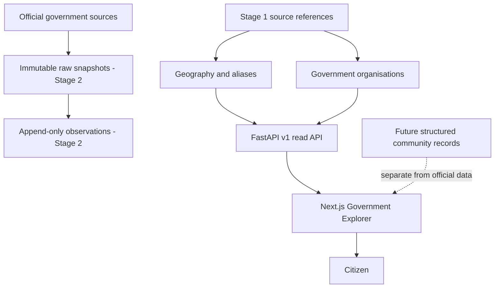

# AP Civic Platform — Development Record

**Product:** Andhra Pradesh public intelligence and civic participation platform
**Analysis date:** 11 August 2026
**Development covered:** Product definition, Stage 0 foundation, and Stage 1 implementation

## Acceptance status

- **Implementation acceptance:** Passed
- **Database operational acceptance:** Pending
- **Visual acceptance:** Pending
- **Overall Stage 1 acceptance:** Pending

Stage 2 must not begin until database operational and visual acceptance pass and the evidence is recorded in this file.

## 1. Purpose of this document

This is the cumulative development record for the project, not only a Stage 1 report. It records the
original product reasoning, the decisions made before implementation, Stage 0 repository work, Stage
1 database and product work, verification evidence, unresolved risks, and the planned path forward.

> **Canonical record:** This is the only cumulative development log for the project. After every
> future development stage or material implementation, append the new work, decisions, commands,
> verification results, limitations, and next steps to this same file. Do not create separate
> stage-completion reports unless explicitly requested.

## 2. Product definition and analysis completed before coding

### 2.1 Problem

India already has official government portals. The unmet need is a system that connects fragmented
records and lets a citizen follow public money from a government decision to a local result.

The platform should eventually answer:

- What was announced?
- What was budgeted and revised?
- What was released and utilised?
- What was accounted as expenditure?
- Which tender and contract relate to the work?
- Who is responsible?
- What physical progress and public outcome were reported?
- What do local citizens experience?
- Which official document supports every value?

The product was therefore positioned as a public-money intelligence and civic evidence platform,
not a news site, grievance portal, political social network, or directory of links.

### 2.2 Core financial rule

These stages must remain distinct:

1. Announcement
2. Budget Estimate
3. Revised Estimate
4. Funds Released
5. Utilisation
6. Actual Expenditure
7. Tender Estimate
8. Contract Award
9. Revised Project Cost
10. Physical Progress
11. Public Outcome

An announcement is not expenditure. Contract value is not outcome. Every future observation must
retain its stage, reporting period, source, retrieval date, classification, and review state.

### 2.3 Official and community separation

The long-term product contains two connected but independent records:

| Official record         | Community record             |
| ----------------------- | ---------------------------- |
| Government documents    | Structured citizen reports   |
| Budget and expenditure  | Beneficiary experience       |
| Official project status | Community verification       |
| Scheme eligibility      | Application experience       |
| Tender and contractor   | Dated local evidence         |
| Official outcome        | Community poll or assessment |

Community popularity cannot turn a claim into an official fact. A verified account does not make a
claim true. Official records cannot be created or modified through comments.

### 2.4 Scope decision

The national idea was reduced to Andhra Pradesh because nationwide coverage would make source
review, entity matching, bilingual accuracy, boundary management, and moderation unreliable.

The first durable experience is “My Area”: a citizen selects a district and mandal without exposing
precise location, then discovers schemes, projects, responsible offices, official updates, polls,
and structured reports.

Administrative and electoral geography must overlap without being treated as identical.

### 2.5 Future civic participation model

The planned community layer uses structured participation rather than unrestricted political
posting:

- Scheme application and delivery experiences
- Project-status verification
- Infrastructure and service reports
- Positive completion reports
- Evidence-backed discussion
- Transparent platform-participant polls
- Authority responses and resolution timelines

Open platform polls must never be described as representative surveys of Andhra Pradesh.

### 2.6 Trust and business strategy

Citizen access should remain free. Possible professional products include an API, research and media
subscriptions, procurement intelligence, benchmarking, alerts, and institutional dashboards.

The defensible asset is the historical entity graph and provenance chain—not possession of public
documents. Trust requires transparent sources, uncertainty, freshness, completeness, corrections,
and clear separation of official, calculated, inferred, and community information.

## 3. Permanent engineering contract created before Stage 1

The repository instructions require:

1. Every official claim to reference a source record.
2. Historical government information never to be silently overwritten.
3. Raw source documents to be stored before normalized extraction.
4. Every value to be classified as official, calculated, inferred, or community-reported.
5. Platform polls never to be called representative of Andhra Pradesh.
6. Precise user locations not to be exposed.
7. Telugu and English support in user-facing data structures.
8. Every moderation action to create an audit record.
9. Migrations, tests, and documentation for schema changes.
10. Fixtures to be visibly labeled.

These rules constrain all future stages and take priority over rapid feature expansion.

## 4. Stage 0 — Product contract and repository foundation

### 4.1 Goal

Stage 0 created a runnable and governed foundation without introducing government records, citizen
data, polls, projects, or production ingestion.

### 4.2 Repository structure established

- `apps/web`: Next.js citizen application
- `apps/api`: FastAPI service
- `workers/ingestion`: future source acquisition
- `workers/extraction`: future format-specific parsing
- `workers/verification`: future review and reconciliation
- `packages/database`: database tooling boundary
- `packages/shared-types`: safe cross-service contracts
- `packages/ui`: reusable interface components
- `packages/localization`: bilingual support
- `data/fixtures`: explicitly labeled development fixtures
- `data/schemas`: data contracts
- `infrastructure/deployment`: deployment documentation
- `tests/integration` and `tests/e2e`: cross-service test boundaries
- `docs`: product, architecture, governance, sources, moderation, security, and roadmap

### 4.3 Technology and deployment decisions

Stage 0 selected Next.js/TypeScript, FastAPI/Python, PostgreSQL/PostGIS, PostgreSQL search initially,
and native Render services. Docker was removed from the server strategy.

Quality tooling established included Prettier, ESLint, TypeScript, Vitest, Ruff, strict MyPy, Pytest,
and a Next.js production-build gate.

### 4.4 Data architecture established

Three layers were defined:

1. **Raw:** unchanged source files, checksums, retrieval metadata, and access conditions.
2. **Normalized:** sources, observations, entities, relationships, and financial events.
3. **Presentation:** calculations, explanations, search documents, freshness indicators, and public
   projections.

Corrections append and supersede; they do not erase source history. Workers are source-specific
rather than one universal scraper. Public and private evidence are separate.

### 4.5 Documentation and policy delivered

Stage 0 created:

- Product requirements
- Architecture decisions
- Data-governance policy
- Source-registry specification
- Moderation policy
- Threat model
- Implementation roadmap
- Repository engineering instructions
- Local setup, quality, and Render deployment documentation

Moderation and privacy boundaries were documented before community functionality existed.

### 4.6 Initial application foundation

The Stage 0 website established the product’s visual and trust language:

- “Where public money goes”
- Separate official, platform-analysis, and community evidence classes
- Explanation of distinct financial stages
- Telugu and English typography path
- Responsive layout
- Web health route

The FastAPI service established its health and documentation boundary. The Render Blueprint defined
native web and API services and managed PostgreSQL without Docker.

### 4.7 Stage 0 acceptance

Stage 0 completed its intended foundation role. It intentionally contained no official civic
records, ingestion adapters, accounts, citizen reports, polls, schemes, projects, eligibility
decisions, or production personal-data processing.

## 5. Cumulative architecture after Stage 0 and Stage 1



The current repository implements the product contract, source-reference bridge, geography,
organisations, public API, and Government Explorer. Full provenance, schemes, projects, finance,
procurement, identity, and community participation remain later stages.

## 6. Cumulative development status

| Area                                    | Status                                             |
| --------------------------------------- | -------------------------------------------------- |
| Product definition                      | Complete                                           |
| Engineering and trust contract          | Complete                                           |
| Repository and quality foundation       | Complete                                           |
| Render-native service foundation        | Complete                                           |
| Andhra Pradesh geography schema         | Implemented                                        |
| Government-entity schema                | Implemented                                        |
| Reviewed 26-district baseline           | Implemented with 28-district discrepancy disclosed |
| Bilingual Government Explorer           | Implemented                                        |
| Live PostgreSQL/PostGIS migration proof | Outstanding                                        |
| Manual mobile/desktop visual review     | Outstanding                                        |
| Full append-only provenance             | Stage 2                                            |
| Schemes, projects, finance, procurement | Future stages                                      |
| Identity, reports, polls, moderation    | Future stages                                      |

## 7. Development record policy

At the end of every future development stage, append an entry to this file containing:

- Completion date
- Goal and scope
- Schema and migrations
- Sources and data coverage
- APIs and frontend routes
- Deployment changes
- Commands executed
- Test and build results
- Visual inspection
- Security and privacy observations
- Limitations and unresolved risks
- Acceptance decision
- Recommended next stage

The remaining sections preserve the complete Stage 1 implementation analysis.

---

# Stage 1 Development Completion Analysis

**Project:** AP Civic Platform
**Stage:** 1 — Andhra Pradesh geography and government-entity foundation
**Analysis date:** 11 August 2026
**Status:** Implementation complete; operational acceptance pending a live PostgreSQL/PostGIS migration test and manual browser visual review.

## 1. Executive assessment

Stage 1 establishes the first real public-data foundation for the platform. The repository now has
a PostgreSQL/PostGIS schema, source-aware reviewed seed records, versioned read-only APIs, independent
administrative and electoral geography models, historical government-organisation relationships,
health probes, and a bilingual Government Explorer.

The implementation remains Render-native and Docker-free. Schema migration is separated from mutable
seed execution. Official, platform-derived, and future community data remain conceptually and
technically separate.

The code and host-side quality gates pass. The stage must not yet be described as operationally
accepted because this development environment has no PostgreSQL/PostGIS runtime and no
`TEST_DATABASE_URL`. Consequently, the real empty-database migration, migration rerun, seed rerun,
and database-readiness checks have not been executed against a live database. Manual mobile and
desktop visual inspection is also outstanding.

## 2. Scope delivered

### Geography

The model supports all required geography classes:

1. State
2. District
3. Revenue division
4. Mandal
5. Village
6. Urban local body
7. Assembly constituency
8. Parliamentary constituency

Each geography can have a stable UUID and slug, English and Telugu names, normalized alternate and
historical aliases, official code and code scheme, validity dates, active status, an administrative
parent, source reference, and timestamps.

Administrative containment uses the direct parent hierarchy. Electoral containment and geographic
overlap use separate, time-bounded relationship records. A constituency is therefore not treated as
a district, and future projects can relate to multiple geographic entities without changing the
geography hierarchy.

### Spatial design

The schema uses native PostGIS types:

- SRID 4326 point locations
- SRID 4326 multipolygon boundaries
- Stored centroids derived from boundaries
- GIST indexes on spatial columns
- Boundary precision, source, and validity metadata

There is no JSON geometry fallback. All Stage 1 seed records intentionally have null geometry because
no authoritative reusable boundary dataset was approved. Null geometry means “not yet reviewed or
available,” not an empty or zero-area boundary.

### Government organisations and representatives

The schema supports:

- Government bodies
- Departments
- Public offices
- Office jurisdictions
- Government-body relationships
- Official roles
- Representatives
- Representative terms

Organisation relationships and representative terms carry validity periods. Future changes append
new rows instead of overwriting prior officeholders or organisational history. Stage 1 seeds only the
limited organisations needed for roads, healthcare, and education; it does not seed offices,
representatives, or terms.

### Minimal provenance bridge

Stage 2 will implement full append-only provenance, but Stage 1 introduces a deliberately small
source-reference table. Seeded records include:

- Source name
- Official source URL
- Retrieval date
- Publication or effective date when available
- Review status
- Fixture status
- Citation metadata and notes

Every seeded geography and government body has a source reference. Seed conflicts fail visibly
rather than silently replacing existing official data.

## 3. Database and migration analysis

The initial Alembic revision:

- Executes `CREATE EXTENSION IF NOT EXISTS postgis`
- Performs a clear PostGIS availability/privilege preflight
- Creates the source, geography, alias, relationship, government, office, jurisdiction, role, and
  representative tables
- Adds native spatial columns and GIST indexes
- Adds validity-order, identity, and self-relationship constraints
- Has a downgrade path
- Contains schema only, not mutable seed content

Migration SQL was successfully generated in PostgreSQL offline mode. The SQL includes the PostGIS
extension command, all required tables, constraints, spatial indexes, and the Alembic version update.

A disposable integration test exists for a real PostgreSQL/PostGIS database. It requires
`TEST_DATABASE_URL`, refuses database names without `_test`, migrates from base to head, reruns the
migration, runs the seed twice, and validates stable row counts and source links.

## 4. Seed-data analysis

The Stage 1 seed is deterministic, idempotent, and separate from Alembic. UUID version 5 identifiers
provide stable identities across environments.

Seed coverage:

- Andhra Pradesh state: 1
- Requested district baseline: 26
- Pilot districts: Visakhapatnam, Guntur, and Ananthapuramu
- Root Andhra Pradesh government body: 1
- Initial departments: Roads and Buildings; Health, Medical and Family Welfare; School Education
- Mandals, villages, constituencies, offices, roles, and representatives: 0
- Boundary or point geometry: 0

The primary district codes are Local Government Directory district codes. Supplemental AP State
Portal details and official Telugu district portal links are retained in citation metadata.

A source discrepancy was found during review: the current LGD response lists 28 Andhra Pradesh
districts, including Markapuram and Polavaram, while the requested Stage 1 baseline specifies 26.
The implementation does not hide or silently resolve this conflict. It seeds the requested 26 and
discloses the two pending districts in state coverage notes, seed citations, the Government Explorer,
the README, and the source registry.

## 5. API analysis

The public read-only API exposes:

- `GET /api/v1/geographies`
- `GET /api/v1/geographies/{id-or-slug}`
- `GET /api/v1/geographies/{id-or-slug}/children`
- `GET /api/v1/government-bodies`
- `GET /api/v1/government-bodies/{id-or-slug}`
- `GET /api/v1/public-offices`
- `GET /api/v1/representatives`

Collections support numbered pagination, stable name/UUID ordering, type filters, parent filters,
active-date filters, English and Telugu name search, and normalized alias search. Public schemas
include provenance summaries while excluding ORM state, source citation internals, and other
unnecessary database fields.

Not-found and request-validation errors use structured response bodies. Stage 1 introduces no
authentication because these endpoints expose reviewed public records and allow only GET requests.
CORS is restricted through configured origins and methods.

Health behavior is separated:

- `GET /health/live` confirms process health without requiring the database.
- `GET /health/ready` performs read-only database connectivity and PostGIS extension checks.
- The legacy `GET /health` remains a liveness alias for compatibility.

## 6. Frontend analysis

The Government Explorer route is `/government-explorer`. It preserves the existing visual
foundation and adds:

- English and Telugu interface modes
- District and department browsing
- English, Telugu, and alias search
- Loading, empty, failure, and retry states
- Provenance and source links
- Reviewed/fixture labels
- Pilot district labels
- Explicit missing-boundary labels
- A visible 26-versus-28 coverage notice
- Responsive grid and mobile controls
- Native buttons, forms, headings, lists, tabs, live regions, and keyboard navigation

The homepage now links to the explorer and accurately describes the reviewed Stage 1 baseline instead
of claiming that no government records exist.

Frontend tests verify loading, reviewed records, provenance display, coverage disclosure, Telugu
rendering, native controls, empty results, API failure handling, retry controls, and alias queries.
The Next.js production build successfully prerenders the explorer.

## 7. Render deployment analysis

The deployment remains entirely native:

- Next.js web service
- FastAPI Python web service
- Managed Render PostgreSQL
- No Dockerfile, Docker Compose, or container start path

The API receives `DATABASE_URL` through Render's managed database reference. The API uses a
`starter` service plan because Render pre-deploy commands are unavailable on the free web-service
plan. Its pre-deploy command runs `alembic upgrade head`; migration failure therefore prevents the
new release from becoming healthy. The API health path is `/health/ready`.

Seed execution is intentionally absent from build, pre-deploy, and start commands. An operator must
run it deliberately after a successful migration. This prevents every application restart from
reprocessing mutable seed data.

The documented migration recovery preference is to preserve the database, inspect Alembic state and
Render logs, restore a backup before destructive recovery, and fix forward. Downgrade should be used
only after its path is tested against a copy.

## 8. Verification evidence

Completed checks:

| Check                                     | Result                                                         |
| ----------------------------------------- | -------------------------------------------------------------- |
| Prettier                                  | Passed                                                         |
| ESLint                                    | Passed                                                         |
| TypeScript                                | Passed                                                         |
| Frontend tests                            | 6 passed                                                       |
| Next.js production build                  | Passed                                                         |
| Ruff lint                                 | Passed                                                         |
| Ruff formatting                           | 38 files passed                                                |
| Strict MyPy                               | 36 files passed                                                |
| Backend tests                             | 21 passed                                                      |
| PostgreSQL integration test               | 1 skipped: no `TEST_DATABASE_URL`                              |
| SQLAlchemy mapper configuration           | Passed                                                         |
| Alembic PostgreSQL offline SQL generation | Passed                                                         |
| Docker-reference review                   | No Docker deployment introduced                                |
| Secret review                             | No committed database credentials or application secrets found |

The backend test suite covers domain hierarchy validation, administrative/electoral separation,
historical validity, API filtering and pagination, alias and Telugu search behavior, public-read
authorization assumptions, structured errors, source requirements, seed-manifest integrity,
migration contract requirements, and live/readiness behavior.

## 9. Security, privacy, and trust observations

- The Stage 1 public API is read-only.
- No authentication data, user location, citizen evidence, or other personal information is stored.
- No precise citizen location is collected or exposed.
- Geometry represents public administrative geography, not user location.
- Database credentials remain environment-managed.
- Readiness checks do not mutate the database.
- Seed records cannot exist without source metadata.
- Fixture status is explicit.
- Historical and overlapping relationships are time-bounded.
- Source disagreements are disclosed rather than normalized away.
- The platform still needs normal production controls such as TLS enforcement, database backups,
  monitoring, resource limits, and restore drills.

## 10. Limitations and unresolved risks

### Blocking acceptance items

1. Run the migration from an empty disposable PostgreSQL/PostGIS database.
2. Run `alembic upgrade head` a second time to confirm safe rerun behavior.
3. Run the Stage 1 seed twice and confirm stable counts and source references.
4. Verify `/health/ready` against the migrated database.
5. Perform manual mobile and desktop visual/accessibility inspection.

### Data limitations

- No approved district, mandal, village, urban-body, or constituency boundaries are loaded.
- Markapuram and Polavaram remain unseeded pending explicit review.
- No mandals, villages, revenue divisions, urban local bodies, constituencies, offices, roles,
  representatives, or office jurisdictions are seeded.
- Telugu names and interface copy require professional language review.
- The minimal source-reference bridge does not yet retain raw documents, checksums, snapshots,
  extraction runs, or correction chains.

### Operational risks

- Render PostGIS extension privilege and availability must be proven on the selected managed
  database.
- The database is currently declared on a free plan; backup and retention guarantees must be
  reviewed before real civic records are loaded.
- Search uses `ILIKE` and normalized aliases. It is appropriate for the seed volume but will need
  measurement and indexing review as coverage grows.
- Read-only API database failures currently surface through service unavailability and readiness;
  production observability must distinguish connectivity, timeout, and query failures.

## 11. Recommended acceptance procedure

Use a disposable database whose name contains `_test`:

```bash
cd apps/api
export TEST_DATABASE_URL='postgresql://.../ap_civic_stage1_test'
../../.venv/bin/python -m app.commands.preflight
../../.venv/bin/pytest -p no:cacheprovider tests/integration/test_postgres_stage1.py
```

After a Render deployment:

1. Confirm the pre-deploy migration succeeds.
2. Confirm `/health/live` returns process health.
3. Confirm `/health/ready` reports database and PostGIS readiness.
4. Run `python -m app.commands.seed` manually.
5. Run the seed a second time and confirm zero newly created records.
6. Query the district and department APIs in English and Telugu.
7. Inspect the Government Explorer at narrow mobile and desktop widths.
8. Record the database, PostGIS, deployment, and inspection results in this document.

## 12. Stage 2 entry point

Do not broaden into schemes or projects before completing the provenance layer. Stage 2 should
replace the minimal source-reference bridge with:

- Source
- Source document
- Immutable source snapshot
- Extraction run
- Source observation
- Correction
- Review decision
- Freshness and completeness projections

Stage 2 migrations must preserve every Stage 1 UUID and source link. Existing records should be
backfilled into the richer provenance chain without deleting or silently replacing the Stage 1
references.

## 13. Final conclusion

The Stage 1 implementation is structurally sound and its host-side code quality gates pass. It
creates the correct separation between administrative hierarchy, electoral overlap, government
organisation history, source provenance, and public presentation. It also handles the discovered
district-count discrepancy transparently.

The development work is complete, but the stage remains conditionally accepted until the live
PostgreSQL/PostGIS integration test and manual visual review are recorded. Stage 2 should begin only
after those gates pass or are explicitly accepted as documented deployment risks.

## Development entry — Canonical record consolidation

- **Completion date:** 11 August 2026
- **Goal:** Maintain one cumulative Markdown record containing all completed work and all future
  development updates.
- **Change:** Consolidated the original product analysis, Stage 0 foundation, and detailed Stage 1
  implementation into root-level `DEVELOPMENT.md`.
- **Repository rule:** Updated `AGENTS.md` so every future completed stage or material implementation
  must append its scope, decisions, commands, verification, limitations, and next step to this file.
- **Cleanup:** Removed the separate Stage 1 completion report and replaced stale README links.
- **Verification:** Confirmed the canonical file contains product definition, Stage 0, Stage 1,
  cumulative status, roadmap, and development-entry template.

## Development entry — Stage 1 operational acceptance attempt

- **Attempt date:** 11 August 2026
- **Authorized gate:** Deploy the Render Blueprint and complete the ordered operational and visual
  acceptance checks without beginning Stage 2.
- **Gate 1 — Render Blueprint deployment:** Blocked before deployment.
- **Repository state:** The workspace is not a Git repository; `git status` and `git remote -v`
  return “not a git repository.” No source remote is available for a Render Blueprint deployment.
- **Render access:** The Render CLI is not installed and no Render credential variables are present
  in the environment.
- **Database access:** Neither `DATABASE_URL` nor `TEST_DATABASE_URL` is available.
- **Deployment mutation:** None. No Render service, database, migration, or seed operation was
  started.
- **Database version:** Pending; no Render PostgreSQL connection is available.
- **PostGIS version:** Pending; no Render PostgreSQL connection is available.
- **Health checks:** Pending because no deployed API URL exists.
- **Seed verification:** Pending because no migrated live database exists.
- **English, Telugu, and alias live search:** Pending.
- **Mobile, desktop, keyboard, focus, overflow, and Telugu typography review:** Pending.
- **Acceptance result:** Implementation acceptance remains passed. Database operational acceptance,
  visual acceptance, and overall Stage 1 acceptance remain pending.
- **Stage 2 decision:** Not started. Deployment success alone will not authorize Stage 2; readiness,
  seed idempotency, live search, and visual evidence must all pass first.
- **Required unblock:** Provide this workspace as a Git repository connected to the Render Blueprint
  source, plus authenticated Render access or the deployed service URLs and a secure operator path
  for running migrations, seed commands, database version queries, and visual checks.

## Development entry — GitHub repository preparation

- **Date:** 11 August 2026
- **Goal:** Publish the complete project source to
  `https://github.com/Ravindra2377/POI`.
- **Remote inspection:** The target repository returned no branches or tags, so no remote history
  requires merging or preservation.
- **Pre-push review:** Ignored dependency, virtual-environment, build, coverage, cache, environment,
  and TypeScript build-info artifacts. Removed an unintended `vitest.config.ts.orig` backup.
- **Secret review:** No private key, GitHub token, OpenAI key, or production database credential was
  found. `.env.example` contains only a visibly local development placeholder.
- **Authentication state:** GitHub CLI is unavailable, SSH authentication is not configured, and no
  Git credential helper or author identity was present before repository initialization.
- **Stage 1 acceptance impact:** None. Publishing source does not satisfy database operational or
  visual acceptance and does not authorize Stage 2.

## Development entry — GitHub publication result

- **Publication date:** 11 August 2026
- **Repository:** `https://github.com/Ravindra2377/POI`
- **Branch:** `main`
- **Initial published commit:** `475d350e4aca264809a5968b92759346b85cb58a`
- **Push result:** Successful. The remote `main` branch contains the complete reviewed Stage 0 and
  Stage 1 source tree, documentation, tests, seed manifest, Alembic migration, and Render Blueprint.
- **Upstream:** Local `main` tracks `origin/main`.
- **Acceptance impact:** Source publication is complete but does not change the pending database
  operational, visual, or overall Stage 1 acceptance states.
