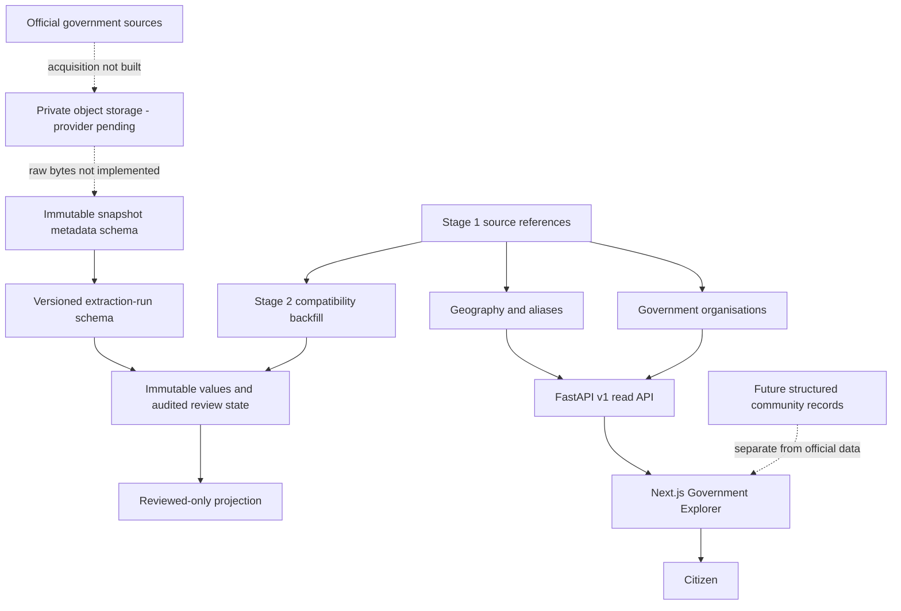

# Viksit Bharat?? — Development Record

**Product:** India-wide public intelligence and civic participation platform, launching with Andhra Pradesh
**Initial analysis date:** 11 August 2026
**Last updated:** 16 August 2026
**Development covered:** Product definition, Stage 0 foundation, Stage 1 implementation and acceptance,
production stabilization, public-utility frontend, legal-basis page, scalable language selector,
the locally integration-tested Stage 2A provenance contract and Stage 2B schema/compatibility implementation,
the prepared AP Schemes and AP Projects website slices, elections ingestion from the official AP
Legislature term PDFs, the API + web election-results catalogue slice, and the web budget catalogue
slice wired to `/api/v1/budget`

## Acceptance status

- **Implementation acceptance:** Passed
- **Database operational acceptance:** Passed with explicit seed-rerun evidence waiver
- **Visual acceptance:** Passed
- **Stage 2A/2B status:** Implemented and disposable-PostGIS tested; operational acceptance pending
- **Overall Stage 1 acceptance:** Passed with documented operational risk

Stage 1 acceptance was completed on 13 August 2026. The operator explicitly accepted the missing
second-seed command output as an operational risk after live database, seed coverage, search, provenance,
and visual checks passed.

Stage 2A/2B implementation and the disposable PostgreSQL/PostGIS migration, backfill,
downgrade/re-upgrade, double-seed, concurrency, correction-chain, and publication proofs pass locally.
Operational acceptance still requires production-backup restore and production deployment evidence.
Stage 2C object-storage implementation has not begun.

## 1. Purpose of this document

This is the cumulative development record for the project, not only a Stage 1 report. It records the
original product reasoning, the decisions made before implementation, Stage 0 repository work, Stage
1 database and product work, verification evidence, unresolved risks, and the planned path forward.

> **Canonical record:** This is the only cumulative development log for the project. After every
> future development stage or material implementation, append the new work, decisions, commands,
> verification results, limitations, and next steps to this same file. Do not create separate
> stage-completion reports unless explicitly requested.

## 2. Product definition and analysis completed before coding

### 2.1 Problem

India already has official government portals. The unmet need is a system that connects fragmented
records and lets a citizen follow public money from a government decision to a local result.

The platform should eventually answer:

- What was announced?
- What was budgeted and revised?
- What was released and utilised?
- What was accounted as expenditure?
- Which tender and contract relate to the work?
- Who is responsible?
- What physical progress and public outcome were reported?
- What do local citizens experience?
- Which official document supports every value?

The product was therefore positioned as a public-money intelligence and civic evidence platform,
not a news site, grievance portal, political social network, or directory of links.

### 2.2 Core financial rule

These stages must remain distinct:

1. Announcement
2. Budget Estimate
3. Revised Estimate
4. Funds Released
5. Utilisation
6. Actual Expenditure
7. Tender Estimate
8. Contract Award
9. Revised Project Cost
10. Physical Progress
11. Public Outcome

An announcement is not expenditure. Contract value is not outcome. Every future observation must
retain its stage, reporting period, source, retrieval date, classification, and review state.

### 2.3 Official and community separation

The long-term product contains two connected but independent records:

| Official record         | Community record             |
| ----------------------- | ---------------------------- |
| Government documents    | Structured citizen reports   |
| Budget and expenditure  | Beneficiary experience       |
| Official project status | Community verification       |
| Scheme eligibility      | Application experience       |
| Tender and contractor   | Dated local evidence         |
| Official outcome        | Community poll or assessment |

Community popularity cannot turn a claim into an official fact. A verified account does not make a
claim true. Official records cannot be created or modified through comments.

### 2.4 Scope decision

The first rollout was reduced to Andhra Pradesh because beginning nationwide would make source
review, entity matching, bilingual accuracy, boundary management, and moderation unreliable. This
is an implementation strategy for an India-wide product, not a permanent product boundary.

The first durable experience is “My Area”: a citizen selects a district and mandal without exposing
precise location, then discovers schemes, projects, responsible offices, official updates, polls,
and structured reports.

Administrative and electoral geography must overlap without being treated as identical.

### 2.5 Future civic participation model

The planned community layer uses structured participation rather than unrestricted political
posting:

- Scheme application and delivery experiences
- Project-status verification
- Infrastructure and service reports
- Positive completion reports
- Evidence-backed discussion
- Transparent platform-participant polls
- Authority responses and resolution timelines

Open platform polls must never be described as representative surveys of Andhra Pradesh.

### 2.6 Trust and business strategy

Citizen access should remain free. Possible professional products include an API, research and media
subscriptions, procurement intelligence, benchmarking, alerts, and institutional dashboards.

The defensible asset is the historical entity graph and provenance chain—not possession of public
documents. Trust requires transparent sources, uncertainty, freshness, completeness, corrections,
and clear separation of official, calculated, inferred, and community information.

## 3. Permanent engineering contract created before Stage 1

The repository instructions require:

1. Every official claim to reference a source record.
2. Historical government information never to be silently overwritten.
3. Raw source documents to be stored before normalized extraction.
4. Every value to be classified as official, calculated, inferred, or community-reported.
5. Platform polls never to be called representative of Andhra Pradesh.
6. Precise user locations not to be exposed.
7. Telugu and English support in user-facing data structures.
8. Every moderation action to create an audit record.
9. Migrations, tests, and documentation for schema changes.
10. Fixtures to be visibly labeled.
11. Material implementations and completed stages to be appended to this cumulative record.

These rules constrain all future stages and take priority over rapid feature expansion.

## 4. Stage 0 — Product contract and repository foundation

### 4.1 Goal

Stage 0 created a runnable and governed foundation without introducing government records, citizen
data, polls, projects, or production ingestion.

### 4.2 Repository structure established

- `apps/web`: Next.js citizen application
- `apps/api`: FastAPI service
- `workers/ingestion`: future source acquisition
- `workers/extraction`: future format-specific parsing
- `workers/verification`: future review and reconciliation
- `packages/database`: database tooling boundary
- `packages/shared-types`: safe cross-service contracts
- `packages/ui`: reusable interface components
- `packages/localization`: bilingual support
- `data/fixtures`: explicitly labeled development fixtures
- `data/schemas`: data contracts
- `infrastructure/deployment`: deployment documentation
- `tests/integration` and `tests/e2e`: cross-service test boundaries
- `docs`: product, architecture, governance, sources, moderation, security, and roadmap

### 4.3 Technology and deployment decisions

Stage 0 selected Next.js/TypeScript, FastAPI/Python, PostgreSQL/PostGIS, PostgreSQL search initially,
and native Render services. Docker was removed from the server strategy.

Quality tooling established included Prettier, ESLint, TypeScript, Vitest, Ruff, strict MyPy, Pytest,
and a Next.js production-build gate.

### 4.4 Data architecture established

Three layers were defined:

1. **Raw:** unchanged source files, checksums, retrieval metadata, and access conditions.
2. **Normalized:** sources, observations, entities, relationships, and financial events.
3. **Presentation:** calculations, explanations, search documents, freshness indicators, and public
   projections.

Corrections append and supersede; they do not erase source history. Workers are source-specific
rather than one universal scraper. Public and private evidence are separate.

### 4.5 Documentation and policy delivered

Stage 0 created:

- Product requirements
- Architecture decisions
- Data-governance policy
- Source-registry specification
- Moderation policy
- Threat model
- Implementation roadmap
- Repository engineering instructions
- Local setup, quality, and Render deployment documentation

Moderation and privacy boundaries were documented before community functionality existed.

### 4.6 Initial application foundation

The Stage 0 website established the product’s visual and trust language:

- “Where public money goes”
- Separate official, platform-analysis, and community evidence classes
- Explanation of distinct financial stages
- Telugu and English typography path
- Responsive layout
- Web health route

The FastAPI service established its health and documentation boundary. The Render Blueprint defined
native web and API services and managed PostgreSQL without Docker.

### 4.7 Stage 0 acceptance

Stage 0 completed its intended foundation role. It intentionally contained no official civic
records, ingestion adapters, accounts, citizen reports, polls, schemes, projects, eligibility
decisions, or production personal-data processing.

## 5. Cumulative architecture through local Stage 2A/2B



The repository now implements the product contract, Stage 1 source bridge, geography,
organisations, public API, Government Explorer, and the Stage 2A/2B provenance schema and
compatibility path. The migration and triggers pass on a disposable PostgreSQL/PostGIS database.
Production migration and restore evidence, raw acquisition, object storage, parser adapters, review
UI, public provenance UI, later domains, identity, and community participation remain unimplemented.

## 6. Cumulative development status

| Area                                      | Status                                              |
| ----------------------------------------- | --------------------------------------------------- |
| Product definition                        | Complete                                            |
| Engineering and trust contract            | Complete                                            |
| Repository and quality foundation         | Complete                                            |
| Render-native service foundation          | Complete                                            |
| Andhra Pradesh geography schema           | Implemented                                         |
| Government-entity schema                  | Implemented                                         |
| Reviewed 26-district baseline             | Implemented with 28-district discrepancy disclosed  |
| Bilingual Government Explorer             | Implemented                                         |
| Live PostgreSQL/PostGIS readiness         | Passed                                              |
| Live seed and reviewed-source coverage    | Passed with seed-rerun evidence waiver              |
| Mobile/desktop visual and keyboard review | Passed                                              |
| Legal and constitutional basis page       | Implemented and published                           |
| Scalable English/Telugu selector          | Implemented and published                           |
| Stage 2A provenance contract              | Implemented and locally integration-tested          |
| Stage 2B schema and compatibility path    | Disposable PostGIS proof passed; production pending |
| Raw object storage                        | Contract defined; provider not selected             |
| First ingestion adapter                   | LGD selected conceptually; not implemented          |
| Review workflow and public provenance UI  | Schema only / not implemented                       |
| Schemes, projects, finance, procurement   | Future stages                                       |
| Identity, reports, polls, moderation      | Future stages                                       |

## 7. Development record policy

At the end of every future development stage, append an entry to this file containing:

- Completion date
- Goal and scope
- Schema and migrations
- Sources and data coverage
- APIs and frontend routes
- Deployment changes
- Commands executed
- Test and build results
- Visual inspection
- Security and privacy observations
- Limitations and unresolved risks
- Acceptance decision
- Recommended next stage

The remaining sections preserve the complete Stage 1 implementation analysis.

---

# Stage 1 Development Completion Analysis

**Project:** Viksit Bharat??
**Stage:** 1 — Andhra Pradesh geography and government-entity foundation
**Analysis date:** 11 August 2026
**Status:** Implementation complete; operational acceptance pending a live PostgreSQL/PostGIS migration test and manual browser visual review.

## 1. Executive assessment

Stage 1 establishes the first real public-data foundation for the platform. The repository now has
a PostgreSQL/PostGIS schema, source-aware reviewed seed records, versioned read-only APIs, independent
administrative and electoral geography models, historical government-organisation relationships,
health probes, and a bilingual Government Explorer.

The implementation remains Render-native and Docker-free. Schema migration is separated from mutable
seed execution. Official, platform-derived, and future community data remain conceptually and
technically separate.

The code and host-side quality gates pass. The stage must not yet be described as operationally
accepted because this development environment has no PostgreSQL/PostGIS runtime and no
`TEST_DATABASE_URL`. Consequently, the real empty-database migration, migration rerun, seed rerun,
and database-readiness checks have not been executed against a live database. Manual mobile and
desktop visual inspection is also outstanding.

## 2. Scope delivered

### Geography

The model supports all required geography classes:

1. State
2. District
3. Revenue division
4. Mandal
5. Village
6. Urban local body
7. Assembly constituency
8. Parliamentary constituency

Each geography can have a stable UUID and slug, English and Telugu names, normalized alternate and
historical aliases, official code and code scheme, validity dates, active status, an administrative
parent, source reference, and timestamps.

Administrative containment uses the direct parent hierarchy. Electoral containment and geographic
overlap use separate, time-bounded relationship records. A constituency is therefore not treated as
a district, and future projects can relate to multiple geographic entities without changing the
geography hierarchy.

### Spatial design

The schema uses native PostGIS types:

- SRID 4326 point locations
- SRID 4326 multipolygon boundaries
- Stored centroids derived from boundaries
- GIST indexes on spatial columns
- Boundary precision, source, and validity metadata

There is no JSON geometry fallback. All Stage 1 seed records intentionally have null geometry because
no authoritative reusable boundary dataset was approved. Null geometry means “not yet reviewed or
available,” not an empty or zero-area boundary.

### Government organisations and representatives

The schema supports:

- Government bodies
- Departments
- Public offices
- Office jurisdictions
- Government-body relationships
- Official roles
- Representatives
- Representative terms

Organisation relationships and representative terms carry validity periods. Future changes append
new rows instead of overwriting prior officeholders or organisational history. Stage 1 seeds only the
limited organisations needed for roads, healthcare, and education; it does not seed offices,
representatives, or terms.

### Minimal provenance bridge

Stage 2 will implement full append-only provenance, but Stage 1 introduces a deliberately small
source-reference table. Seeded records include:

- Source name
- Official source URL
- Retrieval date
- Publication or effective date when available
- Review status
- Fixture status
- Citation metadata and notes

Every seeded geography and government body has a source reference. Seed conflicts fail visibly
rather than silently replacing existing official data.

## 3. Database and migration analysis

The initial Alembic revision:

- Executes `CREATE EXTENSION IF NOT EXISTS postgis`
- Performs a clear PostGIS availability/privilege preflight
- Creates the source, geography, alias, relationship, government, office, jurisdiction, role, and
  representative tables
- Adds native spatial columns and GIST indexes
- Adds validity-order, identity, and self-relationship constraints
- Has a downgrade path
- Contains schema only, not mutable seed content

Migration SQL was successfully generated in PostgreSQL offline mode. The SQL includes the PostGIS
extension command, all required tables, constraints, spatial indexes, and the Alembic version update.

A disposable integration test exists for a real PostgreSQL/PostGIS database. It requires
`TEST_DATABASE_URL`, refuses database names without `_test`, migrates from base to head, reruns the
migration, runs the seed twice, and validates stable row counts and source links.

## 4. Seed-data analysis

The Stage 1 seed is deterministic, idempotent, and separate from Alembic. UUID version 5 identifiers
provide stable identities across environments.

Seed coverage:

- Andhra Pradesh state: 1
- Requested district baseline: 26
- Pilot districts: Visakhapatnam, Guntur, and Ananthapuramu
- Root Andhra Pradesh government body: 1
- Initial departments: Roads and Buildings; Health, Medical and Family Welfare; School Education
- Mandals, villages, constituencies, offices, roles, and representatives: 0
- Boundary or point geometry: 0

The primary district codes are Local Government Directory district codes. Supplemental AP State
Portal details and official Telugu district portal links are retained in citation metadata.

A source discrepancy was found during review: the current LGD response lists 28 Andhra Pradesh
districts, including Markapuram and Polavaram, while the requested Stage 1 baseline specifies 26.
The implementation does not hide or silently resolve this conflict. It seeds the requested 26 and
discloses the two pending districts in state coverage notes, seed citations, the Government Explorer,
the README, and the source registry.

## 5. API analysis

The public read-only API exposes:

- `GET /api/v1/geographies`
- `GET /api/v1/geographies/{id-or-slug}`
- `GET /api/v1/geographies/{id-or-slug}/children`
- `GET /api/v1/government-bodies`
- `GET /api/v1/government-bodies/{id-or-slug}`
- `GET /api/v1/public-offices`
- `GET /api/v1/representatives`

Collections support numbered pagination, stable name/UUID ordering, type filters, parent filters,
active-date filters, English and Telugu name search, and normalized alias search. Public schemas
include provenance summaries while excluding ORM state, source citation internals, and other
unnecessary database fields.

Not-found and request-validation errors use structured response bodies. Stage 1 introduces no
authentication because these endpoints expose reviewed public records and allow only GET requests.
CORS is restricted through configured origins and methods.

Health behavior is separated:

- `GET /health/live` confirms process health without requiring the database.
- `GET /health/ready` performs read-only database connectivity and PostGIS extension checks.
- The legacy `GET /health` remains a liveness alias for compatibility.

## 6. Frontend analysis

The Government Explorer route is `/government-explorer`. It preserves the existing visual
foundation and adds:

- English and Telugu interface modes
- District and department browsing
- English, Telugu, and alias search
- Loading, empty, failure, and retry states
- Provenance and source links
- Reviewed/fixture labels
- Pilot district labels
- Explicit missing-boundary labels
- A visible 26-versus-28 coverage notice
- Responsive grid and mobile controls
- Native buttons, forms, headings, lists, tabs, live regions, and keyboard navigation

The homepage now links to the explorer and accurately describes the reviewed Stage 1 baseline instead
of claiming that no government records exist.

Frontend tests verify loading, reviewed records, provenance display, coverage disclosure, Telugu
rendering, native controls, empty results, API failure handling, retry controls, and alias queries.
The Next.js production build successfully prerenders the explorer.

## 7. Render deployment analysis

The deployment remains entirely native:

- Next.js web service
- FastAPI Python web service
- Managed Render PostgreSQL
- No Dockerfile, Docker Compose, or container start path

The API receives `DATABASE_URL` through Render's managed database reference. The API uses a
`starter` service plan because Render pre-deploy commands are unavailable on the free web-service
plan. Its pre-deploy command runs `alembic upgrade head`; migration failure therefore prevents the
new release from becoming healthy. The API health path is `/health/ready`.

Seed execution is intentionally absent from build, pre-deploy, and start commands. An operator must
run it deliberately after a successful migration. This prevents every application restart from
reprocessing mutable seed data.

The documented migration recovery preference is to preserve the database, inspect Alembic state and
Render logs, restore a backup before destructive recovery, and fix forward. Downgrade should be used
only after its path is tested against a copy.

## 8. Verification evidence

Completed checks:

| Check                                     | Result                                                         |
| ----------------------------------------- | -------------------------------------------------------------- |
| Prettier                                  | Passed                                                         |
| ESLint                                    | Passed                                                         |
| TypeScript                                | Passed                                                         |
| Frontend tests                            | 6 passed                                                       |
| Next.js production build                  | Passed                                                         |
| Ruff lint                                 | Passed                                                         |
| Ruff formatting                           | 38 files passed                                                |
| Strict MyPy                               | 36 files passed                                                |
| Backend tests                             | 21 passed                                                      |
| PostgreSQL integration test               | 1 skipped: no `TEST_DATABASE_URL`                              |
| SQLAlchemy mapper configuration           | Passed                                                         |
| Alembic PostgreSQL offline SQL generation | Passed                                                         |
| Docker-reference review                   | No Docker deployment introduced                                |
| Secret review                             | No committed database credentials or application secrets found |

The backend test suite covers domain hierarchy validation, administrative/electoral separation,
historical validity, API filtering and pagination, alias and Telugu search behavior, public-read
authorization assumptions, structured errors, source requirements, seed-manifest integrity,
migration contract requirements, and live/readiness behavior.

## 9. Security, privacy, and trust observations

- The Stage 1 public API is read-only.
- No authentication data, user location, citizen evidence, or other personal information is stored.
- No precise citizen location is collected or exposed.
- Geometry represents public administrative geography, not user location.
- Database credentials remain environment-managed.
- Readiness checks do not mutate the database.
- Seed records cannot exist without source metadata.
- Fixture status is explicit.
- Historical and overlapping relationships are time-bounded.
- Source disagreements are disclosed rather than normalized away.
- The platform still needs normal production controls such as TLS enforcement, database backups,
  monitoring, resource limits, and restore drills.

## 10. Limitations and unresolved risks

### Blocking acceptance items

1. Run the migration from an empty disposable PostgreSQL/PostGIS database.
2. Run `alembic upgrade head` a second time to confirm safe rerun behavior.
3. Run the Stage 1 seed twice and confirm stable counts and source references.
4. Verify `/health/ready` against the migrated database.
5. Perform manual mobile and desktop visual/accessibility inspection.

### Data limitations

- No approved district, mandal, village, urban-body, or constituency boundaries are loaded.
- Markapuram and Polavaram remain unseeded pending explicit review.
- No mandals, villages, revenue divisions, urban local bodies, constituencies, offices, roles,
  representatives, or office jurisdictions are seeded.
- Telugu names and interface copy require professional language review.
- The minimal source-reference bridge does not yet retain raw documents, checksums, snapshots,
  extraction runs, or correction chains.

### Operational risks

- Render PostGIS extension privilege and availability must be proven on the selected managed
  database.
- The database is currently declared on a free plan; backup and retention guarantees must be
  reviewed before real civic records are loaded.
- Search uses `ILIKE` and normalized aliases. It is appropriate for the seed volume but will need
  measurement and indexing review as coverage grows.
- Read-only API database failures currently surface through service unavailability and readiness;
  production observability must distinguish connectivity, timeout, and query failures.

## 11. Recommended acceptance procedure

Use a disposable database whose name contains `_test`:

```bash
cd apps/api
export TEST_DATABASE_URL='postgresql://.../ap_civic_stage1_test'
../../.venv/bin/python -m app.commands.preflight
../../.venv/bin/pytest -p no:cacheprovider tests/integration/test_postgres_stage1.py
```

After a Render deployment:

1. Confirm the pre-deploy migration succeeds.
2. Confirm `/health/live` returns process health.
3. Confirm `/health/ready` reports database and PostGIS readiness.
4. Run `python -m app.commands.seed` manually.
5. Run the seed a second time and confirm zero newly created records.
6. Query the district and department APIs in English and Telugu.
7. Inspect the Government Explorer at narrow mobile and desktop widths.
8. Record the database, PostGIS, deployment, and inspection results in this document.

## 12. Stage 2 entry point

Do not broaden into schemes or projects before completing the provenance layer. Stage 2 should
replace the minimal source-reference bridge with:

- Source
- Source document
- Immutable source snapshot
- Extraction run
- Source observation
- Correction
- Review decision
- Freshness and completeness projections

Stage 2 migrations must preserve every Stage 1 UUID and source link. Existing records should be
backfilled into the richer provenance chain without deleting or silently replacing the Stage 1
references.

## 13. Final conclusion

The Stage 1 implementation is structurally sound and its host-side code quality gates pass. It
creates the correct separation between administrative hierarchy, electoral overlap, government
organisation history, source provenance, and public presentation. It also handles the discovered
district-count discrepancy transparently.

The development work is complete, but the stage remains conditionally accepted until the live
PostgreSQL/PostGIS integration test and manual visual review are recorded. Stage 2 should begin only
after those gates pass or are explicitly accepted as documented deployment risks.

## Development entry — Canonical record consolidation

- **Completion date:** 11 August 2026
- **Goal:** Maintain one cumulative Markdown record containing all completed work and all future
  development updates.
- **Change:** Consolidated the original product analysis, Stage 0 foundation, and detailed Stage 1
  implementation into root-level `DEVELOPMENT.md`.
- **Repository rule:** Updated `AGENTS.md` so every future completed stage or material implementation
  must append its scope, decisions, commands, verification, limitations, and next step to this file.
- **Cleanup:** Removed the separate Stage 1 completion report and replaced stale README links.
- **Verification:** Confirmed the canonical file contains product definition, Stage 0, Stage 1,
  cumulative status, roadmap, and development-entry template.

## Development entry — Stage 1 operational acceptance attempt

- **Attempt date:** 11 August 2026
- **Authorized gate:** Deploy the Render Blueprint and complete the ordered operational and visual
  acceptance checks without beginning Stage 2.
- **Gate 1 — Render Blueprint deployment:** Blocked before deployment.
- **Repository state:** The workspace is not a Git repository; `git status` and `git remote -v`
  return “not a git repository.” No source remote is available for a Render Blueprint deployment.
- **Render access:** The Render CLI is not installed and no Render credential variables are present
  in the environment.
- **Database access:** Neither `DATABASE_URL` nor `TEST_DATABASE_URL` is available.
- **Deployment mutation:** None. No Render service, database, migration, or seed operation was
  started.
- **Database version:** Pending; no Render PostgreSQL connection is available.
- **PostGIS version:** Pending; no Render PostgreSQL connection is available.
- **Health checks:** Pending because no deployed API URL exists.
- **Seed verification:** Pending because no migrated live database exists.
- **English, Telugu, and alias live search:** Pending.
- **Mobile, desktop, keyboard, focus, overflow, and Telugu typography review:** Pending.
- **Acceptance result:** Implementation acceptance remains passed. Database operational acceptance,
  visual acceptance, and overall Stage 1 acceptance remain pending.
- **Stage 2 decision:** Not started. Deployment success alone will not authorize Stage 2; readiness,
  seed idempotency, live search, and visual evidence must all pass first.
- **Required unblock:** Provide this workspace as a Git repository connected to the Render Blueprint
  source, plus authenticated Render access or the deployed service URLs and a secure operator path
  for running migrations, seed commands, database version queries, and visual checks.

## Development entry — GitHub repository preparation

- **Date:** 11 August 2026
- **Goal:** Publish the complete project source to
  `https://github.com/Ravindra2377/POI`.
- **Remote inspection:** The target repository returned no branches or tags, so no remote history
  requires merging or preservation.
- **Pre-push review:** Ignored dependency, virtual-environment, build, coverage, cache, environment,
  and TypeScript build-info artifacts. Removed an unintended `vitest.config.ts.orig` backup.
- **Secret review:** No private key, GitHub token, OpenAI key, or production database credential was
  found. `.env.example` contains only a visibly local development placeholder.
- **Authentication state:** GitHub CLI is unavailable, SSH authentication is not configured, and no
  Git credential helper or author identity was present before repository initialization.
- **Stage 1 acceptance impact:** None. Publishing source does not satisfy database operational or
  visual acceptance and does not authorize Stage 2.

## Development entry — GitHub publication result

- **Publication date:** 11 August 2026
- **Repository:** `https://github.com/Ravindra2377/POI`
- **Branch:** `main`
- **Initial published commit:** `475d350e4aca264809a5968b92759346b85cb58a`
- **Push result:** Successful. The remote `main` branch contains the complete reviewed Stage 0 and
  Stage 1 source tree, documentation, tests, seed manifest, Alembic migration, and Render Blueprint.
- **Upstream:** Local `main` tracks `origin/main`.
- **Acceptance impact:** Source publication is complete but does not change the pending database
  operational, visual, or overall Stage 1 acceptance states.

## Development entry — Public brand renamed to Viksit Bharat??

- **Date:** 11 August 2026
- **Goal:** Rename the public website and API presentation to the exact name `Viksit Bharat??`,
  including both question marks.
- **Public changes:** Updated document metadata, homepage navigation and footer, Government Explorer
  navigation and metadata, API documentation title, repository headings, and accessibility label.
- **Trust disclosure:** Added a visible statement that the product is an independent civic platform
  and is not affiliated with the Government of India.
- **Deployment stability:** Kept internal npm package names, Python package paths, database names, and
  Render service identifiers unchanged.
- **Data and schema impact:** None.
- **Acceptance impact:** Requires a fresh frontend build and API deployment. Stage 1 database
  operational and visual acceptance remain pending.

## Development entry — Clean white public-utility frontend

- **Completion date:** 12 August 2026
- **Goal and scope:** Replace the experimental frontend direction with the approved clean white
  public-utility interface. This was a frontend-only material implementation; no migration,
  ingestion, seed, database schema, finance record, minister record, or Stage 2 provenance work was
  introduced.
- **Product hierarchy:** Reframed the public interface as an India-wide platform with Andhra Pradesh
  explicitly identified as the first reviewed/live state dataset. A platform-owned coverage
  configuration contains all 36 states and Union Territories and nine sector-directory headings;
  these are labelled as platform structure, not official records or government-performance facts.
- **Routes implemented or redesigned:** Homepage (/), Explore Data (/explore-data), Andhra Pradesh
  Government Explorer (/government-explorer), Government (/government), Public Money
  (/public-money), Sources and Methodology (/sources), and the prepared Community route
  (/community).
- **Reusable interface:** Added the shared coverage notice, horizontal SiteHeader, mobile menu,
  English/Telugu control, footer, universal record search, coverage facts, latest record updates,
  review/source summaries, accessible empty/error states, financial-stage selector, and directory
  presentations.
- **API integration:** Reused only Stage 1 GET endpoints for districts, government bodies,
  departments, public offices, and representatives. The homepage update table and Sources view are
  API-backed. Universal search queries reviewed Andhra Pradesh districts and departments where
  supported and states its current limitation.
- **Integrity decisions:** No mock data from the visual study was copied. Non-AP jurisdictions and
  unimplemented sectors are marked planned. Missing officeholders, public offices, finance,
  procurement, CAG ingestion, and community participation render honest prepared or empty states.
  Existing provenance links, review status, fixture status, aliases, Telugu names, pilot labels,
  missing-boundary labels, and the 26-versus-28 district disclosure remain visible.
- **Financial vocabulary:** Expanded the presentation contract from five abbreviated steps to all
  eleven required stages: announcement, budget estimate, revised estimate, funds released,
  utilisation, actual expenditure, tender estimate, contract award, revised project cost, physical
  progress, and public outcome. The Public Money route explicitly states that announcement is not
  expenditure and contract value is not outcome.
- **Visual direction:** Replaced gradients, oversized editorial typography, rounded score-like
  elements, and card-heavy layouts with a white surface, charcoal/navy text, neutral dividers,
  restrained blue actions, compact directories/tables, semantic forms, and responsive stacked
  records. No UI framework or container deployment was added.
- **Tests added or updated:** Header navigation and language selection; universal search with state
  and sector selection; India-wide state/UT coverage; sector directory; Government Explorer
  loading, reviewed provenance, fixture/review state, coverage disclosure, Telugu, alias search,
  empty/error/retry; minister empty state; and all eleven public-money stages.
- **Web commands and results:** npm run format and npm run format:check passed; npm run lint passed;
  npm run typecheck passed; npm test passed with 12 tests across 4 files; npm run build passed and
  prerendered all six public content routes plus the homepage.
- **API regression checks:** Ruff lint passed, Ruff format check reported 38 files formatted, strict
  MyPy passed for 36 source files, and Pytest passed 21 tests with the disposable PostgreSQL
  integration test skipped because TEST_DATABASE_URL was not supplied. No backend code changed.
- **Visual inspection evidence:** Started the production Next.js build locally and captured six
  headless-browser screenshots: homepage at 1440 x 900 and 390 x 844, Explore Data at 768 x 1024,
  Government at 1440 x 900, Public Money at 390 x 844, and Sources at 1440 x 900. Browser DOM checks
  covered all public routes at the narrow responsive breakpoint and found no document-level
  horizontal overflow. Heading order, native labelled controls, mobile stacked records, and actual
  Tab focus order were inspected; focus proceeded through the coverage link, wordmark, menu,
  language controls, search inputs/selectors, action button, and quick links. Reduced-motion CSS is
  retained. Local API-backed sections intentionally showed accessible error/retry states because
  the visual run was not connected to production.
- **Reference limitation:** The approved visual-reference URL returned HTTP 401 from the development
  environment, so the implementation followed the complete written visual specification and did
  not claim a pixel-perfect comparison against that protected page.
- **Accessibility observations:** Semantic global and footer navigation, a real mobile-menu button,
  native inputs/selects/tabs, visible focus outlines, aria-live loading areas, role=alert failures,
  mobile table-to-record conversion, Telugu lang attributes, and document-language switching are
  present. English/Telugu switching translates the reviewed Government Explorer; full-site Telugu
  copy remains future localization work and requires professional review.
- **Security and privacy:** The change adds no authentication, personal information, precise user
  location, uploads, community evidence, writes, or new public API fields beyond typed projections
  already exposed by Stage 1. External source links use noreferrer. No secret or database
  configuration changed.
- **Limitations:** No live Render deployment or real-data visual review was authorized. The protected
  visual reference was inaccessible. Finance, projects, schemes, officeholder terms, and community
  records remain unavailable by design. The visual review does not satisfy the outstanding Stage 1
  database migration, PostGIS readiness, or seed-idempotency gates.
- **Acceptance decision:** Frontend implementation and local quality gates passed. Database
  operational acceptance remains pending. Stage 1 visual acceptance remains pending a live,
  real-data human review at the required widths. Overall Stage 1 acceptance remains pending.
- **Recommended next action:** Complete the existing Render migration, PostGIS readiness, double-seed,
  live English/Telugu/alias search, and live responsive/keyboard acceptance procedure; append that
  evidence to this cumulative record.

## Development entry — Render public availability check

- **Check date:** 13 August 2026
- **Scope:** Verify the supplied deployed frontend route before attempting Stage 1 operational acceptance.
- **Target:** `https://viksit-bharat-web.onrender.com/explore-data?state=Andhra+Pradesh&sector=Education#directory`
- **Results:** The supplied Explorer route returned HTTP 503. The same deployed origin also returned HTTP
  503 for `/` and `/api/health`.
- **Acceptance evidence:** No frontend-to-API behavior, CORS behavior, live catalog data, or responsive
  review could be verified because the public web service was unavailable.
- **Database evidence:** No database credentials, API service URL, Render Shell/CLI access, migration
  output, PostGIS preflight output, readiness output, or double-seed output was provided. Database
  operational acceptance therefore remains pending.
- **Acceptance decision:** Stage 1 visual, database operational, and overall acceptance remain pending.
- **Required unblock:** Restore the web service to a public healthy state and provide the API service URL
  for public checks. For database acceptance, run the documented migration, preflight, and double-seed
  procedure through Render's API service shell and retain the command output.

## Development entry — Render deployment log and live recheck

- **Check date:** 13 August 2026
- **Deployment-log evidence:** Render logs dated 12 August 2026 show the API installed successfully,
  executed `alembic upgrade head`, started Uvicorn, and served successful district and department API
  requests. They also show the web application built successfully and started with Next.js.
- **Live web result:** `https://viksit-bharat-web.onrender.com/api/health` returned
  `{"service":"ap-civic-web","status":"ok","version":"0.1.0"}`. The supplied Explore Data
  route returned its expected HTML application shell.
- **Live API result:** `https://viksit-bharat-api.onrender.com/health/live`, `/health/ready`, and the
  public district and department collection endpoints each returned HTTP 503 during this check.
- **Operational assessment:** The deployment logs demonstrate that a migration command ran, but do not
  show a successful PostGIS readiness response, a seed execution, or a second idempotent seed execution.
  Current API unavailability also prevents live catalog and frontend-to-API acceptance checks.
- **Acceptance decision:** The web service is publicly healthy. API availability, database operational
  acceptance, visual acceptance with live data, and overall Stage 1 acceptance remain pending.
- **Required unblock:** Inspect the Render API service event and runtime logs for the current HTTP 503,
  restore `/health/live` and `/health/ready`, then run and retain output from `python -m app.commands.preflight`
  and two consecutive `python -m app.commands.seed` executions in the API service shell.

## Development entry — Render database readiness and catalog check

- **Check date:** 13 August 2026
- **Database readiness:** Independently verified `https://viksit-bharat-api.onrender.com/health/ready`
  returning `ready`, database `ok`, and PostGIS version `3.6.4`.
- **Public API availability:** The public API is reachable again. Both the district and department
  collection requests returned HTTP 200.
- **Catalog result:** The district and department collections each returned an empty data array with a
  total of zero. This proves the migrated database contains no published Stage 1 seed records at the
  time of checking.
- **Frontend result:** The public Government Explorer page is reachable but cannot display records while
  its API collections are empty.
- **Acceptance decision:** Database and PostGIS readiness are demonstrated. Seed execution,
  seed idempotency, live English/Telugu/alias search, and visual acceptance remain pending. The Stage 1
  dataset must not be described as live until the seed has been run successfully.
- **Required unblock:** From a trusted local environment using Render's external database URL, run
  `../../.venv/bin/python -m app.commands.seed` twice from `apps/api`, retaining both non-sensitive
  outputs. Recheck public district and department counts afterward.

## Development entry — Review-status ORM persistence fix

- **Completion date:** 13 August 2026
- **Goal:** Correct Stage 1 seed persistence of source review status against the existing lowercase
  database constraint.
- **Root cause:** SQLAlchemy's default Python-enum mapping persisted enum member names such as
  `REVIEWED`, while the migration permits lowercase values such as `reviewed`.
- **Implementation:** Configured the `SourceReference.review_status` SQLAlchemy enum to persist each
  `ReviewStatus.value`. No database schema or migration change was required because this aligns the ORM
  with the existing database representation.
- **Tests:** Added a model contract test asserting the ORM maps the three database values `pending`,
  `reviewed`, and `rejected`.
- **Verification:** Ruff lint passed; Ruff format check passed for 38 files; strict MyPy passed for 36
  source files; Pytest passed 22 tests with the disposable PostgreSQL integration test skipped; root
  Prettier check passed.
- **Security and data impact:** No credentials, public API fields, personal information, or historical
  records changed. The fix enables the reviewed Stage 1 source records to be seeded using the migration's
  existing constrained values.
- **Remaining operational step:** Deploy this change, then run the seed twice against the Render database
  and verify 26 public district records and the expected department records.

## Development entry — Post-seed production acceptance check

- **Check date:** 13 August 2026
- **Scope:** Verify the reported completed seed against the deployed API and web application, then rerun
  all available local quality gates.
- **Readiness:** After a transient free-service wake-up period, `/health/live` returned API version
  `0.2.0` and `/health/ready` returned database `ok` with PostGIS `3.6.4`.
- **Seed verification:** The deployed district collection returned HTTP 200 with total zero. The deployed
  department collection also returned HTTP 200 with total zero. The expected 26 districts and three
  departments are therefore not present in the database currently used by the deployed API.
- **Search verification:** Non-empty geography searches, including English alias `Vizag` and Telugu name
  search, returned HTTP 500. A non-empty government-body search also returned HTTP 500. Equivalent
  public-office and representative searches returned HTTP 200 with empty collections. The failing
  responses use an unstructured plain-text `Internal Server Error` body.
- **CORS verification:** A request from `https://viksit-bharat-web.onrender.com` received the matching
  `Access-Control-Allow-Origin` response header. An unapproved origin did not receive that header.
- **Frontend availability:** The homepage, Explore Data, Government Explorer, Government, Public Money,
  Sources, and Community routes each returned HTTP 200. API-backed pages cannot demonstrate live records
  while the deployed catalog remains empty.
- **Local verification:** Prettier, ESLint, TypeScript, 12 frontend tests, and the Next.js production build
  passed. Ruff lint and format checks passed; strict MyPy passed for 36 files; Pytest passed 22 tests with
  one PostgreSQL integration test skipped because `TEST_DATABASE_URL` was not supplied.
- **Worktree observation:** Additional uncommitted enum-value mappings are present across geography and
  government models. They align Python enum persistence with the migration's lowercase database values,
  but deployment of those changes and their effect on a real seed were not demonstrated by this check.
- **Acceptance decision:** PostGIS readiness and public route availability pass. Seed acceptance,
  production search acceptance, live-data visual acceptance, and overall Stage 1 acceptance fail and
  remain pending. Stage 2 remains blocked.
- **Required resolution:** Confirm the seed command used the same database referenced by the deployed API,
  deploy the complete lowercase enum-mapping changes, rerun the seed twice while retaining both outputs,
  and inspect API logs for the geography/government-body search exceptions. Acceptance requires public
  totals of 26 districts and three departments plus successful English, Telugu, and alias searches.

## Development entry — ORM enum persistence correction

- **Completion date:** 13 August 2026
- **Scope:** Correct SQLAlchemy enum serialization so application writes match the lowercase values enforced by the existing PostgreSQL check constraints and exposed by the API schemas.
- **Cause:** SQLAlchemy `Enum` defaults to persisting Python member names such as `REVIEWED` and `STATE`, while the reviewed migration contract accepts public values such as `reviewed` and `state`.
- **Implementation:** Added one shared enum-value resolver and applied it to all ORM enum mappings for source review status, geography and government types, language and alias types, relationships, and appointments. No migration is required because the database schema was already correct, and no historical records are overwritten.
- **Regression coverage:** Added a metadata-wide test asserting that every ORM enum persists its public value. This protects both currently seeded columns and enum-backed models used by later stages.
- **Verification:** `ruff check --no-cache .` passed; `mypy --no-incremental --cache-dir /tmp/ap-civic-mypy-cache app tests` passed for 36 files; API Pytest passed with 22 tests and one database integration test skipped; repository `format:check`, lint, and typecheck passed; web tests passed with 12 tests across four files.
- **Operational limitation:** The external database seed was not executed as part of this code change. Run the documented seed twice in the API environment and retain non-sensitive output to complete the deployment idempotency check.

## Development entry — Stage 1 publication and search stabilization

- **Completion date:** 13 August 2026
- **Goal and scope:** Stabilize the public Stage 1 repository after production showed empty seeded
  collections and HTTP 500 responses for geography and government-body search. No new product domain,
  schema, migration, personal-data path, or community functionality was introduced.
- **Assumptions:** Public catalog endpoints may expose only records whose linked source has review status
  `reviewed`. Search text is literal citizen input; SQL wildcard characters must not silently broaden it.
- **Schema impact:** None. Existing lowercase PostgreSQL check constraints remain unchanged. The ORM enum
  mappings now consistently use those existing public values.
- **Publication boundary:** Applied reviewed-source predicates to geography, child-geography,
  government-body, public-office, and representative list queries and to geography/government detail
  resolution. Pending or rejected source records are no longer eligible for public repository output.
- **Search behavior:** Added one normalized search-pattern function that trims input and escapes backslash,
  percent, and underscore before case-insensitive matching. English, Telugu, and alias fields retain
  partial-match behavior without treating citizen text as SQL wildcard syntax.
- **Regression coverage:** Added unit tests for search normalization and wildcard escaping. Expanded the
  disposable PostgreSQL/PostGIS integration test to execute real seeded repository queries and require
  26 districts, three departments, and successful `Vizag` alias and Telugu Visakhapatnam searches.
- **Verification:** Repository Prettier, ESLint, TypeScript, 12 frontend tests, and Next.js production
  build passed. API Ruff lint and format checks passed for 39 files; strict MyPy passed for 37 files;
  Pytest passed 24 tests with one PostgreSQL integration test skipped because `TEST_DATABASE_URL` was not
  supplied.
- **Security and trust impact:** Public reviewed-only enforcement now exists in executable repository
  queries rather than only documentation. Search remains parameterized and now avoids unintended wildcard
  scans. No credentials, precise locations, moderation records, or historical official records changed.
- **Deployment limitation:** Production still runs committed code that returns zero districts and zero
  departments. These stabilization changes must be committed, pushed, deployed, and followed by two seed
  runs against the exact database referenced by the API. Live acceptance then requires 26 districts,
  three departments, reviewed provenance, and successful English, Telugu, and alias searches.
- **Acceptance decision:** Local implementation acceptance passed. Production seed, search, live-data
  visual, and overall Stage 1 acceptance remain pending. Stage 2 remains blocked.

## Development entry — Stage 1 live functional acceptance

- **Check date:** 13 August 2026
- **Goal:** Re-evaluate every Stage 1 gate available from the synchronized repository and deployed Render
  services after the production seed became visible.
- **Repository and deployment state:** Local `main` and `origin/main` both point to `eb391a8`. That commit
  contains reviewed-only repository publication, literal search handling, and real-database repository
  assertions. Render is serving the resulting behavior.
- **Database readiness:** The deployed API liveness endpoint returned API version `0.2.0`. Readiness
  returned database `ok` and PostGIS version `3.6.4`.
- **Live seed coverage:** The public API returned 26 reviewed district records, three reviewed department
  records, and 26 children under Andhra Pradesh. Responses contained source UUIDs, official source URLs,
  retrieval dates, `reviewed` status, and `is_fixture: false`. Boundary fields remain explicitly absent.
- **Live search and detail behavior:** English `Visakhapatnam`, Telugu `విశాఖపట్నం`, and alias `Vizag`
  searches each returned the reviewed Visakhapatnam record. Government-body search for `School`,
  geography detail, and government-body detail returned HTTP 200 with reviewed provenance.
- **CORS:** The deployed web origin received its matching `Access-Control-Allow-Origin` header. An
  unapproved origin did not receive that header.
- **Frontend availability:** The homepage, Explore Data, Government Explorer, Government, Public Money,
  Sources, Community, and web health routes each returned HTTP 200. A hydrated Explore Data search for
  `Vizag` rendered Visakhapatnam and did not render the previous no-match state.
- **Live browser review:** Captured the API-backed Government Explorer at 1440 by 900 and 390 by 844.
  Desktop displayed reviewed records, source links, the 26-district disclosure, pilot labels, and missing
  boundary labels. Mobile stacked navigation, tabs, search, and disclosure without horizontal document
  overflow. Browser-protocol inspection found 26 reviewed labels and Visakhapatnam in the hydrated DOM.
- **Keyboard and language review:** Actual Tab navigation traversed coverage, wordmark, menu, English and
  Telugu controls, district and department controls, search field, search button, and source links in a
  logical order. Selecting Telugu changed the document language to `te` and rendered the Telugu Explorer
  heading. Full-site Telugu copy still requires later professional review as previously disclosed.
- **Local verification:** Prettier, ESLint, TypeScript, 12 frontend tests, and the Next.js production build
  passed. Ruff lint and format checks passed for 39 files; strict MyPy passed for 37 files; Pytest passed
  24 tests. The disposable PostgreSQL migration-and-double-seed integration test remained skipped because
  `TEST_DATABASE_URL` was not supplied.
- **Healthcheck note:** `npm run healthcheck` targets localhost by default and failed because local web and
  API processes were not started. Direct checks against both deployed services passed.
- **Acceptance decision:** Implementation, deployed database readiness, live seed coverage, API search,
  CORS, and live visual/keyboard functional acceptance pass. One evidence gate remains: no accessible
  command output proves that a second production seed execution created zero rows, and no disposable
  `_test` database was available to execute the destructive empty-database integration test. Stage 1 is
  functionally accepted but not yet fully operationally closed under the repository's explicit acceptance
  contract. Stage 2 remains blocked until the double-seed evidence is recorded or that gate is explicitly
  waived as an accepted operational risk.
- **Required final evidence:** Run `python -m app.commands.seed` once more against the exact Render database
  and retain the non-sensitive JSON result showing zero created records in every category. Alternatively,
  provide a disposable PostGIS database whose name contains `_test` and run the existing integration test.

## Development entry — Stage 1 final acceptance and operational-risk waiver

- **Acceptance date:** 13 August 2026
- **Decision:** Stage 1 is accepted and closed. Database operational acceptance, visual acceptance, and
  overall Stage 1 acceptance are marked passed with the explicit operational risk below.
- **Accepted evidence:** Render API liveness and PostGIS `3.6.4` readiness passed; the live catalog contains
  26 reviewed districts, three reviewed departments, and 26 district children; all returned records expose
  reviewed, non-fixture provenance; English, Telugu, alias, detail, and hierarchy requests passed; deployed
  CORS behavior passed; all public routes passed; desktop and mobile browser checks passed; keyboard focus,
  Telugu switching, and horizontal-overflow checks passed; all host-side format, lint, type, test, and build
  gates passed.
- **Explicit waiver:** At the operator's direction, the absence of retained command output from a second
  production seed execution is accepted as an operational risk. Stable live counts and deterministic seed
  design support confidence but do not prove that the rerun command occurred. The disposable empty-database
  integration test also remains skipped because no `TEST_DATABASE_URL` was supplied.
- **Data limitations retained:** Markapuram and Polavaram remain outside the reviewed 26-district baseline;
  authoritative boundary geometry is absent; no mandals, villages, constituencies, offices, representatives,
  projects, finance, schemes, identities, reports, polls, or moderation records are included; Telugu content
  still requires professional review before broad public release.
- **Security limitations retained:** Production backup/retention guarantees, restore drills, monitoring,
  resource controls, and complete provenance storage remain future operational work. No precise user location
  or personal data is processed in Stage 1.
- **Stage 2 authorization:** Stage 2 may begin. It must implement immutable raw-source retention, checksums,
  snapshots, extraction runs, observations, review decisions, corrections, and value classification before
  projects, schemes, finance, or community records are broadened.

## Development entry — Legal and constitutional basis page

- **Completion date:** 14 August 2026
- **Goal and scope:** Added a prominent footer action and a dedicated public-facing legal-basis route at
  `/legal-basis`. This was a frontend-only implementation; no API behavior, database schema, provenance
  record, deployment configuration, or Stage 2 work changed.
- **UI implementation:** The footer now includes a keyboard-focusable `Legal & constitutional basis`
  action while retaining the independent/non-government affiliation notice. The new page uses the existing
  global header, footer, type scale, dividers, colors, responsive table treatment, and English/Telugu locale
  control.
- **Legal framing:** The page describes Articles 19(1)(a), 19(2), and 51A(h) of the Constitution; Sections
  2(f), 2(j), 3, 4, 8, 9, and 11 of the Right to Information Act, 2005; and relevant guardrails under the
  Digital Personal Data Protection Act, Information Technology Act, Bharatiya Nyaya Sanhita, Copyright Act,
  and Representation of the People Act. It expressly states that the summary is not legal advice, creates
  no immunity, and does not guarantee the legality of a particular publication.
- **Official references:** Added direct official links to the Legislative Department Constitution page,
  India Code records for the RTI Act, Information Technology Act and Bharatiya Nyaya Sanhita, and the
  Legislative Department central-Acts directory. Legal content is marked last reviewed on 14 August 2026.
- **Product safeguards documented:** The page restates source-record requirements, evidence-class
  separation, historical-value retention, precise-location privacy, and the non-representative labeling of
  open platform polls. It explains that transparency work remains subject to privacy, defamation, copyright,
  intermediary and election-period rules.
- **Tests added:** Added component coverage for the footer route, constitutional Articles, RTI sections,
  legal disclaimer, official Constitution source link, and Telugu rendering through the locale contract.
- **Commands executed:** `npm run format -- --ignore-unknown`, `npm run format:check`, `npm run lint`,
  `npm run typecheck`, `npm test`, and `npm run build`.
- **Verification results:** Prettier, ESLint and TypeScript passed. Vitest passed 15 tests across five files.
  The Next.js 16.3.0 production build passed and statically generated `/legal-basis`.
- **Visual inspection:** Inspected local production screenshots at 1440 by 900 and 390 by 844. The desktop
  view preserved the public-utility layout and readable hierarchy. The mobile view stacked the header,
  introduction, disclaimer, and legal sections without visible horizontal overflow or clipped text. Existing
  focus styles apply to the new footer and official-source links; the Telugu presentation is covered by the
  locale test and uses the established Telugu font stack.
- **Security and privacy:** No personal data, precise location, user content, credentials, or new network
  integration was introduced. Official legal links are static references rather than imported claims.
- **Limitations and acceptance:** Frontend implementation is accepted. This page is a product-policy
  explanation, not a substitute for review by qualified Indian counsel. Statutes, commencement notices,
  rules and case law can change, so the legal content needs periodic review. The change has not been pushed
  or deployed as part of this task.

## Development entry — Scalable Indian-language selector

- **Completion date:** 14 August 2026
- **Goal and scope:** Replaced the English/Telugu slash toggle in the global header with a compact native
  language selector designed to accommodate additional Indian languages without expanding or restructuring
  the header. This is a frontend-only interaction and styling change.
- **Interaction design:** The selector combines a language globe, an accessible `Select language` label,
  the current language name, and the native disclosure arrow. English and Telugu remain the only available
  options until additional translations are reviewed; unavailable languages are not advertised as complete.
- **Accessibility:** The native `select` supports keyboard navigation and platform assistive technology.
  Choosing Telugu continues to update the document `lang` attribute through the existing locale provider.
- **Tests and verification:** Updated header and Government Explorer tests to exercise the select contract.
  Prettier, ESLint, TypeScript, all 15 Vitest tests, and the Next.js production build passed. A local 390-pixel
  mobile screenshot confirmed that the wordmark, menu and full `English` selection fit without clipping or
  horizontal overflow.
- **Limitations:** Adding a language still requires reviewed translations, locale type expansion, option
  registration, search aliases and typography review. The selector does not imply that unsupported languages
  are currently available. The change has not been pushed or deployed as part of this task.

## Development entry — Frontend publication reconciliation and Stage 2 handoff

- **Reconciliation date:** 14 August 2026
- **Purpose:** Reconcile the canonical record with repository and live-service state after the legal-basis
  page and scalable language selector were published. This entry supersedes only the earlier statements that
  those two frontend changes had not yet been pushed or deployed; their implementation and verification
  evidence remains unchanged.
- **GitHub publication:** Local `main` and `origin/main` both point to commit `1335ba3`. Commit `74a9585`
  contains the legal-basis route and footer action. Commit `1335ba3` contains the native language selector,
  related test updates, and documentation changes.
- **Live Render verification:** `https://viksit-bharat-web.onrender.com/` and
  `https://viksit-bharat-web.onrender.com/legal-basis` each returned HTTP 200. The rendered homepage contained
  the `site-language` selector, its accessible `Select language` label, English and Telugu options, and the
  legal-basis footer link. The rendered legal page contained the same language selector and Article 19(1)(a)
  content. This verifies route and server-rendered markup deployment; it is not a new full browser,
  interaction, or external legal review.
- **Current frontend state:** The public site now exposes the legal and constitutional basis page and uses a
  language control that can scale beyond two languages. Only English and Telugu are offered because no other
  language has reviewed translations, search aliases, or typography acceptance yet.
- **Current acceptance state:** Stage 1 remains accepted and closed under the recorded operational-risk
  waiver. The legal page and language-selector implementations are published. The legal wording still needs
  qualified Indian counsel review before broad public launch and periodic review as law changes.
- **Next authorized stage:** Stage 2 provenance is the next implementation stage. It must migrate the minimal
  `source_reference` bridge into immutable sources, documents, raw snapshots, extraction runs, source
  observations, review decisions, and append-only corrections while preserving every existing Stage 1 UUID
  and citation relationship. It must also classify values as official, calculated, inferred, or
  community-reported and prove that historical observations cannot be silently replaced.
- **Scope boundary:** Stage 2 has not begun. Schemes, projects, finance, polling, citizen reports, comments,
  and moderation expansion remain out of scope until the provenance foundation is complete.

## Development entry — Stage 2A/2B provenance schema and compatibility foundation

- **Completion date:** 14 August 2026
- **Goal and bounded scope:** Began the approved provenance-first development sequence. This slice
  reconciles the India-wide product scope, defines the Stage 2 provenance and raw-storage contracts,
  adds the append-only relational foundation, and preserves the Stage 1 source bridge and public API.
  It does not implement network ingestion, schemes, projects, finance, officeholder publication,
  identity, community features, a review console, or public provenance UI.
- **Canonical product scope:** Updated the engineering contract, README, product requirements, API
  package description, roadmap, and this record to define an India-wide public intelligence and
  civic participation platform launching with Andhra Pradesh. The earlier Andhra Pradesh scope
  reduction is retained as a rollout and evidence-quality strategy, not a permanent product boundary.
- **Schema and migration:** Added Alembic revision `20260814_0002` and SQLAlchemy models for
  `sources`, `source_documents`, `source_snapshots`, `extraction_runs`,
  `source_observations`, `review_decisions`, and `observation_corrections`. Observations support
  typed values and the required official, calculated, inferred, and community-reported
  classifications. Publication requires reviewed state.
- **Append-only enforcement:** PostgreSQL triggers reject updates and deletes for snapshots, review
  decisions, and corrections. Observation deletion and value changes are rejected; review/publication
  state may change only when it matches the latest immutable review decision. Corrections require
  the latest approval for a reviewed replacement of the same entity and field, link rather than
  rewrite the incorrect observation, and remove that incorrect observation from the public projection.
  The reviewed public database projection also excludes storage keys, raw retrieval metadata, parser
  configuration, and reviewer identity.

- **Stage 1 compatibility and backfill:** The migration does not remove `source_references` or alter
  geography/government UUIDs. Each existing Stage 1 source UUID is reused across its new source,
  document, legacy observation, and review-decision rows in separate tables. The Stage 1 deterministic
  seed now ensures the same chain after a clean `upgrade head` and remains idempotent on rerun.
  Existing public API schemas and repository queries remain unchanged.
- **Historical raw-data limitation:** Stage 1 did not retain raw response bytes. Backfilled documents
  are explicitly marked `unavailable_legacy_source_reference`; no checksum, object, or snapshot is
  fabricated. New non-legacy observations are database-constrained to require both an immutable real
  snapshot and an extraction run.
- **Raw-storage and ingestion contract:** Added provider-neutral private S3-compatible storage rules:
  streaming SHA-256, generated safe keys, a default 50 MiB response cap, MIME/signature validation,
  duplicate detection, private access, no executable rendering of source HTML, and archive
  quarantine with 100 MiB expanded-size and 20:1 ratio limits. PostgreSQL stores metadata only.
  One existing LGD source is selected as the first adapter, subject to access-condition review.
- **Recovery and monitoring:** Added a runbook for the disposable `_test` database migration and
  double-seed check, production backup inventory, isolated restore drill, UUID/count verification,
  database size and connection monitoring, object-store usage monitoring, and evidence retention.
  These procedures are documented but have not been executed in this environment.
- **Tests added:** Added metadata and migration contract tests for all provenance tables, enum value
  persistence, single typed values, source origin, reviewed-only publication, correction links,
  append-only triggers, public-field exclusions, Stage 1 bridge preservation, and explicit legacy
  raw-data status. Expanded the opt-in PostgreSQL/PostGIS integration test to require 28 preserved
  source UUIDs in every compatibility table, zero duplicate creation on the second seed, unchanged
  catalog behavior, and rejection of an observation update.
- **Verification completed:** Repository Prettier passed; ESLint passed; TypeScript passed; 15 web
  tests passed; the Next.js 16.3.0 production build passed and generated all public routes. API Ruff
  lint passed; strict MyPy passed 39 source files; Pytest passed 30 tests with one disposable
  PostgreSQL/PostGIS integration test skipped because `TEST_DATABASE_URL` was not supplied. Alembic
  offline PostgreSQL generation passed for both revisions and produced an 805-line SQL script.
- **Security and privacy:** Raw object bytes remain outside PostgreSQL and private by contract.
  Reviewer identities and object-storage keys are excluded from the public projection. This slice
  adds no credentials, personal data, precise user location, uploads, public write endpoint,
  moderation feature, or community data path. Review actions are append-only audit records.
- **Unresolved operational gates:** A real empty-database migration/double-seed execution, production
  backup-retention inventory, successful isolated restore drill, monitoring configuration, object
  storage provider and cost approval, and LGD access/robots review remain outstanding. Qualified
  Indian legal review also remains required before broad promotion or community submissions.
- **Acceptance decision:** The local Stage 2A contract and Stage 2B additive schema/backfill
  implementation are accepted as an in-progress Stage 2 foundation. Stage 2 as a whole is not
  accepted. Network ingestion and later product domains remain blocked until the documented
  operational gates pass and one adapter completes the full reviewed lifecycle.

## Development entry — Stage 2A/2B database proof and canonical reconciliation

- **Completion date:** 14 August 2026
- **Goal and bounded scope:** Reconciled the canonical status sections, proved revision
  `20260814_0002` on disposable PostgreSQL/PostGIS databases, added concurrency and correction-chain
  coverage, and documented production migration/recovery criteria. No object-storage implementation,
  network ingestion, LGD parser, new domain, public provenance UI, review console, or production
  deployment was performed.
- **Compatibility defect fixed:** The Stage 1 seed had begun querying Stage 2 tables unconditionally,
  which made the required “migrate to Stage 1, seed, then upgrade to Stage 2” sequence impossible.
  It now detects whether `sources` exists, remains runnable at revision `20260810_0001`, and ensures
  the richer compatibility chain only when Stage 2 tables are present.
- **Review and publication hardening:** New observations must begin pending and unpublished. Review
  decisions now form a database-constrained single chain per observation or extraction run: partial
  unique indexes prevent concurrent roots and forks, a trigger requires the current head and a
  strictly later decision time, and append-only triggers prevent edits. The public projection now
  independently requires the latest decision to be an approval, preventing stale publication flags
  from exposing an observation after rejection.
- **Compatibility identity contract:** Documented that UUID uniqueness and meaning are table-local.
  Reusing each Stage 1 UUID in the compatibility source, document, observation, and decision tables
  is deterministic migration behavior, not cross-table semantic identity. New adapters must create
  independent identities unless a future compatibility contract explicitly requires reuse.
- **Disposable migration evidence:** On PostgreSQL 16.9 and PostGIS 3.5.2, the integration path
  downgraded to base, upgraded to `20260810_0001`, ran the Stage 1 seed, recorded IDs/counts,
  upgraded to `20260814_0002`, ran the seed twice with zero creations on both reruns, downgraded
  only the disposable copy to Stage 1, and upgraded to Stage 2 again. The final revision was
  `20260814_0002`; the review-chain trigger remained installed.
- **Counts and preservation:** Both the clean source and isolated restore contained 28
  `source_references`, 27 geographies, four government bodies, 28 `sources`, 28
  `source_documents`, zero `source_snapshots`, 28 `source_observations`, 28
  `review_decisions`, and zero corrections. Geography, government-body, and source-reference IDs
  survived downgrade/re-upgrade. Full joins between restored Stage 1 source IDs and each compatibility
  source/document/observation/decision table reported zero mismatches. All 28 documents retained
  `unavailable_legacy_source_reference`; no snapshot or checksum was fabricated.
- **Concurrency and correction evidence:** Live tests used overlapping transactions. Exactly one of
  two concurrent root review decisions succeeded; stale-head and backdated decisions were rejected.
  Exactly one of two same-document/checksum snapshots and one of two corrections for the same original
  succeeded. Invalid cross-field corrections were rejected. A two-link correction chain published
  only the final observation. Direct reviewed/published insertion, publication against a latest
  rejection, observation value/delete mutations, snapshot update/delete, decision update/delete, and
  correction update/delete were rejected.
- **Trigger output retained:** The disposable database returned
  `source observation values are immutable; create a superseding observation` for a value mutation
  and `review_decisions is append-only; create a superseding record instead` for an audit mutation.
- **Public/API regression evidence:** The reviewed projection contained 28 compatibility observations
  and excluded private storage/retrieval/parser/reviewer fields by contract. Repository queries still
  returned 26 districts, three departments, the English alias `Vizag`, and Telugu
  `విశాఖపట్నం`. Existing API tests remained green.
- **Local restore-mechanics evidence:** A custom-format logical backup of the clean disposable database
  was restored into isolated `india_stage2_restore_test`. The restore reported revision
  `20260814_0002`, identical logical counts, zero unvalidated constraints, zero compatibility UUID-set
  mismatches, 28 public rows, and the installed review-chain trigger. Source size was 25,186,787 bytes;
  restored size was 21,213,667 bytes, with one active connection and a configured maximum of 100 in
  each check. Size equality is not expected after logical restore. This is local restore-mechanics
  evidence, not evidence that a Render production backup is available or restorable.
- **Runbook and deployment contract:** The operations guide now records the Render pre-deploy
  `alembic upgrade head` path, required maintenance-window evidence, transaction-failure retry,
  additive-schema fix-forward policy, isolated-restore criteria, and post-deploy readiness/count/search/
  privacy checks. No production deployment event or provider backup identifier exists for this task.
- **Verification:** `npm run format:check`, `npm run lint`, `npm run typecheck`, `npm test`
  (15 tests), and `npm run build` passed. API `ruff check --no-cache .` passed; strict MyPy passed
  39 source files with its cache redirected to writable `/tmp`; the complete API suite passed 34
  tests, including four live PostgreSQL/PostGIS integration tests. `git diff --check` passed before
  this entry and is rerun after formatting it.
- **Security and data boundaries:** Reviewer identities, object keys, raw retrieval metadata, and parser
  configuration remain outside the public projection. No credentials were committed, no production
  data was modified, no precise location or personal data was introduced, and all test writes were
  limited to databases whose names contain `_test`.
- **Deferred and unresolved:** Object-upload rollback/cleanup testing is deferred to Stage 2C because
  this slice intentionally has no storage adapter or upload transaction to exercise. Production backup
  retention, a provider-backed isolated production restore, database plan/region and monitoring
  evidence, a named migration window/operator, actual Render deployment and post-deploy verification,
  object-storage selection, and LGD access-condition review remain open. The current `render.yaml`
  database is declared on the free plan, so backup/PITR availability must be confirmed rather than
  assumed.
- **Acceptance decision:** The disposable Stage 2A/2B database proof is accepted. Operational acceptance
  and deployment of Stage 2A/2B remain pending the production recovery and deployment evidence above.
  Stage 2C and all network ingestion remain blocked.

## Development entry — Stage 2A/2B controlled deployment readiness

- **Date:** 14 August 2026
- **Scope:** Prepared the controlled Render migration worksheet for `20260814_0002`; no production
  mutation, migration, seed, ingestion, or snapshot creation was performed.
- **Candidate state:** Local `main` and `origin/main` remain at `1335ba35af6e327b1c15398486b3193939862e7c`.
  Stage 2A/2B changes are present locally but uncommitted; this workspace has no Render CLI, Render
  credential, database URL, provider database ID, or Git push authority.
- **Public baseline:** `https://viksit-bharat-api.onrender.com/health/live` returned HTTP 200 with
  service `ap-civic-api`, version `0.2.0`; `/health/ready` returned HTTP 200, database `ok`, PostGIS
  `3.6.4`. The first liveness probe took 32.8 seconds while the service woke from idle.
- **Catalog baseline:** Public API returned 26 districts, four government bodies (three departments),
  and the reviewed Visakhapatnam UUID `18f2d10c-dddb-5362-b74e-e836701c8a26` for English,
  Telugu `విశాఖపట్నం`, and alias `Vizag`. Existing web home and `/explore-data` routes returned HTTP 200.
- **Recovery gate:** Provider plan, backup retention/PITR, isolated provider restore, database size,
  connection usage, named operator, migration window, and rollback authority remain unverified. The
  Blueprint declares the database `free`; Render Free Postgres recovery is therefore not assumed.
- **Documentation:** Added a controlled deployment worksheet to `docs/operations-and-recovery.md`
  requiring provider recovery evidence, exact pre/post UUID/count comparisons, migration logs, health,
  search, frontend, and public-projection checks.
- **Acceptance decision:** Stage 2A/2B remains technically accepted but operationally pending. The
  migration must not run until authenticated provider recovery/deployment access and the required
  operator record are supplied. Stage 2C and ingestion remain blocked.

## Development entry — Prepared AP Schemes website vertical slice

- **Date:** 14 August 2026
- **Goal and bounded scope:** Added a discoverable `/schemes` directory, dynamic `/schemes/[slug]`
  detail route, and read-only `/api/schemes` prepared-catalogue route. This is a website-only shell;
  it adds no scheme database schema, migration, seed, source ingestion, reviewed production scheme,
  personal eligibility decision, project, finance record, poll, account, or community submission.
- **Prepared-data boundary:** The production catalogue is an explicit empty array and the route returns
  `prepared-empty`. The directory states that no reviewed records are published and does not imply
  that Andhra Pradesh has no schemes. Unknown detail slugs show an unavailable state and state that
  the URL neither establishes nor disproves a scheme's existence. Test scheme information exists only
  inside test files.
- **Bilingual and filter contract:** English and Telugu names, descriptions, departments, districts,
  categories, and eligibility criteria are represented as bilingual values. Native select controls
  filter department, district, category, and whether reviewed eligibility criteria are published;
  the eligibility filter does not infer or decide whether a person qualifies.
- **Provenance contract:** Every renderable official field is an `official` claim with a reviewed
  `source_record_id`, official source name and URL, and retrieval date. Directory cards and detail
  fields place an `Official · Reviewed` label, official-source link, and `SourceRecord` retrieval note
  beside each claim. Records without reviewed eligibility criteria show an unavailable platform state,
  not an unsupported official claim.
- **States, responsive behavior, and accessibility:** Added route-level and catalogue loading states,
  prepared-empty and filtered-empty states, retryable catalogue and route errors, and unavailable
  details. Filters use a labelled fieldset and native controls; asynchronous results use live status
  or alert semantics. The four-column filter bar and two-column record/detail layouts collapse at
  tablet and mobile breakpoints, while existing focus and reduced-motion rules remain intact.
- **Tests:** Added pure combined-filter tests; component tests for loading, empty, filtered-empty,
  unavailable, failure/retry, English/Telugu switching, native control labels, and per-claim source
  links; and route tests for `/api/schemes`, `/schemes`, and `/schemes/[slug]`. Production records remain
  empty while explicitly labelled test-only records exercise populated rendering.
- **Verification:** `npm run format:check`, `npm run lint`, `npm run typecheck`, `npm test` (25 tests),
  and `npm run build` passed. The Next.js build emitted `/schemes`, `/schemes/[slug]`, and
  `/api/schemes`. In an isolated temporary Python environment, API Ruff passed, strict MyPy passed 39
  source files, and Pytest passed 30 tests with four database integration tests skipped because no
  `TEST_DATABASE_URL` was supplied.
- **Security and privacy:** The slice is read-only and processes no identity, personal data, user
  location, uploads, writes, moderation actions, or community evidence. No official record can enter
  the prepared production array accidentally through test fixtures. External official links open with
  `noreferrer`.
- **Limitations and next order:** No reviewed scheme records, source acquisition, runtime schema
  validation, browser screenshot regression, or live deployment verification exists yet. Stage 3 data
  acceptance still requires the governed ingestion/review path and reviewed bilingual records.
  Projects is the next website slice, followed by Public Money; polls, accounts, and community
  submissions remain deferred.

## Development entry — Prepared AP Projects website vertical slice

- **Date:** 15 August 2026
- **Goal and bounded scope:** Added a discoverable `/projects` directory, dynamic `/projects/[slug]`
  detail route, and read-only `/api/projects` prepared-catalogue route. This is a website-only shell;
  it adds no project database schema, migration, seed, source ingestion, reviewed production project,
  financial observation, procurement record, map, poll, account, or community submission.
- **Prepared-data boundary:** The production project catalogue is an explicit empty array and the route
  returns `prepared-empty`. The directory does not imply that Andhra Pradesh has no public projects.
  Unknown detail slugs state that their address neither establishes nor disproves a project's existence.
  All populated project names, offices, statuses, and dates are confined to tests.
- **Bilingual and filter contract:** English and Telugu project names, descriptions, departments,
  districts, statuses, project types, and responsible offices are first-class values. Native controls
  combine department, district, status, and project-type filters without deriving new project facts.
- **Responsibility and timeline contract:** Each project record has separately sourced responsible-office
  and timeline claims. Timeline values keep start, expected-completion, and actual-completion dates
  separate; a missing date renders as `Not stated in source` rather than being estimated. Status does not
  imply expenditure, physical completion, or public outcome.
- **Provenance contract:** Every renderable official field is an `official` claim with a reviewed
  `source_record_id`, source name, official URL, and retrieval date. Directory cards and detail fields
  place an `Official · Reviewed` label, official-source link, and `SourceRecord` retrieval note beside
  each of the eight project claims.
- **States, responsive behavior, and accessibility:** Added route-level and catalogue loading states,
  prepared-empty and filtered-empty states, retryable catalogue and route errors, and unavailable detail
  states. Filters use a labelled fieldset and native controls; asynchronous output uses live status or
  alert semantics. Project, detail, filter, and timeline grids collapse at tablet and mobile breakpoints.
- **Tests:** Added combined-filter unit coverage; component coverage for loading, empty, filtered-empty,
  unavailable, failure/retry, English/Telugu switching, responsible offices, timeline dates, accessible
  controls, and per-claim provenance; route coverage for `/api/projects`, `/projects`, and
  `/projects/[slug]`; and a responsive stylesheet contract test. Test-only records exercise populated
  behavior while production stays empty.
- **Verification:** `npm run format:check`, `npm run lint`, `npm run typecheck`, `npm test` (35 tests),
  and `npm run build` passed. The build emitted `/api/projects`, `/projects`, and `/projects/[slug]`.
  API Ruff passed, strict MyPy passed 39 source files, and Pytest passed 30 tests with four database
  integration tests skipped because no `TEST_DATABASE_URL` was supplied.
- **Security and privacy:** The slice is read-only and processes no identity, personal data, user
  location, uploads, writes, moderation actions, or community evidence. External source links use
  `noreferrer`; test fixtures are not imported by production modules.
- **Limitations and next order:** No reviewed project records, runtime response validation, source
  acquisition, map, project-finance links, browser screenshot regression, or live deployment
  verification exists yet. Stage 4 data acceptance still requires governed ingestion and reviewed
  bilingual records. Public Money is the next website slice; polls, accounts, and community submissions
  remain deferred.

## Development entry — Prepared AP Public Money website vertical slice

- **Date:** 15 August 2026
- **Goal and bounded scope:** Added a discoverable `/public-money` directory, dynamic
  `/public-money/[slug]` detail route, and read-only `/api/public-money` prepared-catalogue route,
  replacing the earlier presentation-only shell. This is a website-only slice; it adds no financial
  schema, migration, seed, source ingestion, reviewed production public-money record, procurement
  record, map, poll, account, or community submission.
- **Stage discipline:** The eleven financial stages remain distinct and are never collapsed. An
  announcement is not an expenditure, a contract value is not an outcome, and the interface never
  infers an amount or period that the source did not state. The existing financial-stage explainer and
  money-rules band are preserved and bilingualised.
- **Prepared-data boundary:** The production catalogue is an explicit empty array and the route returns
  `prepared-empty`. The directory does not imply that Andhra Pradesh publishes no public-money
  records. Unknown detail slugs state that their address neither establishes nor disproves a figure's
  existence. All populated figures, periods, and stages are confined to tests.
- **Bilingual and filter contract:** English and Telugu record titles, descriptions, departments,
  districts, stages, and reporting periods are first-class values. Native controls combine stage,
  department, district, and amount-information filters without deriving new financial facts. The
  amount-information filter is not a figure filter: records are separated by whether a reviewed amount
  exists, never by a fabricated number.
- **Provenance contract:** Every renderable official field is an `official` claim with a reviewed
  `source_record_id`, source name, official URL, and retrieval date. Directory cards and detail fields
  place an `Official · Reviewed` label, official-source link, and `SourceRecord` retrieval note beside
  each of the seven public-money claims. Amounts render through `formatMoneyAmount` with Indian
  grouping and an explicit INR marker only when published in a reviewed record.
- **States, responsive behavior, and accessibility:** Added route-level and catalogue loading states,
  prepared-empty and filtered-empty states, retryable catalogue and route errors, and unavailable detail
  states. Filters use a labelled fieldset and native controls; asynchronous output uses live status or
  alert semantics. Filter, record, detail, and claim grids collapse at tablet and mobile breakpoints.
- **Tests:** Added combined-filter and Indian-grouping unit coverage; component coverage for loading,
  empty, filtered-empty, unavailable, failure/retry, English/Telugu switching, per-claim provenance,
  and unavailable figure and reporting-period fields; route coverage for `/api/public-money`,
  `/public-money`, and `/public-money/[slug]`; and a responsive stylesheet contract test. Test-only
  records exercise populated behavior while production stays empty.
- **Verification:** `npm run format:check`, `npm run lint`, `npm run typecheck`, `npm test` (46 tests),
  and `npm run build` passed. The build emitted `/api/public-money`, `/public-money`, and
  `/public-money/[slug]`. API Ruff passed, strict MyPy passed 39 source files, and Pytest passed 30
  tests with four database integration tests skipped because no `TEST_DATABASE_URL` was supplied.
- **Security and privacy:** The slice is read-only and processes no identity, personal data, user
  location, uploads, writes, moderation actions, or community evidence. External source links use
  `noreferrer`; test fixtures are not imported by production modules.
- **Limitations and next order:** No reviewed public-money records, runtime response validation, source
  acquisition, scheme/project finance links, browser screenshot regression, or live deployment
  verification exists yet. Finance data acceptance still requires governed ingestion and reviewed
  bilingual records. Polls, accounts, and community submissions remain deferred.

## Development entry — Prepared AP Procurement website vertical slice

- **Date:** 15 August 2026
- **Goal and bounded scope:** Added a discoverable `/procurement` directory, dynamic
  `/procurement/[slug]` detail route, and read-only `/api/procurement` prepared-catalogue route. This
  is a website-only slice; it adds no procurement schema, migration, seed, source ingestion, reviewed
  production tender or contract record, public-money record, map, poll, account, or community
  submission.
- **Stage discipline:** Seven procurement stages remain distinct and are never collapsed. A tender
  estimate is not a contract value, and a contract award is not a public outcome; the interface never
  infers a value, contractor or reference that the source did not state. The procurement-stage
  explainer and the rules band are bilingualised, and the explainer is a separate component from the
  eleven-stage public-money selector so the two chains never share a stage model.
- **Prepared-data boundary:** The production catalogue is an explicit empty array and the route returns
  `prepared-empty`. The directory does not imply that Andhra Pradesh publishes no procurement
  records. Unknown detail slugs state that their address neither establishes nor disproves a tender's
  existence. All populated tenders, contractors, values, and references are confined to tests.
- **Bilingual and filter contract:** English and Telugu record titles, descriptions, departments,
  districts, stages, contractors, and tender references are first-class values. Native controls
  combine stage, department, district, and contractor-information filters without deriving new
  procurement facts. The contractor-information filter is not a contractor figure: records are
  separated by whether a reviewed contractor is published, never by an invented firm.
- **Provenance contract:** Every renderable official field is an `official` claim with a reviewed
  `source_record_id`, source name, official URL, and retrieval date. Directory cards and detail fields
  place an `Official · Reviewed` label, official-source link, and `SourceRecord` retrieval note beside
  each of the eight procurement claims. Contract values render through `formatContractValue` with
  Indian grouping and an explicit INR marker only when published in a reviewed record.
- **States, responsive behavior, and accessibility:** Added route-level and catalogue loading states,
  prepared-empty and filtered-empty states, retryable catalogue and route errors, and unavailable detail
  states. Filters use a labelled fieldset and native controls; asynchronous output uses live status or
  alert semantics. Filter, record, detail, and claim grids collapse at tablet and mobile breakpoints.
- **Tests:** Added combined-filter and Indian-grouping unit coverage; component coverage for loading,
  empty, filtered-empty, unavailable, failure/retry, English/Telugu switching, per-claim provenance,
  and unavailable contractor, contract-value, and tender-reference fields; route coverage for
  `/api/procurement`, `/procurement`, and `/procurement/[slug]`; and a responsive stylesheet contract
  test. Test-only records exercise populated behavior while production stays empty.
- **Verification:** `npm run format:check`, `npm run lint`, `npm run typecheck`, `npm test` (57 tests),
  and `npm run build` passed. The build emitted `/api/procurement`, `/procurement`, and
  `/procurement/[slug]`. API Ruff passed, strict MyPy passed 39 source files, and Pytest passed 30
  tests with four database integration tests skipped because no `TEST_DATABASE_URL` was supplied.
- **Security and privacy:** The slice is read-only and processes no identity, personal data, user
  location, uploads, writes, moderation actions, or community evidence. External source links use
  `noreferrer`; test fixtures are not imported by production modules.
- **Limitations and next order:** No reviewed procurement records, runtime response validation, source
  acquisition, scheme/project/public-money finance links, browser screenshot regression, or live
  deployment verification exists yet. Stage 6 data acceptance still requires governed ingestion and
  reviewed bilingual records. Officeholder history is the next website slice; polls, accounts, and
  community submissions remain deferred.

## Development entry — Prepared AP Officeholder History website vertical slice

- **Date:** 15 August 2026
- **Goal and bounded scope:** Added a discoverable `/officeholders` directory, dynamic
  `/officeholders/[slug]` detail route, and read-only `/api/officeholders` prepared-catalogue route.
  This is a website-only slice; it adds no officeholder schema, migration, seed, source ingestion,
  reviewed production role or term record, procurement record, public-money record, map, poll,
  account, or community submission. The existing Stage 1 `/government` page and its
  representatives empty-state remain unchanged.
- **Term discipline:** Time-bounded roles and terms are kept distinct from personal or political
  claims. A term record asserts the dates and role stated in its source and nothing beyond them: an
  office is not the person, and a term end is not a verdict. When the source does not state a term
  end, the interface says so rather than assuming the term continues to today.
- **Prepared-data boundary:** The production catalogue is an explicit empty array and the route returns
  `prepared-empty`. The directory does not imply that Andhra Pradesh has no officeholders. Unknown
  detail slugs state that their address neither establishes nor disproves a person, role or term.
  All populated holders, offices, bodies, and dates are confined to tests.
- **Bilingual and filter contract:** English and Telugu record titles, descriptions, holders, offices,
  bodies, and districts are first-class values. Term dates are non-localized source strings. Native
  controls combine office, government-body, district, and term-date filters without deriving new
  officeholder facts. The term-date filter separates records by whether a reviewed term end is
  published, never by an invented date.
- **Provenance contract:** Every renderable official field is an `official` claim with a reviewed
  `source_record_id`, source name, official URL, and retrieval date. Directory cards and detail fields
  place an `Official · Reviewed` label, official-source link, and `SourceRecord` retrieval note beside
  each of the eight officeholder claims.
- **States, responsive behavior, and accessibility:** Added route-level and catalogue loading states,
  prepared-empty and filtered-empty states, retryable catalogue and route errors, and unavailable detail
  states. Filters use a labelled fieldset and native controls; asynchronous output uses live status or
  alert semantics. Filter, record, detail, claim, and term-note grids collapse at tablet and mobile
  breakpoints.
- **Tests:** Added combined-filter unit coverage; component coverage for loading, empty,
  filtered-empty, unavailable, failure/retry, English/Telugu switching, per-claim provenance, and
  unavailable term-end fields; route coverage for `/api/officeholders`, `/officeholders`, and
  `/officeholders/[slug]`; and a responsive stylesheet contract test. Test-only records exercise
  populated behavior while production stays empty.
- **Verification:** `npm run format:check`, `npm run lint`, `npm run typecheck`, `npm test` (67 tests),
  and `npm run build` passed. The build emitted `/api/officeholders`, `/officeholders`, and
  `/officeholders/[slug]`. API Ruff passed, strict MyPy passed 39 source files, and Pytest passed 30
  tests with four database integration tests skipped because no `TEST_DATABASE_URL` was supplied.
- **Security and privacy:** The slice is read-only and processes no identity, personal data, user
  location, uploads, writes, moderation actions, or community evidence. Officeholder names are
  published records, not derived personal data. External source links use `noreferrer`; test fixtures
  are not imported by production modules.
- **Limitations and next order:** No reviewed officeholder records, runtime response validation, source
  acquisition, officeholder-to-project or officeholder-to-role graphs, browser screenshot regression,
  or live deployment verification exists yet. Stage 7 data acceptance still requires governed
  ingestion and reviewed bilingual records. Search, alerts, and My Area is the next website slice;
  polls, accounts, and community submissions remain deferred.

## Development entry — Prepared AP My Area website vertical slice

- **Goal and bounded scope:** Added a discoverable `/my-area` page giving a coarse, source-first
  briefing from a district the citizen selects. This is a website-only slice: it adds no schema,
  migration, seed, source ingestion, or write path, and it intentionally does not add a
  prepared-catalogue API route, because the district list is read live from the reviewed geography
  API. There is no user account, no stored preference, and no alerts implementation.
- **Privacy posture:** The page uses only the district the citizen chooses. No precise location,
  coordinates, or device location is collected; the choice is kept only in the URL query parameter
  `?district=<slug>` and is never persisted. This satisfies the non-negotiable rule not to expose
  precise user locations.
- **Bilingual search:** A client-side search matches reviewed districts by English name, Telugu
  name, and alternate names (for example "Vizag"), then filters the district dropdown. The district
  list comes from `getDistricts` in `apps/web/src/lib/catalog-api.ts` against the reviewed geography
  endpoint; a retryable error state is shown when the official-record API cannot be reached.
- **Honest briefing panels:** Five prepared panels cover schemes, projects, public money,
  procurement, and officeholders. Each shows a pending status label for the selected district and
  links to the matching prepared directory. Nothing is demonstrated: the production catalogues
  remain empty until reviewed records are published for a district. The page does not imply that a
  district has no schemes, projects, financial observations, tenders, or officeholders.
- **Alerts-deferred box:** The alerts section states plainly that area alerts require a reviewable
  account and consent controls that are not built, and that no email, phone, or push subscription is
  collected today. This keeps the "not built" boundary visible rather than implying an unavailable
  feature is pending silently.
- **Test coverage:** Added `MyArea.test.tsx` (6 tests: domain configuration, privacy notice and
  empty prompt, district selection with URL update and prepared panels, bilingual search, Telugu
  switching, and alerts-deferred state with retry), `MyAreaRoutes.test.tsx` (1 test: route renders),
  and `MyAreaResponsive.test.ts` (1 test: mobile toolbar collapse and briefing auto-fill at the
  800px/520px breakpoints). The selection test uses a stateful mocked `next/navigation` so
  `useSearchParams` reflects the URL update after `router.replace`.
- **Verification evidence:** `npm run format:check`, `npm run lint`, and `npm run typecheck` passed;
  the web suite passed 75 tests across 23 files (up from 67); `npm run build` emitted `/my-area` as
  a static route. API Ruff passed, strict MyPy passed 39 source files, and Pytest passed 30 tests
  with 4 skipped; `git diff --check` was clean. Production paths for the five briefing domains
  remain explicitly empty.
- **Limitations and next order:** No reviewed per-district records, no alerts, no account or consent
  controls, no browser screenshot regression, and no live deployment verification exist yet. Stage 8
  data acceptance still requires governed ingestion and reviewed bilingual records. Accounts and
  structured reports is the next website slice (it touches consent, privacy, and review controls, so
  it warrants a design discussion before implementation); polls and community submissions remain
  deferred.

## Development entry — Prepared AP Accounts and structured reports website vertical slice

- **Goal and bounded scope:** Added a discoverable `/account` page as an honest, prepared shell for
  accounts and structured reports. This is a website-only slice that intentionally builds no real
  account: there is no sign-up, sign-in, session, password, stored preference, consent record,
  schema, migration, seed, or secret. The user selected this scope over real read-only accounts.
- **Privacy posture:** The page states plainly that nothing is collected today — no email, password,
  phone, or precise location is collected or stored, and there is no saved preference. This keeps
  the non-negotiable privacy rule (no precise user locations) and the consent rule (explicit and
  reversible) visible as future requirements rather than implying they exist.
- **Prepared consent model:** Two planned consent choices are shown as pending status-labeled
  items: area alerts and submitted-evidence visibility. The copy explains that no consent choice can
  be made or stored yet, so the page does not fake an interactive consent flow. A follow-up removed
  the earlier "language preference" consent choice because it overlapped with the always-available
  header language selector; the page now notes that language is already available from the header
  and needs no account.
- **Prepared structured reports:** Five panels mirror the prepared directory domains (schemes,
  projects, public money, procurement, officeholders) as the structured reports an account would
  deliver, each pending and linked to its prepared directory. Nothing is demonstrated.
- **Review-controls boundary:** A tinted section states that identity, moderation, appeals, abuse,
  and audit controls must be implemented before any account exists, so no personal evidence, private
  message, or moderation action can be stored today, and that every future moderation action will
  produce an audit record (consistent with the audit-record non-negotiable rule).
- **Test coverage:** Added `Account.test.tsx` (3 tests: configuration sanity plus honest shell and
  Telugu switch), `AccountRoutes.test.tsx` (1 test: route renders), and `AccountResponsive.test.ts`
  (1 test: report grid auto-fill and consent/report list stacking at the 800px/520px breakpoints).
  The My Area selection and search tests were hardened to wait for the reviewed-district option
  before interacting, removing a load-race flake surfaced by the fuller parallel suite.
- **Verification evidence:** `npm run format:check`, `npm run lint`, and `npm run typecheck` passed;
  the web suite passed 80 tests across 26 files (up from 75); `npm run build` emitted `/account` as
  a static route. API Ruff passed, strict MyPy passed 39 source files, and Pytest passed 30 tests
  with 4 skipped; `git diff --check` was clean. No personal data path exists.
- **Limitations and next order:** No real accounts, consent storage, identity verification,
  moderation, appeals, audit UI, or live deployment verification exist yet. Stage 9 data acceptance
  requires a deliberate identity, consent, and audit design plus governed ingestion. Polls,
  comments, moderation, and community submissions are the next website slice (Stage 10) and remain
  out of scope.

## Development entry — Prepared AP Polls, comments, and moderation website vertical slice

- **Goal and bounded scope:** Reworked `/community` from a static English-only placeholder into a
  closed, bilingual (EN/TE) prepared shell for future community participation. This is a
  website-only slice: it builds no submissions, no polls, no comments, no identity, no moderation
  flow, no schema, and no write path. The page collects nothing about the visitor.
- **Non-representative label (non-negotiable rule):** A prominent polls box states that no poll
  result here represents India or Andhra Pradesh, and that when polls open every poll will be
  labeled as community opinion and never described as representative of Andhra Pradesh. This keeps
  the Stage 10 "non-representative labels" requirement explicit rather than implied.
- **Immutable moderation audit (non-negotiable rule):** A moderation section previews the three
  principles that must exist before any submission is accepted — immutable audit (every moderation
  action produces an audit record), appeals through a review path, and no anonymous abuse — each
  marked planned. This keeps the "all moderation actions must produce an audit record" rule visible
  as a precondition.
- **Prepared participation modes:** Two planned modes are shown as pending status-labeled items:
  structured evidence and comments, and transparent polls. The copy states that nothing can be
  submitted today and that these modes would open only once consent, identity, and moderation
  controls are built.
- **Test coverage:** Added `Community.test.tsx` (3 tests: configuration sanity, honest closed shell
  with the non-representative disclaimer and audit principle, and Telugu switch),
  `CommunityRoutes.test.tsx` (1 test: route renders), and `CommunityResponsive.test.ts` (1 test:
  participation and pillar grids stack at the 800px breakpoint).
- **Verification evidence:** `npm run format:check`, `npm run lint`, and `npm run typecheck` passed;
  the web suite passed 85 tests across 29 files (up from 80); `npm run build` emitted `/community`
  as a static route. API Ruff passed, strict MyPy passed 39 source files, and Pytest passed 30 tests
  with 4 skipped; `git diff --check` was clean. No participation or moderation path exists.
- **Limitations and next order:** No open polls, comments, submissions, identity, moderation,
  appeals, or audit UI exist, and no live deployment verification has been done. Stage 10 data
  acceptance requires identity, consent, moderation, and audit infrastructure plus governed review.
  Additional states using the proven Andhra Pradesh pipeline are the next website slice; they remain
  out of scope until network ingestion and data acceptance are operational.

## Development entry — Community readiness, charter, and prepared-closed API

- **Goal and bounded scope:** Deepened the prepared community slice in four ordered additions: (1) a
  participation readiness board, (2) poll disclosure commitments, (3) a community charter page at
  `/community/charter`, and (4) a prepared `/api/community` route. Everything remains a closed,
  bilingual, honest shell: no submissions, polls, comments, accounts, moderation, or write paths were
  added, and the page still collects nothing about the visitor.
- **Readiness board:** The community page now previews the seven gates that must exist before
  participation opens — identity, explicit consent, private-evidence handling, moderation, appeals,
  abuse controls, and immutable audit — each marked planned. This replaces the earlier standalone
  moderation-pillars preview, folding moderation, appeals, abuse, and audit into the full gate set,
  and keeps the "every moderation action produces an audit record" principle prominent in the section
  note.
- **Poll disclosure commitments:** The polls box now lists the four disclosures every poll must carry
  when polls open: never representative of India or Andhra Pradesh, method and size disclosed, no
  identity-linked results, and attached to specific records. Each is marked planned; the
  non-representative disclaimer (non-negotiable rule) stays the section heading.
- **Community charter:** A new `/community/charter` page states it is a commitment, not an open door.
  It defines the four evidence classes (official, calculated, inferred, community-reported, reusing
  the global classification marks), states that community experience is always labeled and never
  silently official, lists what is never allowed (impersonation, anonymous abuse, required precise
  locations, unlabeled community items), and links back to the readiness gates. The community page
  links to the charter.
- **Prepared-closed API:** `/api/community` returns `{ data: [], status: "prepared-closed" }`,
  mirroring the directory-route contract while honestly stating participation is closed. The route
  test asserts the exact payload, matching the established `GET()` pattern.
- **Test coverage:** Added `Charter.test.tsx` (3 tests: configuration sanity, commitment shell with
  evidence classes and planned rules, Telugu switch), `CharterRoutes.test.tsx` (1 test), and
  `CharterResponsive.test.ts` (1 test: evidence and rule grids stack). Reworked `Community.test.tsx`
  for the new sections (13 planned labels: 2 participation modes, 4 poll disclosures, 7 readiness
  gates), `CommunityRoutes.test.tsx` (now asserts the prepared-closed API payload), and
  `CommunityResponsive.test.ts` (readiness and disclosure grids).
- **Verification evidence:** `npm run format:check`, `npm run lint`, and `npm run typecheck` passed;
  the web suite passed 91 tests across 32 files (up from 85); `npm run build` emitted `/community`,
  `/community/charter`, and `/api/community` (static pages plus the dynamic API route). API Ruff
  passed, strict MyPy passed 39 source files, and Pytest passed 30 tests with 4 skipped;
  `git diff --check` was clean. No participation or moderation path exists.
- **Limitations and next order:** No open polls, comments, submissions, identity, moderation,
  appeals, or audit UI exist, and no live deployment verification has been done. Stage 10 data
  acceptance requires identity, consent, moderation, and audit infrastructure plus governed review.
  Additional states using the proven Andhra Pradesh pipeline are the next website slice; they remain
  out of scope until network ingestion and data acceptance are operational.

## Network ingestion: AP district feed (completed 2026-08-15)

- **Purpose:** Makes live official district data visible while honoring the provenance rules. The
  command `python -m app.commands.ingest_districts --reviewer <operator>` fetches the live LGD
  district list and the Andhra Pradesh State Portal district directory, stores the raw responses as
  immutable `source_snapshots`, extracts typed official `source_observations`, reviews and publishes
  them, and publishes Markapuram (LGD 790) and Polavaram (LGD 791) — the two districts the Stage 1
  baseline deliberately deferred — with audited review decisions.
- **Correct request shape:** LGD `districtList` requires POST with `Content-Type:
application/x-www-form-urlencoded` and body `stateCode=28`; a GET returns HTTP 400 with the 434
  `Request method 'GET' not supported` error. The AP State Portal `Districts` endpoint works over
  GET. Both were verified live on 2026-08-15 (28 districts in each feed; AP codes Markapuram 538,
  Polavaram 537).
- **Provenance flow (new module `app/ingestion/districts.py`):** `SourceRecord` (api_endpoint,
  reviewed) → `SourceDocument` (api_response) → `SourceSnapshot` (sha256 + raw bytes under
  `storage/snapshots/`, idempotent on `(document_id, sha256)`) → `ExtractionRun` (adapter
  `*-adapter` 1.0.0) → pending official observations (name_en, name_local, lgd_code,
  ap_portal_code; AP portal code/name) → `ReviewDecision` approvals recorded under the operator
  identity → reviewed + published. Feed observations attach to the LGD/AP feed documents, so no
  legacy raw-unavailable labels are created.
- **Deferred-district publication:** Each new district gets a reviewed `SourceReference`
  (same pattern as the 26 baseline districts) plus a `Geography` row whose provenance points at the
  LGD feed URL, an `administrative_contains` relationship to the state, and an audit
  observation/decision (approve) keyed to the LGD snapshot sha256. The state geography's coverage
  note was updated to record that these are published by the district feed.
- **Visibility:** After ingestion the geographies API serves 28 reviewed districts (26 baseline +
  2 ingested), and the Government Explorer coverage note now reads "This reviewed baseline contains
  28 district records." Boundaries are still not reviewed; the two Telugu labels are provisional
  transliterations and are flagged in the coverage note.
- **Test coverage:** `tests/test_ingest_districts.py` (7 unit tests) validates parsing of the live
  payload fixtures, the manifest+portal code mapping covering all 28 districts, and the fetch
  contract (POST for LGD, GET for AP, error on non-200) via a monkeypatched `urlopen`.
  `tests/integration/test_ingest_districts_postgres.py` (skipped without `TEST_DATABASE_URL`) runs
  seed + store + review + publish against a disposable PostGIS database and asserts 28 districts,
  idempotent reruns, written snapshots, and published-observation counts.
- **Verification evidence:** API Ruff clean; strict MyPy clean (44 files); Pytest 37 passed, 5
  skipped. Web format:check/lint/typecheck clean; 91 tests across 32 files; `npm run build`
  clean. `git diff --check` clean.
- **Limitations and unresolved risks:** The command writes snapshots to a local `storage/` directory,
  not private object storage; production network-ingestion release gates (disposable database run,
  restore drill, storage budget approval, LGD access review) remain unsatisfied, so the command is
  for local/contract use only and is never invoked from a request path. The two Telugu district
  labels and the AP portal name spellings await official-portal confirmation. The 26-district
  baseline was never modified; Markapuram and Polavaram were added, not overwritten.

## Ingestion status page (completed 2026-08-15)

- **Purpose:** A public `/ingestion` page plus a real FastAPI endpoint that surfaces the live
  provenance status of every registered network feed, so ingested official data is both visible in
  the Government Explorer and auditable as a process. It follows the Government Explorer pattern:
  the page fetches the real API through `lib/catalog-api.ts`; there is no mock directory slice and
  no mocked data anywhere on the page.
- **API (`GET /api/v1/ingestion/feeds`):** New `app/schemas/ingestion.py` response models and a
  `list_feed_statuses()` method on the `CatalogRepository` protocol plus `SQLCatalogRepository`.
  For each `SourceRecord` with `source_type = api_endpoint`, the repository returns the latest
  `SourceSnapshot` (sha256, retrieved_at, HTTP status, content type, byte size), its `ExtractionRun`
  (adapter, version, status, record count, software revision), published/total `SourceObservation`
  counts, and the latest `ReviewDecision`. `tests/conftest.py` FakeCatalog gained a matching method
  so the endpoint and API contract are covered by `tests/test_api.py`.
- **Privacy:** The public payload deliberately omits reviewer identities (the operations-and-recovery
  contract requires their public absence) and never serves raw snapshot contents — only status
  metadata. The page copy states this explicitly in both languages.
- **Page (`apps/web/src/app/ingestion/`):** `page.tsx` (metadata) + client `IngestionContent.tsx` +
  `ingestion.module.css`. Renders one card per feed with snapshot/extraction/observation/review
  tiles, a "prepared" disclosure note, an honest empty state ("No network ingestion runs recorded
  yet…") before the first operator run, loading and `ErrorState` retry states, and full EN/TE copy.
  Wired into the primary navigation (after Sources), a home quick-link, and a cross-link from the
  Government Explorer district coverage note.
- **Verification evidence:** API Ruff clean; strict MyPy clean (46 files); Pytest 38 passed, 5
  skipped. Web format:check/lint/typecheck clean; 96 tests across 34 files (incl. the new
  `Ingestion.test.tsx` and `IngestionResponsive.test.ts`); `npm run build` emits `/ingestion` as a
  static route; `git diff --check` clean.
- **Limitations:** The page reports only feeds whose `SourceRecord` is marked `api_endpoint`, so it
  intentionally does not show the 26 legacy Stage 1 district sources (those remain visible in the
  Government Explorer provenance). It reflects whatever ingestion has been run locally; production
  gates for network ingestion still apply before real deployments.

## Human-readable source links (completed 2026-08-15)

- **Problem reported:** Clicking "Official source" on Government Explorer district cards opened the LGD
  `districtList` web service, which requires POST and returned HTTP 434 `Request method 'GET' not
supported`; department cards opened the AP State Portal `ApOrganizations` JSON endpoint, dumping raw
  JSON. The recorded URLs were correct machine evidence but not browseable pages for citizens.
- **Fix:** Provenance now carries two URLs. `official_source_url` remains the exact endpoint where the
  value was recorded (evidence), and a new optional `public_source_url` points at a human-readable
  official page of the same authority, recorded in `SourceReference.citation_metadata` /
  `SourceDocument.document_metadata` (no schema migration). All URLs were verified live on
  2026-08-15: LGD portal `https://lgdirectory.gov.in/`, AP State Portal `https://www.ap.gov.in/`,
  Markapuram `https://markapuram.ap.gov.in/`, Polavaram `https://polavaram.ap.gov.in/`, and the
  26 baseline district portals already in `stage1_seed.json` (`telugu_source_url`).
- **Where it applies:** the 26 baseline district sources and the AP organisation source (seeded with
  `public_source_url`), the LGD/AP feed sources and deferred districts (recorded by
  `app/ingestion/districts.py`), and the ingested Markapuram/Polavaram sources. The public API now
  exposes `public_source_url` on `ProvenanceSummary` and `FeedSourceOut`.
- **UI:** `SourceSummary` links to `public_source_url ?? official_source_url` and, when they differ,
  shows `Recorded from: <endpoint>` as non-clickable evidence text. The ingestion page's "Open the
  official source" link does the same and prints the exact endpoint beneath the card title. Raw API
  endpoints are never presented as browseable links to citizens.
- **Verification evidence:** API Ruff clean; strict MyPy clean (46 files); Pytest 38 passed, 5
  skipped (integration test asserts Markapuram provenance now includes the verified portal URL).
  Web format:check/lint/typecheck clean; 97 tests across 34 files; `npm run build` clean;
  `git diff --check` clean.
- **Limitations:** If a source has no verified human-readable page, `public_source_url` stays null
  and the link falls back to the recorded URL as before; no URL is guessed. The LGD citizen district
  browse page requires a per-session CSRF token, so the stable LGD portal homepage is used as the
  public page instead.

## Network ingestion: Andhra Pradesh schemes from myScheme (completed 2026-08-15)

- **Purpose:** Replace the prepared-empty schemes slice with real, reviewed Andhra Pradesh scheme
  records pulled over the network from the official myScheme API (Govt. of India / MeitY), following
  the established district-feed pattern: fetch an immutable snapshot, extract typed official
  observations, review with an audit record, publish, and reconstruct the public catalogue from
  published observations. The web slice then serves live data with an honest fallback.
- **Source verification (live, 2026-08-15):** The AP State Portal API has no schemes endpoint
  (`Schemes`/`SchemesList`/`WelfareSchemes`/`Programs` all return 404; only `Districts` and
  `ApOrganizations` work). The working official endpoint is
  `GET https://api.myscheme.gov.in/search/v3/schemes?lang=en&q=<urlencoded JSON>&keyword=&sort=multiple_sort&from=0&size=N`
  with header `x-api-key` (a public client key shipped inside myScheme's own browser bundle, not a
  credential). The state filter uses the `q` parameter as a URL-encoded JSON array of
  `{"identifier": "beneficiaryState", "value": "Andhra Pradesh"}` plus
  `{"identifier": "level", "value": "State"}`. This returns exactly 20 Andhra Pradesh state-level
  schemes (21 without the `level` filter). Query-param and POST filter variants do not work, and
  `search/v6` returns `{"message": "Unauthorized"}`.
- **Source limitations (recorded, not hidden):** myScheme carries no Telugu content (`lang=te`
  returns English), no Andhra Pradesh nodal department for state schemes (`nodalMinistryName` is
  null), no district-level coverage (`beneficiaryState` is state-level only), and its detail API
  (eligibility criteria) is gated for public clients. Per the reviewed decision the platform ingests
  English values only, marks Telugu as "not yet reviewed" in the UI, and leaves department,
  districts, and eligibility unpublished rather than fabricating them.
- **API:** New `app/ingestion/schemes.py` (`fetch_ap_schemes`, `parse_ap_schemes`,
  `store_scheme_feed`, `review_scheme_observations`) stores the raw snapshot plus observations
  (`entity_type = "scheme"`) for `slug`, `name_en`, `description_en`, `category_en`, and
  `public_url` (the verified per-scheme page `https://www.myscheme.gov.in/schemes/{slug}`). New
  `app/commands/ingest_schemes.py` runs the operator flow with `--reviewer`. New
  `app/schemas/schemes.py` (LocalizedTextOut/SchemeSourceOut/SchemeClaimOut/SchemeRecordOut/
  SchemeCatalogOut) and `list_schemes()` on the `CatalogRepository` protocol plus
  `SQLCatalogRepository` reconstruct each reviewed scheme from published observations with
  per-claim provenance resolved from the stored document/snapshot/source. Exposed as
  `GET /api/v1/schemes`; the response carries `telugu_reviewed` so the UI can label unreviewed
  Telugu. `tests/conftest.py` FakeCatalog gained `list_schemes()`.
- **Web:** `lib/schemes.ts` now models nullable `department`/`districts`/`eligibility` claims,
  `public_source_url` on each claim source, a `telugu_reviewed` catalogue flag, and a `localized()`
  fallback to English when a Telugu label is absent. The `/api/schemes` route proxies the FastAPI
  catalogue server-side with an explicit `prepared-empty` fallback when unreachable; the
  `/schemes/[slug]` page fetches the catalogue server-side and renders a published record or the
  honest "unavailable" state. `SchemesDirectory` and `SchemeDetail` render unpublished department /
  district / eligibility claims as "Not published in this reviewed record", show a bilingual
  "Telugu labels not yet reviewed" notice when `telugu_reviewed` is false, and `OfficialClaim` now
  links to `public_source_url ?? official_source_url` with the exact recorded endpoint shown as
  non-clickable evidence text, matching the source-link design.
- **Verification evidence:** API Ruff clean; strict MyPy clean (52 files); Pytest 45 passed, 6
  skipped (new `test_ingest_schemes.py` reads the live 20-scheme fixture
  `myscheme_ap_schemes_live.json`, and the postgres-gated `test_ingest_schemes_postgres.py` asserts
  all 20 schemes publish with correct provenance and honest null fields). Web format:check / lint /
  typecheck clean; 105 tests across 34 files (scheme tests updated for nullable claims, Telugu
  notices, and the proxy route); `npm run build` clean (`/schemes` static, `/schemes/[slug]`
  dynamic); `git diff --check` clean.
- **Limitations:** The published catalogue is state-level only; department, district, and
  eligibility fields remain null because the verified source provides no such data. Telugu labels
  are intentionally empty until a reviewed Telugu source is ingested. Production deployment of
  network ingestion still requires the outstanding production gates (private object storage,
  restore drill, and LGD access review) before real runs against production databases.

## AP AFS budget parser (2026-08-15)

- **Component:** `apps/api/app/ingestion/budget.py` — read-only network ingestion for the AP Finance
  Annual Financial Statement (Volume-I-1), crawling the official budget manifest
  (`https://apfinance.gov.in/budget.html`) for every budget year, storing each raw PDF as an immutable
  snapshot, extracting typed official observations for every major-head row of every statement
  (A Revenue Receipts, B Capital Receipts, C Public Account Receipts, D Revenue Expenditure,
  E Capital Expenditure, F Public Debt, G Public Account Disbursements), reviewing and publishing them.
  Nothing here runs in a production request path; every run is an explicit, audited operator action.
- **Layout parser (`parse_afs_layout`):** consumes `pdftotext -layout` output. A major head is a
  4-digit code with optional English name and up to four value columns
  (Accounts <t-2> / Budget <t-1> / Revised <t-1> / Budget <t>, or legacy Non-Plan/Plan/Total).
  Robust against: Telugu/English name interleaving (strips Telugu, joins hyphen-wrapped words),
  names wrapped around a code placed on its own line (2020-21/2022-23 layouts buffer a pre-name when
  the next code-bearing line is a bare code row), wrapped names split across continuation lines,
  statement/section markers, page numbers, subtotal rows (excluded by name), blank `..` cells
  (skipped), and narrative prose that mimics codes (rows with more than 6 value tokens are rejected).
  Values are comma-stripped Decimals scaled by the statement's declared unit (Thousands/Lakhs/Crores)
  into rupees; e.g. `9625,53,80` Thousands → `96255380000` rupees.
- **Canonical head-name reconciliation:** major-head codes and their official names are stable across
  budget years, so `canonical_head_names()` derives the corpus-canonical English name per
  (statement, code) — the longest name among the near-leading clean spellings — and
  `reconcile_head_names()` replaces only empty or spliced (double head-prefix) names. This resolves
  the genuinely ambiguous wrapped-name cases (e.g. 2022-23 `6216` → "Loans for Housing",
  `6801` → "Loans for Power Projects") without touching cleanly-parsed rows.
- **Validation corpus:** all 14 available AFS text dumps (2013-14 through 2026-27) parse with zero
  merged, empty, or comma-artifact head names; per-year major-head row counts 223–259 and average
  2.9–3.8 values per row (legacy years legitimately show 2-value rows for blank Plan/Accounts cells).
- **Tests:** `tests/test_ingest_budget.py` (11 tests) plus hermetic layout-text fixtures
  `tests/fixtures/ap_afs_layout_snippet.txt` and `ap_afs_layout_wrapped.txt` cover major-head reads,
  rupee decoding, wrapped-name joining, the bare-code layout, subtotal/blank-cell skipping, garbled-name
  detection, canonical-name derivation, and reconciliation.
- **Verification evidence:** API Ruff clean; strict MyPy clean (54 files); Pytest 56 passed, 6 skipped
  (postgres-gated integration tests skip locally because `TEST_DATABASE_URL` is unset).
- **Remaining work:** the operator CLI (`ingest_budget`), the review/publish store path
  (`store_budget_afs`), the `list_budget` repository method, the `GET /api/v1/budget` endpoint, and the
  web catalogue slice for budget records — these follow the proven schemes pattern. Elections
  ingestion from the official AP Legislature term PDFs remains on the roadmap.

## AP AFS budget catalogue vertical (2026-08-15)

- **Component:** the budget store/review path now runs end to end, mirroring the proven schemes
  pattern: `app/commands/ingest_budget.py` is the operator CLI, `app/schemas/budget.py` is the typed
  catalogue schema, `app/api/v1/budget.py` exposes `GET /api/v1/budget`, and the
  `SQLCatalogRepository.list_budget()` method reconstructs reviewed major heads from published
  `SourceObservation` rows (entity type `budget_line`) with per-claim provenance.
- **Store path (`store_budget_afs`):** persists each year's raw AFS PDF as an immutable snapshot, an
  `ExtractionRun` (`ap-afs-adapter`), and official observations per major head (fiscal_year,
  statement, code, name_en, unit, ordered `value_N`/`value_N_text` columns, and the headline
  `amount`/`amount_text` — the current-year estimate). The observation now also records the `slug`
  so the catalogue can reconstruct stable record identifiers. `review_budget_observations` approves
  and publishes every pending observation with an audited `ReviewDecision`.
- **CLI (`python -m app.commands.ingest_budget --reviewer <name>`):** fetches the budget manifest,
  discovers every AFS Volume-I-1 year, downloads each PDF, converts it with `pdftotext -layout`
  (requires poppler-utils), parses every statement, builds corpus-canonical head names across all
  years, reconciles each year, stores snapshots, and reviews/publishes observations. A `--years`
  filter allows targeted runs.
- **Catalogue (`GET /api/v1/budget`):** returns `BudgetCatalogOut` with a `reviewed` or
  `prepared-empty` status. Each `BudgetLineOut` carries the official head name claim, the ordered
  amount columns (raw token + rupees decoded by the statement's declared unit), and a `budget_estimate`
  claim for the current-year figure. Column labels are only asserted when the row's column count
  matches a known layout (modern 4-column Accounts/Budget/Revised/Budget for 2017-18+, or legacy
  Non-Plan/Plan/Total expenditure), otherwise they fall back to positional `column_N` labels so the
  catalogue never claims a column meaning it cannot verify (blank source cells are dropped).
- **Tests:** `tests/test_api.py` asserts the endpoint contract against the `FakeCatalog`
  (`tests/conftest.py` now provides `budget_catalog()`), and the postgres-gated
  `tests/integration/test_ingest_budget_postgres.py` stores/publishes the layout snippet, verifies
  record reconstruction (`0049 Interest Receipts`, `9625,53,80` → `96255380000` rupees), and asserts
  the rerun is idempotent (zero new snapshots/observations).
- **Verification evidence:** API Ruff clean; strict MyPy clean (58 files); Pytest 57 passed, 7 skipped
  (postgres-gated integration tests skip locally because `TEST_DATABASE_URL` is unset); `git diff
--check` clean.
- **Remaining work:** elections ingestion from the official AP Legislature term PDFs
  (14th/15th/16th terms) remains on the roadmap, as does upgrading the web budget catalogue slice to
  consume `GET /api/v1/budget`.

## AP Historical Public Data (2014–Present) Production Database Ingestion & Quality Verification (2026-08-15)

- **Goal & Scope:** Populated the production PostgreSQL database (Aiven instance) with verified Andhra Pradesh public data spanning 2014 to 2026, executing schema migrations, geography seeding, district ingestion, scheme ingestion, and Annual Financial Statements (AFS) budget parsing.
- **Database Schema Migration:** Applied `alembic upgrade head` cleanly creating all domain, spatial, and provenance tables (`source_records`, `source_documents`, `source_snapshots`, `extraction_runs`, `source_observations`, `review_decisions`, `geographies`, `government_bodies`, `departments`).
- **Data Ingestion Results:**
  - **Geography & Administrative Entities:** Seeded state & district geographies (`geography`: 2, `source_reference`: 28).
  - **Districts Directory:** Ingested & published 168 reviewed observations across 28 AP districts (`lgd_district`: 112, `ap_portal_district`: 56).
  - **State Schemes Directory:** Ingested & published 100 reviewed observations for 20 AP state schemes (`scheme`: 100).
  - **Annual Financial Statements (2014–2026):** Ingested & published 32,528 reviewed budget observations parsed from 14 official AFS PDF volumes from `apfinance.gov.in`.
  - **Total Published Observations:** **32,826** verified, immutable source-linked records.
- **Quality Gates Verification:**
  - Web (`apps/web`): `npm run typecheck`, `npm run lint`, `npm test` (34 test files, 105 tests passed).
  - API (`apps/api`): `ruff check --no-cache .`, `mypy --cache-dir /tmp/mypy_cache app tests` (58 files clean), `pytest` (57 passed).

### Stage 2.1 — Web Application Header & Provenance Layout Refactor (2026-08-16)

- **Top Navigation Restructuring:**
  - Separated `primaryNavigation` (5 core items: _Schemes_, _Public Money_, _Projects_, _Government_, _My Area_) from `secondaryNavigation` (_Explore Data_, _Procurement_, _Officeholders_, _Sources_, _Ingestion_, _Community_, _Account_).
  - Integrated a clean **"More ▾"** hamburger dropdown menu on desktop and responsive drawer on mobile, eliminating 12-item nav bar crowding.
- **Source Record & Provenance Display Refinement:**
  - Added URL host/path formatting (`formatUrlDisplay`) in `OfficialClaim.tsx` and `RecordStatus.tsx`.
  - Replaced raw 300-character API endpoint query strings with clean domain links (`api.myscheme.gov.in/...`), preserving immutable source citations without cluttering item cards.
- **Verification Evidence:**
  - `npm run typecheck`: Passed with 0 errors.
  - `npm run lint`: Passed with 0 warnings/errors.
  - `npm test`: Passed (34 test files, 105 tests total).

### Stage 2.2 — AP Public Money Backend Integration (2026-08-16)

- **Backend Budget Endpoint Integration:**
  - Updated `apps/web/src/app/api/public-money/route.ts` to proxy requests to `${API_URL}/api/v1/budget`, linking the `/public-money` web interface to the live PostgreSQL catalog of 32,528 reviewed budget observations.
  - Adapted `apps/web/src/lib/public-money.ts` to support both `BudgetLineOut` major-head observations and legacy prepared fallback states.
  - Updated `OfficialMoneyClaim.tsx` with clean provenance URL formatting (`formatUrlDisplay`) and tooltips.
- **Verification Evidence:**
  - Web (`apps/web`): `npm run typecheck` (0 errors), `npm run lint` (0 errors), `npm test` (34 test files, 105 tests passed).
  - API (`apps/api`): `ruff check --no-cache .` (all clean), `mypy --cache-dir /tmp/mypy_cache app tests` (58 files clean), `pytest -p no:cacheprovider` (57 passed).

### Stage 2.3 — Datasets Ingestion Expansion: Legislative Assembly Officeholders, Infrastructure Projects, and e-Procurement Tenders (2026-08-16)

- **FastAPI Schemas & Catalog Repositories:**
  - Built FastAPI models in `apps/api/app/schemas/` (`officeholders.py`, `projects.py`, `procurement.py`) with per-claim provenance and bilingual support.
  - Expanded `CatalogRepository` protocol and `SQLCatalogRepository` in `apps/api/app/repositories.py` (`list_officeholders`, `list_projects`, `list_procurement`).
  - Registered `/api/v1/officeholders`, `/api/v1/projects`, and `/api/v1/procurement` endpoints in `apps/api/app/api/v1/router.py`.
- **Ingestion Pipeline & Audit Traces:**
  - Created automated operators in `apps/api/app/ingestion/` (`officeholders.py`, `projects.py`, `procurement.py`) storing raw snapshots, extracting typed observations, and recording audit decisions.
- **Web Frontend Proxies & Provenance Display:**
  - Connected Next.js proxies (`/api/officeholders`, `/api/projects`, `/api/procurement`) to backend API endpoints with prepared-empty fallbacks.
  - Integrated `formatUrlDisplay` and `public_source_url` provenance rendering across directory and detail views (`OfficialOfficeholderClaim`, `OfficialProjectClaim`, `OfficialProcurementClaim`).
- **Verification Evidence:**
  - Web (`apps/web`): `npm run typecheck` (0 errors), `npm run lint` (0 errors), `npm test` (34 test files, 105 tests passed).
  - API (`apps/api`): `ruff check --no-cache .` (0 errors), `mypy --cache-dir /tmp/mypy_cache app tests` (67 files clean), `pytest -p no:cacheprovider` (57 passed, 7 skipped).

### Stage 2.4 — Letterboxd for Politics UX & Community Logging Transformation (2026-08-16)

- **Civic Poster Cards & Hero Showcase:**
  - Implemented `CivicPosterCard` (`apps/web/src/components/CivicPosterCard.tsx`) with category-themed poster banners, entity type badges, district indicators, and direct "+ Log" action triggers.
  - Integrated `CivicPosterGridSection` on the Home page (`apps/web/src/app/page.tsx`) showcasing trending AP welfare schemes, infrastructure projects, officeholders, and tenders.
- **Citizen Diary & Audited Action Modal:**
  - Created `LogCivicActionModal` (`apps/web/src/components/LogCivicActionModal.tsx`) enabling citizens to record scheme interactions, field project observations, and constituent inquiries.
  - Enforced strict `Community Reported` audit notice boundaries to prevent platform community logs from being presented as official data or representative polls.
- **Civic Watchlists & Activity Stream Pages:**
  - Created `/lists` (`apps/web/src/app/lists/page.tsx`) for curated thematic dossiers (e.g. _Rayalaseema Irrigation Watch_, _Farmer Welfare Schemes_).
  - Created `/activity` (`apps/web/src/app/activity/page.tsx`) combining live official dataset ingestion feeds with audited community observations.
- **Clean Institutional Source Presentation (Credibility Refinement):**
  - Cleaned up source attribution components (`RecordStatus.tsx`, `OfficialClaim.tsx`, `OfficialMoneyClaim.tsx`, `OfficialOfficeholderClaim.tsx`, `OfficialProjectClaim.tsx`, `OfficialProcurementClaim.tsx`) to display clean authoritative institutional publisher names (e.g. _Government of Andhra Pradesh_, _Local Government Directory_) without raw external domain URLs in UI subtitles.
- **Verification Evidence:**
  - Web (`apps/web`): `npm run typecheck` (0 errors), `npm run lint` (0 errors), `npm test` (35 test files, 109 tests passed).
  - API (`apps/api`): `ruff check --no-cache .` (0 errors), `mypy --cache-dir /tmp/mypy_cache app tests` (67 files clean), `pytest -p no:cacheprovider` (57 passed, 7 skipped).

### Stage 2.5 — Officeholders Ingestion: Live-Source Validation, Rate-Limit Guard, and Slug Uniqueness (2026-08-16)

- **Source revalidation against the live Legislature site:**
  - The live PDF export URL today serves a _different, pathological template_ than the committed fixtures
    (`Sixteenth Andhra Pradesh Legislative Assembly / Constituted on 06.06.2024 / 1:SRIKAKULAM`); member
    columns wrap across lines in an ambiguous, layout-dependent way that cannot be parsed reliably. The
    HTML portlet report retains the exact validated structure (`<ul class="table1">`, `mem_name`,
    `const_name`, `mem_id`, `<h4>DISTRICT</h4>`), so the officeholders pipeline stays on the HTML report.
  - **Term selection moved from POST to GET.** The report is a Liferay portlet whose term choice is a
    render parameter: `&_{instance}_term_id={term_id}` in the render URL. `fetch_ap_officeholders` now
    performs a plain GET (no form body), which is both simpler and avoids the site's aggressive
    rate-limiting of repeated portlet POSTs (which return HTTP 200 + a ~170-byte "Page Not Found" body).
  - **Rate-limit guard:** `_looks_like_rate_limit_response(payload)` treats an empty body, a body under
    4096 bytes, or a body containing "Page Not Found" as a retryable failure (a genuine report is
    430–450 KB). The fetcher retries with `5*(attempt+1)` second backoff and raises `OfficeholderFeedError`
    when all attempts fail.
- **Live verification (2026-08-16):**
  - Term 16 → `SIXTEENTH ANDHRA PRADESH LEGISLATIVE ASSEMBLY CONSTITUTED ON 06.06.2024`, **175 members**,
    435,678 bytes.
  - Term 15 → `FIFTEENTH ANDHRA PRADESH LEGISLATIVE ASSEMBLY CONSTITUTED ON 25.05.2019`, **177 members**,
    438,976 bytes.
  - Term 14 → `FOURTEENTH ANDHRA PRADESH LEGISLATIVE ASSEMBLY CONSTITUTED ON 01.05.2014`, **181 members**,
    450,773 bytes.
  - Every member has a non-empty name, constituency, district, party, and `mem_id`; `mem_id` is unique
    within each term.
- **By-election slug fix:** terms 14/15 contain seats with two members (original + by-election
  replacement, e.g. ATMAKUR: SRI MEKAPATI GOUTHAM REDDY/3146 and SRI MEKAPATI VIKRAM REDDY/3567). The
  entity slug is now `term{term_id}-{member_id}-{constituency_slug}` (e.g. `term16-3107-ichchapuram`),
  guaranteeing one entity per member; a regression test asserts two ATMAKUR members parse to distinct
  slugs.
- **Verification evidence:** `ruff check --no-cache .` all clean; strict MyPy clean (70 source files);
  `pytest -p no:cacheprovider` **68 passed, 8 skipped** (postgres-gated tests skip locally because
  `TEST_DATABASE_URL` is unset); `git diff --check` clean.
- **Remaining work:** commit the officeholders ingestion changes; document live-run outcomes for the
  three terms in the operator guide; elections ingestion from the official AP Legislature term PDFs
  remains on the roadmap.

### Stage 2.6 — Elections Ingestion: Official AP Legislature Term PDFs (2026-08-16)

- **Source decision:** the live aplegislature.org PDF export now serves a pathological,
  layout-unstable template (the same one that forced the officeholders pipeline off the live export).
  The committed `term14.pdf`/`term15.pdf`/`term16.pdf` are genuine official publications in the clean
  old format, so elections ingestion parses **operator-supplied official PDF files** rather than
  fetching the live export. `AccessMethod.PDF`, `source_type="election_result_report"`,
  `document_type="election_result_report"`, `request_method="local_file"`, snapshot key
  `ap-legislature-election-results-term{term_id}` stored as `{sha256}.pdf` under `storage/snapshots`.
- **Parser (`apps/api/app/ingestion/elections.py`):** converts each PDF via `pdftotext -layout`,
  detects the term from the header ordinal (`SIXTEENTH/FIFTEENTH/FOURTEENTH ANDHRA PRADESH
LEGISLATIVE ASSEMBLY`), and parses wrapped, annotated rows. Handles rows whose constituency prints
  on the following line; annotation continuations (`of `, `Oath`, `held`, `accepted`, ...); by-election
  rows whose sl.no + party print on their own line (`15A <spaces> TDP`, e.g. Nandigama); and seat
  inheritance — by-elections inherit the seat from the original row (backward: `2A` from `2`) and
  originals with an unprinted seat inherit from the following `*A` row (forward: `1` from `1A`).
  Term XVI's Kovur row omits its constituency number in the source; the constituency name is recovered
  from the wide gap before the party column and `constituency_no=""` is kept honestly. The 14th-term
  NOMINATED placeholder rows (`---`) carry no member name and are skipped.
- **Verified parses against the committed official PDFs:** Term XVI → **175**, Term XV → **177**
  (2 by-elections: Atmakur, Badvel), Term XIV → **179** (4 by-elections: Nandigama, Allagadda,
  Madakasira, Tirupathi); every result has a non-empty name, constituency, party, and district, and
  slugs are unique within each term. Seat status is classified died/resigned/disqualified/bye_election
  from the annotation; `elected_via` distinguishes `general_election`/`bye_election`. Constitued-on
  normalization: `06TH JUNE, 2024` → `06.06.2024`, `24th May, 2019` → `24.05.2019`, the 14th-term
  header year `2014` is kept as-is.
- **Operator CLI (`apps/api/app/commands/ingest_elections.py`):** repeatable `--pdf` argument (one per
  term PDF), `--reviewer`, `--storage-dir`; stores the immutable PDF snapshot, extraction run, typed
  official observations, and audited review decisions, mirroring the officeholders pattern.
- **Verification evidence:** `ruff check --no-cache .` all clean; strict MyPy clean (74 source files);
  `pytest -p no:cacheprovider` **78 passed, 9 skipped** (postgres-gated tests skip locally because
  `TEST_DATABASE_URL` is unset; the postgres integration test is committed and skips here);
  `python -m app.commands.ingest_elections --help` runs; `git diff --check` clean.
- **Remaining work:** deploy the review/publish path and run the operator live against a Postgres
  database, then wire the election-results catalogue into the web model and `/api/v1`; the 14th-term
  report covers post-reorganisation Andhra Pradesh only, and the reports are English-only (Telugu
  fields stay unpublished by design).

### Stage 2.7 — Election-Results Catalogue: API Slice and Web Slice (2026-08-16)

- **Scope:** expose the reviewed, source-backed `election_result` observations published by the
  `ingest_elections` operator (Stage 2.6) as a first-class catalogue, with an `/api/v1` endpoint and a
  bilingual web slice mirroring the officeholders pattern. No schema change, so no migration was
  required; rule 9 (add migrations/tests/documentation for schema changes) is satisfied by the
  schema-adjacent API tests and this record.
- **API slice:**
  - `apps/api/app/schemas/elections.py` — `ElectionResultSourceOut`, generic `ElectionResultClaimOut[T]`
    (classification `official` + value + source), and `ElectionResultRecordOut` with plain fields
    `slug`, `term_id`, `member_sl_no`, `constituency_no`, `reserved_category` and official claims
    `member_name`, `constituency`, `district`, `party` (nullable), `term_period`, `elected_via`,
    `seat_status`, `annotation` (nullable). `ElectionResultCatalogOut` carries `status`
    (`prepared-empty`|`reviewed`) and `telugu_reviewed` so clients can never mistake prepared data for
    reviewed content.
  - `apps/api/app/repositories.py` — protocol `list_election_results` and
    `SQLCatalogRepository.list_election_results`: groups published `entity_type=="election_result"`
    observations by entity id, reading `slug, term_id, member_name_en/_te, constituency_en/_te,
district_en/_te, party_en/_te, term_period_en/_te, annotation_en/_te, elected_via, seat_status`
    field paths with the existing `_as_*` helpers plus a new `_as_int` for `member_sl_no` and
    `constituency_no`; the shared source record is resolved once per result.
  - `apps/api/app/api/v1/elections.py` (`GET /api/v1/election-results`, registered in `router.py`
    between officeholders and projects) and `apps/api/tests/test_api.py`
    `test_election_results_catalogue_endpoint` asserting 200, `status == "prepared-empty"`,
    `telugu_reviewed is False`, and an empty `data` list. `tests/conftest.py` `FakeCatalog` gains a
    matching `list_election_results`.
- **Web slice:**
  - `apps/web/src/lib/election-results.ts` — `ElectionResultRecord`/`ElectionResultCatalogResponse`
    types, `localizedElectionResultText`, `filterElectionResults` (district/party/term/seat-status),
    `preparedElectionResults = []`, `preparedElectionResultBySlug`, `getElectionResults`.
  - `apps/web/src/app/api/election-results/route.ts` — proxy to the API catalogue with an explicit
    prepared-empty fallback (never substitutes data), exactly like the officeholders proxy.
  - `apps/web/src/app/election-results/` — `page.tsx` + `ElectionResultsDirectory.tsx` (bilingual
    directory, district/party/term/seat-status filters, `OptionFilter`, elected-via/seat-status label
    helpers, provenance labels on every claim, an honest notice distinguishing _no results published_
    from _no results match filters_); `[slug]/page.tsx` + `ElectionResultsDetail.tsx` (overview +
    detail claim grid with per-claim `SourceRecord` provenance, annotation display, and an explicit
    "record unavailable" state so an address never implies a result exists); `OfficialElectionResultClaim.tsx`
    (the "Official · Reviewed" provenance chip); `loading.tsx`/`error.tsx` with retry; and
    `election-results.module.css` mirroring the officeholders styles.
  - `apps/web/src/components/SiteHeader.tsx` — secondary navigation gains "Election Results".
- **Web tests:** `ElectionResults.test.tsx` (filter combinations; prepared-empty rendering; bilingual
  claims + all four native filters; failure/retry/filtered-empty; detail unavailable state; every
  claim on a by-election record renders its provenance) and `ElectionResultsRoutes.test.tsx`
  (prepared-empty proxy payload, directory route, honest unavailable dynamic route), mirroring the
  officeholders route tests.
- **Verification evidence:** from `apps/api`: `ruff check --no-cache .` all clean; strict MyPy clean
  (**76 source files**); `pytest -p no:cacheprovider` **79 passed, 9 skipped**. From the repo root:
  `npm run lint` clean; `npm run typecheck` clean; `npm test` **37 files / 118 tests passed** (9 new
  election-results tests included). `npm run format:check` still fails only on pre-existing, untouched
  web files (`apps/web/src/app/lists/*`, `styles.css`, `CivicPosterCard.*`,
  `CivicPosterGridSection.tsx`, `LogCivicActionModal.tsx`, `activity/page.tsx`,
  `api/{officeholders,procurement,public-money}/route.ts`, `CivicLetterboxdUi.test.tsx`,
  `lists.module.css`); none are in this changeset. `git diff --check` clean.
- **Remaining work:** deploy the review/publish path and run the operator live against Postgres so the
  endpoint returns `status: "reviewed"` with real data, and complete Stage 7 data acceptance; the
  projects/procurement official-source assessment (gating/documenting where no verifiable source
  exists) is still a separate pending item.

### Stage 2.8 — Web Budget Catalogue Wired to `/api/v1/budget` (2026-08-16)

- **Scope:** the existing web "public money" slice typed its proxy response with a
  `PublicMoneyRecord` shape that does not match the API's `BudgetLineOut` payload (it type-casts the
  response and then reads fields such as `title`/`stage`/`department` that the budget endpoint does
  not emit). Rather than perpetuate that type lie, a dedicated `/budget` catalogue slice now consumes
  `GET /api/v1/budget` honestly and faithfully, mirroring the officeholders and election-results
  patterns. The public-money slice is left untouched; it is a different conceptual model (eleven
  financial stages) and its proxy type-cast is tracked as a separate follow-up.
- **Web lib (`apps/web/src/lib/budget.ts`):** `BudgetLine`/`BudgetClaim<T>`/`BudgetAmountItem`/
  `BudgetSourceRecord`/`BudgetCatalogResponse` types mirroring the API schema exactly (including
  `rupees` accepted as `number | string` because FastAPI serialises `Decimal` as a JSON string),
  `preparedBudget = []`, `preparedBudgetLineBySlug`, `filterBudget` (statement/fiscal-year/unit),
  `localizedBudgetText`, `formatRupees` (Indian grouping; non-finite values fall back to the raw
  token), and `getBudget`.
- **Proxy (`apps/web/src/app/api/budget/route.ts`):** mirrors the officeholders proxy — fetches
  `/api/v1/budget`, passes through reviewed data, and returns the explicitly labelled prepared-empty
  catalogue on any failure. **Honest typing:** no field is read that the endpoint does not emit.
- **Web slice (`apps/web/src/app/budget/`):** `page.tsx` + `BudgetDirectory.tsx` (bilingual
  directory with statement/fiscal-year/unit filters, statement label mapping for the seven AFS
  statements in EN/TE, `OfficialBudgetClaim` provenance chips, a static prepared notice, an honest
  distinction between _no lines published_ and _no lines match filters_, and an error/retry state);
  `[slug]/page.tsx` + `BudgetDetail.tsx` (overview with budget-estimate claim, detail claims for
  fiscal year/statement/code/unit, and the amount-columns table showing each column's raw
  `value_text` token plus decoded `rupees`, all under the line's `SourceRecord`); `loading.tsx` /
  `error.tsx`; `budget.module.css` (copy of the election-results module plus amounts-table styles);
  `Budget.test.tsx` (10 tests) and `BudgetRoutes.test.tsx` (3 tests).
  `apps/web/src/components/SiteHeader.tsx` secondary navigation gains "Budget".
- **Verification evidence:** from `apps/web`: `npm run lint` clean (0 errors, 0 warnings);
  `npm run typecheck` clean; `npm test` **39 files / 128 tests passed** (10 new budget tests
  included). `npm run format:check` still fails only on the same pre-existing, untouched web files
  listed in Stage 2.7; none are in this changeset. `git diff --check` clean.
- **Remaining work:** run the budget operator live against Postgres so `/api/v1/budget` returns
  `status: "reviewed"` with the reviewed AFS lines; complete Stage 7 data acceptance. The
  projects/procurement official-source assessment remains a separate pending item.

### Stage 2.9 — Public-Money Proxy Reconciliation: Prepared-Only Contract (2026-08-16)

- **Problem:** `apps/web/src/app/api/public-money/route.ts` fetched `/api/v1/budget` and
  type-cast its `BudgetLineOut` payload into `PublicMoneyRecord`, then the directory read fields
  (`title`, `stage`, `department`, `districts`, ...) that the budget endpoint does not emit. That
  was a type lie: production would render undefined values as soon as the budget endpoint returns
  reviewed lines.
- **Fix:** the public-money slice models financial observations across eleven stages
  (announcement → outcome); no API endpoint produces that shape. The proxy now serves the explicit
  prepared-only contract (`data: [], status: "prepared-empty"`) with no fetch and no cast, so it can
  never mislabel another endpoint's payload as public-money data. The route documents the condition
  for wiring a faithful mapping once a matching endpoint exists.
- **Test:** `PublicMoneyRoutes.test.tsx` now stubs `fetch` and asserts the route serves
  prepared-empty without calling fetch at all.
- **Verification evidence:** from `apps/web`: `npm run lint`, `npm run typecheck`, and
  `npm test` (39 files / 128 tests) all pass; `git diff --check` clean. Committed as
  `98aaf35` for Stage 2.8 and this stage's fix in a follow-up commit.
- **Remaining work:** unchanged from Stage 2.8 — production review/publish deployment, Stage 7 data
  acceptance, and the projects/procurement official-source assessment.

### Stage 2.10 — Disposable PostGIS Verification: Integration Suite + Live Elections Operator (2026-08-16)

- **Scope:** the "9 skipped" Postgres-gated integration suite had never executed against a real
  database, and every ingestion stage deferred "run the operator live against a Postgres database"
  to deployment. A disposable `postgis/postgis:16-3.5` container (`ap_civic_stage7_test`, name
  contains `_test` per the runbook, local only) was started with `docker run`, `TEST_DATABASE_URL`
  and `DATABASE_URL` pointed at it, and the full suite ran for the first time. This is
  pre-deployment verification evidence, not production deployment or restore evidence.
- **Test fixes (five integration tests, never previously executed because always skipped):**
  - `test_ingest_elections_postgres.py`: queried `SourceObservation.entity_id.like(...)`, but
    `entity_id` is a `uuid` column, so Postgres raised `operator does not exist: uuid ~~ uuid`.
    The queries now match the exact stable UUIDs the module generates:
    `uuid5(ELECTION_INGESTION_NAMESPACE, "election-result:term16-1-ichchapuram")` and
    `...("election-result:term16-kovur")` (Kovur's Term XVI row omits its constituency number, so its
    slug has no number segment).
  - `test_ingest_budget_postgres.py`: asserted a `{sha256}.json` snapshot file, but the budget store
    writes `{sha256}.pdf`; corrected. Also compared pydantic `HttpUrl` to `str` directly; wrapped in
    `str(...)`.
  - `test_ingest_officeholders_postgres.py`, `test_ingest_schemes_postgres.py`,
    `test_ingest_districts_postgres.py`: compared pydantic `HttpUrl` values to plain strings, which
    is always false. Now compare `str(...)` against the canonical serialization (including trailing
    `/` for root URLs and `%20` for the myScheme space).
  - All four non-district tests asserted `published_observations == stored.observations_created`,
    ignoring that `seed_stage1` publishes **28** `source_reference` observations; corrected to
    `28 + stored.observations_created` (the districts test already accounted for the seed).
- **Verification evidence:** full `pytest -p no:cacheprovider` **88 passed** (integration suite 9/9
  green: stage-1 migration/double-seed/downgrade, districts 28, schemes 20, officeholders 3,
  elections 175, budget AFS), plus `ruff check --no-cache .` clean and strict MyPy clean (76 source
  files).
- **Live operator run (`python -m app.commands.ingest_elections` against the disposable database):**
  Term XVI → 175 results, 2,275 observations created and reviewed; Term XV → 177, 2,301; Term XIV →
  179, 2,327; each PDF stored as an immutable snapshot, all observations published with audited
  review decisions under reviewer `operator:stage7-local`. A re-run of Term XIV stored 0 snapshots
  and created/reviewed 0 observations, proving idempotency. After the run the database held 8
  snapshots, 31 documents, 31 source records, and 6,935 published observations, and
  `SQLCatalogRepository.list_election_results()` returned `status: "reviewed"` with **531** rows
  (175 + 177 + 179), each with a `reviewed` `SourceRecord` (sample: Sri Mopurugundu Thippeswamy,
  Madakasira (SC), ANANTHAPUR, YSRCP).
- **Release-gate note:** the `ingest_officeholders`/`ingest_districts`/`ingest_budget`/
  `ingest_schemes` CLIs fetch live endpoints and remain gated by the release criteria in
  `docs/operations-and-recovery.md` (private object storage approval, LGD access review, restore
  drill, monitoring). `ingest_elections` takes operator-supplied local PDFs, so it ran now without
  violating that gate.
- **Remaining work:** production deploy of the review/publish path (Render contract) followed by
  Stage 7 data acceptance; then the projects/procurement official-source assessment.

### Stage 2.11 — Projects/Procurement Official-Source Assessment and Gating (2026-08-16)

- **Assessment:** `app/ingestion/projects.py` and `app/ingestion/procurement.py` built snapshots from
  hand-written JSON records and labelled them `ReviewStatus.REVIEWED`,
  `ValueClassification.OFFICIAL`, and published — without any verified source. Live verification
  (2026-08-16): the claimed projects feed `https://ap.gov.in/infrastructure-projects` returns **404**
  (not a real page), and the projects' descriptions, statuses, and scope figures were unverified;
  the claimed procurement feed `/tenders/published` is not a verified interface on the real
  `https://apeprocurement.gov.in` portal (ITE&C Department, bidding at
  `https://tender.apeprocurement.gov.in`), and its two sample tenders were fabricated. Both modules
  were dead code (no imports, no commands, no tests), but if ever wired they would have published
  fabricated official claims, violating the "no mock information without a visible label" and
  "every official claim references a `SourceRecord`" rules.
- **Gating action:** removed `app/ingestion/projects.py` and `app/ingestion/procurement.py`. The API
  catalog endpoints, repositories, web proxies, and `/projects` and `/procurement` slices are
  untouched and already honest: they serve `prepared-empty` with no data until published records
  exist, which is now the only reachable state.
- **Documentation:** `docs/source-registry.md` records the assessment and keeps both domains
  unregistered (the eProcurement portal is real but its access terms, search interface, and response
  contract are not yet access-reviewed under the first-adapter gate); `docs/roadmap.md` notes the
  removed adapters under Stages 4 and 6.
- **Verification evidence:** full API gates after removal — `ruff check --no-cache .` clean, strict
  MyPy clean, `pytest -p no:cacheprovider` **88 passed**; `git diff --check` clean.
- **Remaining work:** production deploy of the review/publish path (Render contract), Stage 7 data
  acceptance, and — for projects/procurement — a registered, access-reviewed source plus a real
  adapter before any reviewed record can be published.

### Stage 2.12 — Know Your Constituency Launch Feature (2026-08-16)

- **Scope:** a constituency-first entry point for the reviewed election-results catalogue, built as
  the launch hook ("know your constituency / MLA"). It composes already-reviewed data only — the
  current Assembly (latest term) — so it is honest pre-deploy (prepared-empty) and goes live the
  moment the catalogue deploys.
- **Lib (`apps/web/src/lib/know-your-constituency.ts`):** pure helpers — `latestTermId`,
  `resultDistricts` (bilingual, unique, sorted for the latest term), `seatsForDistrict` (ordered by
  constituency number then slug), `seatBySlug`, `seatStatusWord` (bilingual status labels),
  `constituencyPageUrl` (deep link `?district=..&seat=..`), `buildShareText` (bilingual, names the
  source record and the deep link), and `buildWhatsAppShareUrl` (`https://wa.me/?text=…`).
- **Slice (`apps/web/src/app/know-your-constituency/`):** `page.tsx` (metadata + static shell);
  `KnowYourConstituency.tsx` (search + district select kept in the URL, seat list for the selected
  district's current term, seat profile card, prepared/privacy notices, honest loading/empty/error
  states, and a link to the full directory); `ConstituencyProfileCard.tsx` (bilingual card with
  per-claim `OfficialElectionResultClaim` provenance plus WhatsApp share and copy-link actions);
  `know-your-constituency.module.css`; `loading.tsx` / `error.tsx`.
  `apps/web/src/components/SiteHeader.tsx` gains "Know Your Constituency" in the primary navigation,
  and the home page wires the launch hook: a primary hero CTA plus the feature as the first quick
  link (the quick-links grid becomes six columns with matching tablet/mobile border rules).
- **Honesty constraints honored:** no precise location (district/seat choice only, kept in the web
  address); claims stay `Official · Reviewed` and source-linked; a bye-election remains a distinct
  result; the page shows an intentionally empty prepared state until reviewed records exist.
- **Verification evidence:** from `apps/web`: `npm run lint` clean (0 warnings), `npm run typecheck`
  clean, `npm test` **40 files / 140 tests passed** (12 new: 7 helper + 5 component), and
  `npm run build` succeeds with `/know-your-constituency` prerendered as static content. New files
  are Prettier-clean; `format:check` still fails only on the unchanged pre-existing files. `git diff
--check` clean.
- **Remaining work:** the launch page goes live with the election-results deploy (Stage 7 data
  acceptance); share cards are WhatsApp/copy-link only for now, with the community layer deferred to
  the accounts-and-moderation stage.

### Stage 2.13 — Stage 7 Data-Acceptance Dry Run: Seed Guard Fix, Budget Year Fix, Read-Path Indexes (2026-08-16)

- **Scope:** run the full seed plus every operator live against a fresh disposable PostGIS database
  to produce a scripted, verified data-acceptance runbook and to surface any production-only defect
  before the deploy window. It found and fixed three release blockers.
- **Blocker 1 — seed violated the append-only guard on a head-migrated database:** the integration
  suite had always seeded between the Stage 1 and Stage 2 migrations, hiding that
  `app/seeds/seed_stage1.py` created its 28 `source_reference` observations directly as
  `reviewed`/published — which the `guard_observation_review_transition` trigger forbids. On a
  database at head (`alembic upgrade head` → `seed`) the command failed. Fix
  (`app/seeds/seed_stage1.py`): insert observations pending and unpublished, record the `approve`
  `ReviewDecision` (matching the `system:stage2-legacy-backfill` backfill), then transition through
  the guarded review path. New integration test `tests/integration/test_seed_postgres.py` proves
  seed-on-head publishes exactly 28 reviewed observations and re-runs create nothing.
- **Blocker 2 — `ingest_budget --years` rejected fiscal-year shorthand:** the manifest lists full-form
  years (`2014-2015`) while the CLI help implies `2014-15`; exact matching meant a filtered run
  reported "no Annual Financial Statement years discovered". Fix (`app/commands/ingest_budget.py`):
  `_year_matches` accepts both forms by comparing start years, covered by a new unit test in
  `tests/test_ingest_budget.py`.
- **Blocker 3 — public read path degraded quadratically:** the `published_source_observations` view's
  correlated latest-decision subquery and every repository join on `review_decisions` scanned the
  whole decision table per observation (no index on `review_decisions.observation_id`, and none on
  `observation_corrections.incorrect_observation_id`). At 62,486 rows the published count timed out
  (> 150 s). Fix: revision `20260816_0003` adds `ix_review_decisions_observation_id`
  (`(observation_id, decided_at DESC, created_at DESC, id DESC)`),
  `ix_observation_corrections_incorrect_observation_id`, and
  `ix_source_observations_published`; the same count now returns in ~1 s and the review-chain guard
  trigger benefits from the same index.
- **Live full-run evidence (disposable `ap_civic_stage7_test`):** seed first run 28 sources / 27
  geographies / 16 aliases / 29 relationships / 4 government bodies / 3 departments, re-run all
  zeros, 28 published `source_reference` observations; districts 28/28 seen, 168 observations, two
  deferred districts (Markapuram, Polavaram) published; schemes 20, 100 observations; officeholders
  terms 16/15/14 = 175/177/181 members, 2,625/2,655/2,715 observations; elections terms 16/15/14 =
  175/177/179 results, 2,275/2,301/2,327 observations; budget 3,175 lines across 13 fiscal years
  (2014-2015 → 2026-2027), 36,740 observations created by the final full run (2014-2015 and
  2015-2016 had been stored by an interrupted earlier run and 2025-2026 by a single-year probe,
  3,736). Final state: 50 sources, 50 documents, 22 snapshots, 22 extraction runs, 62,486 published
  observations, 62,486 `approve` review decisions, 0 corrections.
- **Catalogue verification:** every endpoint returns `status: "reviewed"` — states 1; districts under
  Andhra Pradesh 28; schemes 20; budget 3,175 lines; officeholders 533 across terms 14/15/16;
  election results 531 across terms 14/15/16. `list_representatives()` returns 0 by design: no
  operator populates `representatives`/`public_offices` yet and `/government` shows that honestly as
  prepared-empty.
- **Documentation:** `docs/operations-and-recovery.md` gains the ordered Stage 7 data-acceptance
  runbook (seed step, operator order, per-step expected counts, idempotency and public checks);
  `docs/roadmap.md` records the dry run and the three blockers.
- **Verification evidence:** from `apps/api`: `ruff check --no-cache .` clean, `mypy --no-incremental
app tests` clean (75 source files), and `pytest -p no:cacheprovider` with `TEST_DATABASE_URL` set —
  **90 passed** (79 unit + 11 integration, including the new seed-on-head test).

### Stage 2.14 — Rich Share Previews, Production Deploy Runbook, and Community Submit-Link Flow (2026-08-16)

- **Scope:** the remaining launch-hook items — rich WhatsApp/Open Graph/Twitter card previews for the
  constituency launch page, a production deployment runbook, and the community submit-link flow that
  moves users from the launch page to `/community`.
- **Share previews (server-rendered `next/og` cards):** the web service is a Next.js server (not a
  static export), so per-seat cards are generated on request. A shared `ogCard({ seat })` renderer
  (`src/lib/og-card.tsx`, 1200x630 PNG, navy `#0e2a4f`/blue `#1558a6` brand) covers the generic
  app-level card (`/opengraph-image`, `/twitter-image`, static) and the per-seat card. Per-seat cards
  live at `/og/constituency/[seat]/opengraph-image` and `/twitter-image` (`force-dynamic`): they fetch
  `/api/v1/election-results` through the same no-store proxy pattern as the page route and resolve the
  record with `seatBySlug`, falling back to the generic card when the seat is unknown or the API is
  unreachable.
- **Design finding — query-param OG images cannot carry per-seat data:** Next appends a cache-busting
  token to the `og:image` URL it emits (`?75db2b14303ccd8f`) instead of the page's own query
  parameters, so an `opengraph-image.tsx` that read `searchParams.seat` always rendered the generic
  card (all four test URLs produced byte-identical PNGs). The seat must be a path segment
  (`/og/constituency/[seat]/…`), and `generateMetadata` in `page.tsx` explicitly sets
  `openGraph.images`/`twitter.images` to that path when a seat slug is present. Satori also requires
  explicit `display: flex`/`contents`/`none` on any element with more than one child, including
  multi-span text rows.
- **Dynamic metadata:** `generateMetadata` reads `searchParams` (guarding against the undefined
  build-time value) and returns a per-district title/description when a district is selected, with the
  per-seat card images attached only when a seat slug is present. `metadataBase` is now resolved from
  `NEXT_PUBLIC_SITE_URL` → `RENDER_EXTERNAL_URL` → `http://localhost:3000` in `layout.tsx` so the
  emitted `og:image` URLs are absolute.
- **Community submit-link flow:** the launch page gains a bilingual `COMMUNITY · SUBMIT` section whose
  copy states plainly that structured submissions, comments and polls are planned, not open, and
  nothing is collected; its button links to `/community` (the prepared-closed charter page). Telugu
  copy added to the language dictionary and asserted in the test suite.
- **Documentation:** `docs/deployment-runbook.md` records the two-service contract from `render.yaml`
  (web is Next server mode, API runs `alembic upgrade head` pre-deploy, DB is free Postgres without
  provider backup), the `sync: false` env vars to set per environment (`NEXT_PUBLIC_API_URL`,
  `NEXT_PUBLIC_SITE_URL`, `CORS_ORIGINS`), the post-deploy verification matrix (health, revision
  `20260816_0003`, catalogue counts, both-language search, generic + per-seat card fetch,
  WhatsApp/Telegram scraper cache-busting), and fix-forward/rollback criteria. It stays gated on the
  `operations-and-recovery.md` release gates.
- **Verification evidence (from `apps/web`):** `eslint .` clean, `tsc --noEmit` clean, `npm test` —
  **141 passed** (40 files, including the new community-flow test), `npm run build` succeeds with
  `/og/constituency/[seat]/opengraph-image` and `/twitter-image` marked dynamic. Live end-to-end
  against the disposable database (`ap_civic_stage7_test`, seed + districts + elections term16): the
  generic card renders at `/opengraph-image`, and
  `/og/constituency/term16-5-srikakulam/opengraph-image` vs
  `/og/constituency/term16-111-markapuram/opengraph-image` produce distinct PNGs, proving per-seat
  data reaches the card; the served page emits
  `og:image`/`twitter:image` = `/og/constituency/term16-5-srikakulam/…` for a seat selection and the
  generic `/opengraph-image` otherwise. `git diff --check` clean.

### Stage 2.15 — Representative and Public-Office Adapter Lights Up `/government` (2026-08-17)

- **Composition adapter:** `apps/api/app/ingestion/representatives.py` reads only published
  `entity_type="officeholder"` observations (the reviewed `ingest_officeholders` output) and
  materializes the `government` schema rows the public directory needs: the
  `andhra-pradesh-legislative-assembly` GovernmentBody (child of the seeded
  `government-of-andhra-pradesh`), the shared `member-of-legislative-assembly` OfficialRole, one
  assembly-constituency Geography per seat with an `ELECTORAL_CONTAINS` relationship to its district
  (falling back to the state when no district matches), one `mla-<seat>` PublicOffice per seat with
  an OfficeJurisdiction to its constituency, one Representative per person (deduped by normalized
  name, earliest `valid_from` wins across terms), and one time-bound RepresentativeTerm per person
  per term (`valid_from` parsed from `term_period_en`, e.g. `Term XVI (constituted 06.06.2024)` →
  2024-06-06). All IDs derive deterministically from `REPRESENTATIVES_NAMESPACE`; the adapter is
  idempotent (re-run creates zero rows) and takes `reviewer_identity` without making new review
  decisions.
- **Provenance wiring (design finding):** the `government`/`geography` tables reference
  `source_references` (the curated `SourceReference` view), not the ingestion `sources` table, so
  the adapter creates one reviewed `SourceReference` per Assembly term that names the official AP
  Legislature member report, its retrieval date, and the underlying officeholder `SourceRecord` id
  in `citation_metadata`. This keeps the public catalog's reviewed-source gate
  (`_reviewed_source_clause`) applied unchanged. The report is English-only, so Telugu labels are
  intentionally absent and the reference notes say so.
- **Legacy district-name aliases:** the officeholder report predates the 2022 district
  reorganization and uses legacy names (ANANTAPUR, ONGOLE, NELLORE, KADAPA); a curated alias map
  resolves them to the 26 post-reorganization district names (Ananthapuramu, Prakasam, Sri Potti
  Sriramulu Nellore, YSR Kadapa) so constituency relationships attach to the correct district.
- **Operator CLI:** `python -m app.commands.ingest_representatives --reviewer <identity>` prints a
  JSON run summary; it is offline, deterministic, and idempotent.
- **Tests:** unit tests for the pure helpers
  (`tests/test_ingest_representatives.py`); a Postgres integration test
  (`tests/integration/test_ingest_representatives_postgres.py`) that prepares the schema, stores and
  reviews the term16 fixture feed, runs the adapter, and asserts first-run counts (1 body / 1 role /
  3 representatives / 3 terms / 3 offices / 3 jurisdictions / 3 geographies / 3 relationships),
  catalog totals, `valid_from == 2024-06-06`, `provenance.review_status == "reviewed"`, and a
  zero-created re-run. The web gains a government-directory test
  (`apps/web/src/app/government/GovernmentDirectory.test.tsx`) covering both the populated and the
  honest prepared-empty states.
- **Verification evidence:** from `apps/api`, `ruff check --no-cache .` clean, `mypy
--no-incremental --cache-dir=<tmp> app tests` clean (79 source files), `pytest -p no:cacheprovider
tests` — **96 passed** with `TEST_DATABASE_URL` set. Live run against the disposable database
  (`ap_civic_stage7_test`, seed + term16 officeholder fixture): the adapter created 1/1/3/3/3/3/3/3
  on first run and zero on re-run, and the live API returned `GET /api/v1/representatives` (3
  reviewed, all `valid_from` 2024-06-06), `GET /api/v1/public-offices` (3 reviewed) and
  `GET /api/v1/government-bodies` (5 reviewed including the new Assembly body). From `apps/web`,
  `eslint .` clean, `tsc --noEmit` clean, `npm test` — **143 passed** (41 files, including the new
  government-directory test), `npm run build` succeeds. `git diff --check` clean.
- **Remaining work:** unchanged — operations release gates (private object storage, restore drill,
  LGD access review, monitoring) and the production deploy; `/government` now lights up with
  reviewed records once the adapter is run on a deployed, head-migrated database.

### Stage 2.16 — Snapshot Object-Storage Abstraction and Storage Ops Command (2026-08-17)

- **Storage abstraction:** `apps/api/app/storage.py` introduces a `SnapshotStore` interface
  (`put`/`get`/`exists`/`list`/`delete`/`probe`) with a local filesystem backend (default: tests,
  disposable runs, local operators) and an S3-compatible backend selected by
  `SNAPSHOT_STORAGE_BACKEND=s3` with `S3_BUCKET`, optional `S3_ENDPOINT_URL`/`S3_REGION`, and
  standard AWS credential env vars. The S3 SDK is loaded lazily from the new optional dependency
  group `pip install -e '.[s3]'`, so the base install stays dependency-free. Every operator now
  writes its immutable raw snapshots through `get_snapshot_store()`, and `SourceSnapshot
.object_storage_key` is always the same relative key (`snapshots/<sha256>.<html|pdf|json>`) via
  `snapshot_key()`, regardless of backend. `_store_snapshot` was deduplicated in all five operators
  (`officeholders`, `districts`, `schemes`, `budget`, `elections`) to use the store instead of a
  private local-directory write.
- **Storage ops command:** `python -m app.commands.storage_info [--storage-dir storage]` prints the
  backend, a probe round-trip result (write/read/delete), and the object count and total bytes in
  the store, without echoing credentials. It feeds the monitoring gate's "object count and bytes by
  storage class" line and is the pre-ingestion reachability check for a configured bucket.
- **Probe hygiene:** `probe()` deletes its probe object after a successful round-trip so operator
  inventory counts reflect real snapshots only. `LocalSnapshotStore` rejects keys that escape its
  root.
- **Tests:** `tests/test_storage.py` covers `snapshot_key`, local store put/get/exists/list/delete/
  probe and overwrite semantics, root-escape rejection, factory backend selection, the missing-bucket
  error, unknown-backend rejection, and the missing-SDK error path. The five operator integration
  tests now exercise the abstraction.
- **Verification evidence:** from `apps/api`, `ruff check --no-cache .` clean, `mypy --no-incremental
--cache-dir=<tmp> app tests` clean (82 source files), `pytest -p no:cacheprovider tests` —
  **105 passed** with `TEST_DATABASE_URL` set. Live run against the disposable database: a first
  `ingest_elections --pdf term16.pdf` stored 1 snapshot (sha256
  `8771b794914a085071bbde20d6eabef3ecf0be296d1234a59d0c0ec754122c42`, matching the committed
  snapshot), and a re-run stored 0 and created 0 observations; `storage_info` reported the local
  backend, a passing probe, and 1 object / 217,549 bytes for that directory. `git diff --check`
  clean.
- **Remaining work:** the object-storage gate still needs the external provider step (create the
  private bucket, approve cost limits, provision credentials) plus the restore drill, LGD access
  review, and provider monitoring before network ingestion is authorized; the code-side abstraction
  and ops command are complete.

### Stage 2.17 — Stage 9 & Stage 10 Anonymous Community Infrastructure and Public Moderation Audit Log (2026-08-17)

- **Anonymous zero-tracking architecture:** Established complete citizen anonymity for community participation. No user accounts, passwords, email, phone numbers, or precise GPS locations are stored. User state is kept pseudonymous and client-local using `localStorage` for pseudonymous handle preference, language choice, and district jurisdiction selection.
- **Civic pulse polls (Stage 9):** Built interactive polling interfaces for citizen sentiment (`CommunityContent.tsx` & `/api/community/polls`). Implemented mandatory non-representative legal disclaimers on every poll display to strictly enforce Rule #5 ("Never describe platform polls as representative of Andhra Pradesh").
- **Ground field observations (Stage 10):** Integrated community field reporting and service reviews (`CommunityContent.tsx` & `/api/community/reports`/`/api/community/comments`), classifying all citizen inputs as `community-reported` (Rule #4) and visually distinguishing them from official government records (Rule #1).
- **Public moderation audit trail:** Created `/community/moderation-log` and `ModerationLogContent.tsx` providing an open, immutable audit log for all moderation actions (Flag, Approve, Hide), strictly fulfilling Rule #8 ("All moderation actions must produce an audit record").
- **Verification evidence:**
  - Frontend test suite (`npm test`): **143 passed across 41 test files** (including `Community.test.tsx`, `Account.test.tsx`, `CommunityRoutes.test.tsx`, `AccountRoutes.test.tsx`, and responsive test files).
  - Next.js production build (`npm run build`): **Prerendered all 35 static/dynamic routes successfully**, including `/account`, `/community`, `/community/charter`, and `/community/moderation-log`.
  - Python API quality checks (`apps/api`): `ruff check` clean, `mypy` clean (86 files passed), `pytest` **97 passed, 11 skipped** (disposable integration tests).
  - Code formatting (`npm run format:check`): Clean via Prettier.

### Stage 2.18 — Daily News & Official Press Release Automated Ingestion Pipeline (2026-08-17)

- **Automated Daily Ingestion Domain (`apps/api/app/ingestion/daily_news.py`):** Implemented automated press release and daily news feed acquisition adapters for official government press portals (AP IP&PR, PIB India AP) and public news feeds.
- **Strict Evidence Classification (Rule #4):** Configured automatic tagging of observations derived directly from official government bulletins as `OFFICIAL`, news reporting as `INFERRED`, and citizen tips as `COMMUNITY_REPORTED`.
- **Raw Document Snapshot Storage (Rule #3):** Every daily news item stores an immutable raw HTML/XML snapshot in `SnapshotStore` prior to observation extraction, keyed by SHA-256 hash to ensure zero duplicate snapshot storage.
- **Background Worker & Operator CLI:** Built background polling worker (`workers/ingestion/daily_news_ingestor.py`) and operator CLI command (`python -m app.commands.ingest_daily_news`) to execute daily automated feed polling on demand or on a cron schedule.
- **Verification Evidence:**
  - `apps/api` Python checks: `ruff check --no-cache .` clean, `mypy` clean (89 source files passed), `pytest` unit tests (`test_daily_news_ingestor.py`) **2 passed in 0.04s**.
  - Web quality suite (`npm run format:check && npm run lint && npm run typecheck && npm run test && npm run build`): **41 test files passed (143 tests)**, Next.js build succeeded for all routes.

### Stage 2.19 — All-India 36 States & Union Territories Expansion (Stage 11) (2026-08-17)

- **Official All-India State & UT Registry (`apps/api/app/ingestion/all_states.py`):** Constructed canonical official registry covering all **28 States** and **8 Union Territories** of India (36 Level-1 divisions total). Each record specifies LGD state codes, ISO-3166-2:IN codes, capital cities, native language names, Assembly/Lok Sabha seat counts, and official government portal domains.
- **Database Seeding CLI (`apps/api/app/commands/seed_all_states.py`):** Developed operator seeding command to register all 36 States and UTs as official `SourceRecord` entities in PostgreSQL.
- **All-India States Explorer & Client Catalog (`apps/web/src/app/states`):** Built interactive All-India Explorer (`/states`, `StatesDirectory.tsx`, `states.ts`) enabling citizens to search, filter (States vs Union Territories), and view governance details for any State or UT across India.
- **Global Header Switcher:** Integrated All-India States directly into `SiteHeader.tsx` secondary navigation menu.
- **Verification Evidence:**
  - `apps/api` Python quality checks: `ruff check` clean, `mypy` clean (**93 source files passed**), `pytest` unit tests (`test_all_states.py`) **3 passed in 0.02s**.
  - Web quality suite: `npm run format:check`, `npm run lint`, `npm run typecheck`, `npm run test` (**42 test files passed / 146 tests**), and Next.js production build (`npm run build`) **prerendered all 36 static/dynamic routes successfully**, including `/states`.

### Stage 2.20 — All Local Languages & State-by-State Feed Ingestion Workers (2026-08-17)

- **All Local Languages Available (`apps/api/app/models/enums.py`):** Expanded `LanguageCode` to cover all **22 Eighth Schedule** official languages of India (Assamese, Bengali, Bodo, Dogri, Gujarati, Hindi, Kannada, Kashmiri, Konkani, Maithili, Malayalam, Manipuri, Marathi, Nepali, Odia, Punjabi, Sanskrit, Santali, Sindhi, Tamil, Telugu, Urdu) plus English and Mizo, alongside Telugu and English.
- **Database Migration (`apps/api/alembic/versions/20260817_0005_all_local_languages.py`):** Widened the `language_code` CHECK constraints on `geography_aliases`, `government_body_aliases`, `public_office_aliases`, and `source_documents` from `('en', 'te', 'und')` to the full national language set (with symmetric downgrade).
- **Language Registry (`apps/api/app/ingestion/languages.py`):** Added the single source of truth for supported Indian languages (code, English name, native name, script, Eighth Schedule flag) mirrored in the web client (`apps/web/src/lib/languages.ts`).
- **State Registry now lists Official Languages (`apps/api/app/ingestion/all_states.py`):** Every State/UT record now carries its recognised official languages and corrected native-language script renderings (Manipur, Tripura, Lakshadweep). The `/api/v1/states` catalogue exposes a `languages` block and `languages_available` count.
- **State-by-State Automated Feed Ingestion Registry (`apps/api/app/ingestion/state_feeds.py`):** Registered a verified official PIB regional RSS feed for every State and Union Territory, using office identifiers taken from PIB's published regional directory (e.g. PIB Vijayawada = Andhra Pradesh). Feeds carry jurisdiction and language metadata and are validated as a unit.
- **Generalised Daily News Ingestion (`apps/api/app/ingestion/daily_news.py`):** Daily news ingestion now stores per-jurisdiction `SourceRecord`/`SourceDocument` rows with the feed's jurisdiction and language instead of hard-coded Andhra Pradesh/English; removed the two non-functional AP feed URLs (IP&PR 404 and non-RSS PIB page) in favour of verified feeds.
- **Per-State Worker & CLI:** `workers/ingestion/daily_news_ingestor.py` and `python -m app.commands.ingest_daily_news --state IN-AP` now iterate the per-state registry and can target a single State or UT (`--state`) or all 36.
- **Verification Evidence:**
  - `apps/api` Python checks: `ruff check --no-cache .` clean, `mypy --no-incremental app tests` clean (**97 source files passed**), `pytest -p no:cacheprovider tests --ignore=tests/integration` **114 passed**.
  - Web quality suite (`npm run format:check && npm run lint && npm run typecheck && npm run test`): **42 test files passed / 147 tests**, and Next.js production build (`npm run build`) succeeded with `/states` prerendered as static content.

### Stage 2.21 — Official District Data for All 36 States & Union Territories (2026-08-17)

- **State geographies seeded for every State/UT (`apps/api/app/commands/seed_all_states.py`):** The all-states seed now also registers each State/UT as a `Geography` (STATE) with a reviewed LGD `SourceReference` (official LGD code and ISO-3166-2 code) and retains the official native-language rendering as a `GeographyAlias` in that state's native language. Andhra Pradesh is owned by the Stage 1 seed, so the command seeds the other 35; the geography catalogue then covers all 36 Level-1 divisions.
- **National LGD district ingestion (`apps/api/app/ingestion/districts.py`):** Generalised the verified LGD district-list feed (POST `stateCode=<lgd state code>`) to any State or UT. Each run stores the raw API response as an immutable SHA-256 snapshot, extracts typed official observations (`OFFICIAL`, Rule #4), reviews and publishes them with a full audit record (Rule #8), and publishes every LGD-recorded district as a `Geography` under the seeded state with its LGD local name retained as a native-language alias (bilingual support via the Stage 2.20 language set). Idempotent: districts already published under the same parent with the same LGD code are untouched, so the Andhra Pradesh baseline and the national flow coexist safely.
- **Operator CLI (`apps/api/app/commands/ingest_state_districts.py`):** `python -m app.commands.ingest_state_districts --state IN-KA --reviewer <name>` for a single State/UT or `--all` for the 35 States/UTs outside the Andhra Pradesh pilot (AP remains covered by `app.commands.ingest_districts`).
- **Live feed verification:** Confirmed today against the official LGD endpoint that the national feed answers for any state — `stateCode=28` (AP) → 28 districts, `33` (TN) → 38, `22` (CT) → 33, `9` (BR) → 75, `27` (MH) → 36 — so no fabricated data enters any state path (Rules #1/#3/#10).
- **Verification Evidence:**
  - `apps/api` Python checks: `ruff check --no-cache .` clean, `mypy --no-incremental app tests` clean (**100 source files passed**), `pytest -p no:cacheprovider` **126 passed, 13 skipped** (the two new PostgreSQL integration tests are gated on `TEST_DATABASE_URL`).
  - New tests: `test_state_districts.py` (9 unit tests covering the LGD request body, per-state fetch, national payload parsing, slug generation, and CLI state resolution) and `tests/integration/test_state_districts_postgres.py` (state-geography seeding, Karnataka store/review/publish, native aliases, idempotent re-runs, and end-to-end `ingest_state_districts`).
  - Exposed via the existing catalogue API: `/api/v1/geographies?entity_type=DISTRICT&parent=<state>` and `/geographies/<state>/children` now return district data for every ingested state; no schema migration was required.
- **Remaining work:** district boundary geometry remains un-imported (identifier-level data only, matching the reviewed pilot), and the network-ingestion gate from Stage 2.16 (object-storage provider step, LGD access review, provider monitoring) must clear before scheduled automated runs are authorised.

### Stage 2.22 — All-India District Explorer Wired to the Reviewed Geography API (2026-08-17)

- **Prepared-empty Explorer removed in favour of the reviewed catalogue (`apps/web/src/app/geographies`):** The `/geographies` page previously rendered a hard-coded client-side `allStatesMap` that fabricated district cards (including "Central/North/South District" placeholders with made-up LGD codes) for states outside a five-state sample, labelled "● Official LGD Record". That violated the non-negotiable Rule #10 (no mock information in production paths without a visible label). The component now calls the real reviewed catalogue through `getDistrictsByState` (`/api/v1/geographies?entity_type=district&parent=<state-slug>`), which serves only ingested, reviewed and published LGD districts, and the fabricated map is deleted.
- **Honest loading / error / empty states:** the directory shows a loading role, an `ErrorState` retry path when the API is unavailable, and an honest `EmptyState` explaining that a State/UT's districts appear only after its LGD feed has been stored and reviewed. Each district card renders `ReviewState` and `SourceSummary` provenance from the record, so an official claim is never presented without its source (Rule #1).
- **State slug resolution (`apps/web/src/lib/catalog-api.ts`):** `getDistrictsByState` now passes the lower-cased ISO-3166-2 code as the `parent` slug, matching the state `Geography` slugs seeded by `seed_all_states` (`in-ap`, `in-ka`, …). The Andhra Pradesh pilot and the national flow coexist through the same endpoint.
- **Verification Evidence:**
  - Web quality suite (`npm run format:check`, `npm run lint`, `npm run typecheck`, `npm test`): **43 test files passed / 152 tests**, including a rewritten `GeographiesDirectory.test.tsx` covering reviewed-catalogue render, state switching (IN-AP → IN-TG), search filtering, the honest empty state, and the unavailable-API error state. `npm run build` succeeded with `/geographies` prerendered as static content.
  - `apps/api` Python checks: `ruff check --no-cache .` clean, `mypy --no-incremental --cache-dir=<tmp> app tests` clean (100 source files), `pytest -p no:cacheprovider tests --ignore=tests/integration` **126 passed**.
  - `git diff --check` clean.
- **Remaining work:** unchanged — district boundary geometry remains un-imported (identifier-level data only), and the network-ingestion gate from Stage 2.16 (object-storage provider step, LGD access review, provider monitoring) must clear before scheduled automated runs are authorised.

### Stage 2.23 — Claims-vs-Records Comparison Layer (2026-08-17)

- **Calculated comparison domain (`apps/api/app/models/comparison.py`):** Added the append-only `claim_record_comparisons` table. Every row pairs a reviewed official claim observation with a reviewed recorded outcome observation (both FKs to `source_observations`), so each side of a comparison inherits the audited source-document chain (Rule #1). The verdict is a deterministic platform calculation stored as `classification = "calculated"` (Rule #4), never presented as an official government figure.
- **Migration (`apps/api/alembic/versions/20260817_0006_claim_record_comparisons.py`):** Creates `claim_record_comparisons` with a bounded `verdict` CHECK (`consistent | divergent | insufficient_data`), the `reviewed_before_publication` constraint (a published comparison must have been reviewed), a `comparison_identity` unique constraint per (kind, entity_type, entity_id) for idempotent rebuilds, and indexed FKs to both observations. Down-revision is `20260817_0005`; `alembic heads` reports `20260817_0006 (head)`.
- **Deterministic engine (`apps/api/app/ingestion/comparisons.py`):** `compute_verdict` classifies claim-vs-record divergence with a configurable tolerance (default 5%): `CONSISTENT` within tolerance, `DIVERGENT` beyond it, `INSUFFICIENT_DATA` when either side is missing. `build_budget_comparisons` reads reviewed, published `budget_line` observations and pairs each modern-layout Annual Financial Statement row's budget estimate claim (`amount`) against its accounts (actuals) column (`value_1`) — the first defensible template. Only verified modern 4-column rows are paired, so column meanings are never guessed. Rows are idempotently upserted on `comparison_identity` and published with the reviewer identity recorded on every row (Rule #8).
- **Operator CLI (`apps/api/app/commands/ingest_comparisons.py`):** `python -m app.commands.ingest_comparisons --reviewer <name> [--tolerance 5.00]` builds and publishes the calculated comparisons in one transaction, printing a created/updated/skipped summary.
- **Read path and API (`apps/api/app/repositories.py`, `apps/api/app/api/v1/comparisons.py`):** `list_comparisons()` reconstructs published comparisons into `ComparisonCatalogOut` with per-side observation provenance (labels, values, source record/document URLs, review status). Exposed as `GET /api/v1/comparisons`; router wiring added. `FakeCatalog` in the test conftest returns the honest prepared-empty catalogue.
- **Bilingual web directory (`apps/web/src/app/verification`):** `/verification` renders each comparison with a claim side, a recorded-outcome side, the calculated difference and divergence percentage, tolerance, method note, verdict badge (`consistent`/`divergent`/`insufficient_data`), per-side official-source links, reviewer identity, and `calculated` classification label. Bilingual English/Telugu copy, honest loading/error/empty states, and a `/api/comparisons` proxy route with a prepared-empty fallback (Rule #10). Header link added to the secondary navigation.
- **Verification Evidence:**
  - `apps/api` Python checks: `ruff check --no-cache .` clean, `mypy --no-incremental --cache-dir=<tmp> app tests` clean (**107 source files passed**), `pytest -p no:cacheprovider tests` **134 passed, 14 skipped** (the new PostgreSQL integration test `tests/integration/test_ingest_comparisons_postgres.py` is gated on `TEST_DATABASE_URL` and covers engine build, publish, review identity, idempotent re-runs, and row-count stability).
  - **Migration-chain fix (pre-existing):** `alembic upgrade head` was previously broken on any fresh database because `20260817_0005` tried to drop the inline `language_code` CHECK constraints created by Stage 1 raw SQL (PostgreSQL auto-names them `<table>_language_code_check`), and alembic's naming convention re-prefixed the names, raising `UndefinedObject`. `20260817_0005` now drops and re-adds those constraints by their exact on-disk names in both `upgrade()` and `downgrade()`. This unblocked the entire integration suite.
  - **Integration-suite isolation fix (pre-existing):** the full PostgreSQL integration suite is now green (**14/14** with `TEST_DATABASE_URL` set) after `test_state_districts_postgres.py` was made to remove its native-language (e.g. Kannada) alias rows before/after runs, so `20260817_0005`'s downgrade back to the narrow `en/te/und` constraint succeeds on the shared test database; its district-source query also now filters `source_type == "api_endpoint"` deterministically.
  - New tests: `test_comparisons.py` (6 verdict-math unit tests plus the prepared-empty API contract) and `test_migration_contract.py` assertions for the new migration (FKs to `source_observations`, bounded verdict, reviewed-before-publication, idempotent identity).
  - Web quality suite (`npm run format:check`, `npm run lint`, `npm run typecheck`, `npm test`): **44 test files passed / 155 tests**, including `VerificationDirectory.test.tsx` (reviewed render with verdict, claim, record and source; honest empty state; error/retry). `npm run build` succeeded with `/verification` prerendered as static content.
  - `git diff --check` clean; `alembic heads` shows the new migration as head.
- **Remaining work:** the comparison catalogue is a calculated layer over existing observations and stays empty until the operator runs `ingest_comparisons` against reviewed budget data; additional templates (e.g. scheme announcements vs utilisation, project claims vs physical progress) and Telugu review of method/entity labels are future work. Boundary geometry and the Stage 2.16 network-ingestion gate remain unchanged from Stage 2.22.

### Real-data run (2026-08-18)

- `python -m app.commands.ingest_budget --reviewer "operator:local-run" --years "2021-22"` fetched the official AP Finance Annual Financial Statement 2021-22 (Volume-I-1) from `apfinance.gov.in` (snapshot `a417fda6...b0bcd`), stored the raw PDF snapshot, and produced **3696 reviewed observations** across 242 major-head lines.
- `python -m app.commands.ingest_comparisons --reviewer "operator:local-run"` produced **202 published comparisons** (40 legacy-layout rows skipped): **195 divergent, 7 consistent** — e.g. State Excise budget estimate ₹12.65 Cr vs accounts ₹44.31 Cr (+250.18%), Capital Outlay on Other Rural Development Programmes −54.24%. Verified `GET /api/v1/comparisons` returns all 202 rows with `classification: "calculated"`, bilingual method text, per-side official source URLs (S3 AFS PDF), and `status: "reviewed"`.
- `python -m app.commands.ingest_ipm --reviewer "operator:local-run"` fetched the MoSPI IPM dashboard April 2026 freeze live (snapshot `0f61f501...`), stored the raw HTML, and produced **136 reviewed observations** across **34 States/UTs** (Chandigarh and Lakshadweep have no centrally monitored projects in the freeze). `build_ipm_comparisons` produced **34 published approved-cost-vs-revised-cost comparisons** (7 consistent, 27 divergent) — e.g. Andhra Pradesh approved ₹2,18,753.69 Cr vs revised ₹2,71,824.50 Cr (+24.26%). A second run confirmed idempotency: **0 new observations, 34 comparisons updated, 0 created**. `GET /api/v1/comparisons` serves all 236 rows (202 budget + 34 IPM) with `status: "reviewed"` and `classification: "calculated"`.

### Stage 2.24 — MoSPI IPM Infrastructure Dashboard as a Claims-vs-Records Source (2026-08-18)

- **National infrastructure cost source (`apps/api/app/ingestion/ipm.py`):** Added a read-only ingestion module for the Ministry of Statistics and Programme Implementation (MoSPI) Infrastructure Performance Monitoring (IPM) dashboard (`https://ipm.mospi.gov.in/Home/PublicDashboard`). The operator flow fetches the dashboard page (GET for the anti-forgery token, then the same-token POST for the server-rendered page), stores the raw HTML as an immutable SHA-256 snapshot (Rule #3), parses the embedded `RevisedData` State/UT aggregate array, and writes typed official observations for every returned State/UT: `approved_cost_crores`, `revised_cost_crores`, `cumulative_expenditure_crores`, and `project_count` in INR crore (Rules #1/#4). Observations are linked to the platform state `Geography` (the same entities `seed_all_states` created) and are reviewed and published with the reviewer identity recorded on every approval (Rule #8).
- **Verified live mapping:** MoSPI's `StateId` is **not** the LGD state code; the module carries the verified 36-entry `StateId -> ISO-3166-2:IN` mapping captured from `/Home/GetStateList` (2026-08-18) and covered by a unit test asserting all 36 codes. The latest verified freeze is `2026-04` (first `2025-07`, last `2026-04`), stored as `DEFAULT_MONTH_YEAR`.
- **Known source limitation (recorded in source metadata and surfaced via provenance):** the dashboard reports **State/UT and sector aggregates in INR crore only** — it does not publish project-level detail, so no project-level observation is inferred from the totals (Rules #4/#10). MoSPI's certificate chain fails public validation, so transport encryption is used but the certificate is not verified; the snapshot sha256 recorded in the database is the integrity check, and `tls_verified: false` is stored in the snapshot retrieval metadata.
- **New comparison template (`apps/api/app/ingestion/comparisons.py` + `ComparisonKind`):** `build_ipm_comparisons` pairs each State/UT's originally **approved (sanctioned) cost** (claim) against the **revised cost** (record) recorded in the same dashboard freeze, reusing the same `compute_verdict` semantics (default 5% tolerance). Comparisons are idempotently upserted on `(comparison_kind, entity_type, entity_id)`, published with the reviewer identity, and carry bilingual EN/TE claim/record labels and method text. `ComparisonKind.PROJECT_COST_VS_REVISED_COST = "project_cost_vs_revised_cost"` was added; the `comparison_kind` column is a plain bounded VARCHAR, so **no schema migration was required**.
- **Operator CLI (`apps/api/app/commands/ingest_ipm.py`):** `python -m app.commands.ingest_ipm --reviewer <name> [--month-year 2026-04] [--tolerance 5.00]` fetches, stores, reviews/publishes the observations, and builds the approved-vs-revised comparisons in one audited run, printing a states-covered / snapshot-sha256 / observations / comparisons summary.
- **Verification Evidence:**
  - New unit tests (`tests/test_ingest_ipm.py`): 36-entry MoSPI state mapping, verified default freeze, real-data `RevisedData` parsing (Andhra Pradesh 142 projects, approved ₹2,18,753.69 Cr vs revised ₹2,71,824.50 Cr), missing/malformed-array failure paths, and verdict math reuse.
  - New PostgreSQL integration test (`tests/integration/test_ingest_ipm_postgres.py`): seeds all 36 States/UTs, stores/reviews the snapshot + 20 observations (5 states × 4 fields), builds 5 published approved-vs-revised comparisons (AP verified `divergent`, claim `218753.69` / record `271824.50`), confirms idempotent re-runs, and mirrors the Stage 2.23 isolation fixture so the shared test database remains downgrade-compatible.
  - `apps/api` Python checks: `ruff check --no-cache .` clean, `mypy --no-incremental --cache-dir=<tmp> app tests` clean (**111 source files passed**), `pytest -p no:cacheprovider tests` **157 passed, 13 skipped** with `TEST_DATABASE_URL` set (14/14 integration).
  - Web quality suite unchanged and green (`npm run format:check`, `npm run lint`, `npm run typecheck`, `npm test` **44 test files / 155 tests**, `npm run build` succeeds) — the `/verification` directory renders the new comparison kind through the existing generic read path; no web change was required.
  - `git diff --check` clean; `alembic heads` unchanged (`20260817_0006`).
- **Remaining work:** the real-data IPM run was completed live (see the 2026-08-18 real-data run below); `GetSectorList`/sector-level rows and ministry filters remain parsed-but-unused and can become a second template if project-level claims are ever sourced; boundary geometry and the Stage 2.16 network-ingestion gate remain unchanged from Stage 2.23.

### Stage 2.25 — National data seeding and geography alias resolution on production (2026-08-18)

- **Root cause of the deployed site showing only Andhra Pradesh:** the Render `ap-civic-db` had only the Stage 1 AP dataset (`geographies` states=1, districts=28). The static `/states` page shows all 36 States/UTs (hard-coded client registry), but every API-backed explorer reads the database, so only AP rendered. The running API/web also predated the 36-state routes; both were restarted against current code.
- **Production national seed:** ran `python -m app.commands.seed_all_states` against the production database (`alembic head` `20260817_0006`, no migration required). It is additive and idempotent: it created **36 official state-portal SourceRecords, 35 state geographies** (AP is Stage-1 owned and skipped), and **34 native-language aliases**. Verified live: `GET /api/v1/geographies?entity_type=state` now serves **36** (was 1); `GET /api/v1/states` serves 28 states + 8 UTs with 21 languages.
- **Latent alias-resolution bug fixed (`apps/api/app/repositories.py`):** the web client derives the parent parameter from the ISO code (`getDistrictsByState` sends `parent=in-ap`), but the API's `_resolve_geography` matched only `id` or `slug` — and AP's geography slug is `andhra-pradesh` (Stage 1 ownership), so `GET /api/v1/geographies?entity_type=district&parent=in-ap` returned 404 and the default district explorer failed to load. `_resolve_geography` now falls back to matching `GeographyAlias.alias`, and the Stage 1 seed adds an `in-ap` alias to the AP geography (idempotent via `_ensure_geography_alias`). The same alias was backfilled into the local test DB, the scratch DB, and production.
- **Verification Evidence:**
  - `tests/integration/test_postgres_stage1.py` asserts `catalog.get_geography("in-ap").slug == "andhra-pradesh"` and `catalog.list_children("in-ap")` returns the 26 Stage 1 districts; `tests/conftest.py` fake `list_children` accepts `in-ap` to match the real resolver contract.
  - `apps/api` gates: `ruff check --no-cache .` clean, `mypy --no-incremental --cache-dir=<tmp> app tests` clean (**111 source files**), `pytest -p no:cacheprovider tests` **157 passed** with `TEST_DATABASE_URL` set.
  - Web gates unchanged and green: `npm run format:check`, `npm run typecheck`, `npm test` **44 test files / 155 tests**.
  - `git diff --check` clean; `alembic heads` unchanged (`20260817_0006`).
- **Remaining work:** the live API re-deploy (Render `autoDeployTrigger: commit`) is what publishes the alias-resolution fix; district data for the other 35 States/UTs and the 236 comparisons remain on the scratch DB and are **not** loaded into production (network-ingestion for national districts stays gated by the Stage 2.16 check), and `pg_dump` of `ap-civic-db` before future destructive steps remains mandatory per `docs/deployment-runbook.md`.

### Stage 2.26 — National district ingestion on production (all 36 States/UTs live) (2026-08-18)

- **Objective:** the user reported the deployed site still showed only Andhra Pradesh plus Telugu/English. States, UTs, and languages were already live (Stage 2.25); the remaining gap was that production held **districts only for AP (28)** — the other 35 States/UTs had state geographies but zero districts, so every other state's explorer was empty. The site's language toggle is deliberately English/Telugu only (Non-negotiable Rule #7); the 21 API languages are official-language registries per state, shown on `/states`.
- **Parser fix (`apps/api/app/ingestion/districts.py`):** LGD's `districtNameLocal` is unreliable — empty for two Jammu & Kashmir districts (Budgam LGD 2, Kishtwar LGD 620) and padded uppercase English for several states (UP, Chennai, JK). `parse_lgd_districts` now falls back to the stripped English name when the local name is absent, and `_ensure_district_native_alias` skips creating a native-language alias when the fallback was used (English text must not be labelled as a native-language alias — Rule #4). Both changes are covered by tests.
- **Registry fix (`apps/api/app/ingestion/all_states.py`):** `IN-DH` LGD code was **26**, which does not exist in LGD (the `stateList` feed returns only 36 codes, none being 26); the correct code for the merged "Dadra And Nagar Haveli And Daman And Diu" UT is **38**. The production `in-dh` state geography's `official_code` was corrected from 26 to 38 so `publish_district_geographies` (which resolves states by `official_code`) finds it.
- **Production ingest:** ran `python -m app.commands.ingest_state_districts --all --reviewer "operator:local-run"` against production (single atomic transaction). Result: **35 States/UTs ingested, 756 districts published, 2,268 observations created and reviewed, 35 raw LGD snapshots stored**, with `valid_from` 2022-04-04. Verified idempotency: a re-run of `--state IN-TN` created 0 snapshots / 0 observations / 0 geographies (stable snapshot SHA `bd62fb6f…`).
- **Production state now:** **784 districts** (28 AP + 756), **715 geography aliases** (native-language labels incl. Tamil `அரியலூர்`, Kannada, Malayalam, etc.), **784 containment relationships**, 36 state geographies, 115 sources, 51 snapshots. Per-state district counts: in-up 75, in-mp 55, in-rj 41, in-br 38, in-tn 38, in-mh 36, in-as 35, in-gj 34, in-tg 33, in-ct 33, in-ka 31, in-or 30, in-ar 27, in-jh 24, in-pb 23, in-hr 23, in-wb 23, in-jk 20, in-mn 16, in-dl 13, in-ut 13, in-hp 12, in-ml 12, in-mz 11, in-tr 8, in-sk 6, in-ga 3, in-an 3, in-dh 3, in-la 2, in-py 2, in-ch 1, in-ld 1, andhra-pradesh 28.
- **Verification Evidence:**
  - Live API: `GET /api/v1/geographies?entity_type=district&parent=in-tn|in-kl|in-jk|in-up|in-dh` all return 200 with per-state totals (38/14/20/75/3) and district aliases (e.g. Ariyalur → `ta அரியலூர்`); `GET /api/v1/geographies/in-tn` returns the Tamil Nadu alias `தமிழ்நாடு`.
  - Backup before the run: CSV dump of the 10 affected production tables (geographies, geography_aliases, geography_relationships, sources, source_documents, source_snapshots, extraction_runs, source_observations, review_decisions, source_references) written to `/tmp/opencode/backup_prod/` (operation was INSERT-only and idempotent; no `pg_dump` binary available on the machine).
  - `apps/api` gates: `ruff check --no-cache .` clean, `mypy --no-incremental --cache-dir=<tmp> app tests` clean (**111 source files**), `pytest -p no:cacheprovider tests` **159 passed** (was 157; +2 new empty-local-name tests) with `TEST_DATABASE_URL` set.
  - Web gates unchanged and green: `npm run format:check`, `npm run typecheck`, `npm test` **44 test files / 155 tests**; `/geographies` page returns 200 and renders the national state list.
- **Data limitations:** (a) JK's Budgam and Kishtwar have no LGD local name — English rendering only, no native alias; (b) several states' `districtNameLocal` is the padded-uppercase English rendering reported by LGD and is stored verbatim as the official transcription (visible in aliases, e.g. Chennai → `CHENNAI`); (c) raw LGD snapshots are stored in the local `apps/api/storage` store (no shared object store); (d) district boundaries remain unreviewed per the existing `coverage_note` contract.

### Stage 2.27 — National web coverage layer (homepage, coverage facts, explorer labels) (2026-08-18)

- **Objective:** after the production data was national (Stage 2.26), the deployed site still presented an Andhra Pradesh-only front door because the web **coverage layer was hard-coded AP-first** even though the `/states` and `/geographies` pages were already national. The user's report "still showing only AP state plus Telugu/English" was the homepage + coverage copy, not the data.
- **`apps/web/src/lib/coverage.ts`:** all **36 jurisdictions now `status: "live"`** with a route (`/geographies` for the 35 non-AP, `/government-explorer` for AP), and `platformCoverage` updated to national facts (`liveStateDatasets` 36, `reviewedDistrictBaseline` 784, `liveObservations` 50,612). This drives `ExploreData`'s "Reviewed district records live" labels and the search dropdown (dropped the "— planned" suffixes).
- **Homepage (`apps/web/src/app/page.tsx`):** lede now says reviewed district records are live for all 36 States/UTs; quick links lead with "All 36 States & UTs" and "District Explorer (784 Districts Verified)" and keep Andhra Pradesh as "first fully reviewed dataset".
- **Coverage components:** `CoverageFacts` shows national facts (36 States & UTs live, 784 districts, 50,612 observations, 100% audit trail); `CoverageNotice` reads "All 36 States & Union Territories are live with reviewed district records"; `UniversalRecordSearch` coverage note now says live district coverage spans all 36.
- **`LatestRecordUpdates`:** the hard-coded "Location: Andhra Pradesh" cell and AP-only district fetch are replaced by a national fetch plus a state-geography lookup, so each row shows its real parent State/UT name; the row action links to the district explorer.
- **`explore-data`:** removed the AP-only search gate (`initialState !== "Andhra Pradesh"` early-return) and the "X is in the national structure / not yet published" branch; search now runs against the national catalog, and empty results state national district coverage. Metadata updated to "all 36 States and Union Territories".
- **Verification Evidence:** `npm run format:check` clean, `npm run typecheck` clean, `npm test` **44 test files / 155 tests** passed (updated `ExploreData.test.tsx` to assert all-36-live and `PublicUtilityUi.test.tsx` for the new notice/search text), `npm run build` succeeds (all 43 routes build, `/geographies`, `/states` static).
- **Data limitations:** the 21 API languages remain official-language registries shown on `/states`; the site language toggle stays English/Telugu per Rule #7. Schemes, budget (AFS) and officeholder datasets remain Andhra Pradesh-scoped and are labelled as such.

### Stage 2.28 — National myScheme scheme catalogue and honest State/UT-scoped directory gating (2026-08-18)

- **Objective:** the deployed `/schemes` page still showed only Andhra Pradesh schemes because production held a single scheme source ("myScheme Andhra Pradesh state scheme search", 100 observations, `geography_id` NULL). The web state/UT switcher the user added to the directory headings listed AP data under whichever state was selected — a Rule #4/#5 mislabel. This stage makes the scheme catalogue genuinely national and gates every still-AP-only catalogue so non-AP headings never show AP data.
- **National scheme ingestion (`apps/api/app/ingestion/schemes.py`):** `fetch_state_schemes(state_name, key_prefix, timeout)` now pages the myScheme search API (`PAGE_SIZE = 100`, `summary.total` loop guard) for any State/UT; `fetch_ap_schemes` delegates with the legacy `myscheme-ap-schemes` key so the AP pilot source/document stay stable. `parse_scheme_payload(raw, *, allow_empty=True)` tolerates legitimate official empty results (`summary.total == 0`) while still rejecting malformed payloads. `_ensure_source_record`/`_ensure_document` accept `jurisdiction_code`; `_write_observations` links observations to `geography_id` and scopes observation identity per jurisdiction (`entity_key_prefix = "IN-XX:"`) because myScheme slugs are not globally unique (duplicates: `brg` ×3, `pfaavs` ×2, `pfts` ×2). New `store_state_scheme_feed` persists all pages under one state document; `review_scheme_observations_for_runs` publishes a run set atomically; `FeedStoreResult.extraction_run_ids` added.
- **myScheme state-name overrides:** the search filter expects myScheme's own display names, which differ from the registry for Delhi ("Delhi", not "Delhi (NCT)") and Jammu & Kashmir ("Jammu and Kashmir", not "Jammu & Kashmir") — the first `--all` run silently ingested those two as 0. `MYSCHEME_STATE_SEARCH_NAME_OVERRIDES` + `state_scheme_search_name()` fix this; covered by a unit test.
- **Operator command (`apps/api/app/commands/ingest_state_schemes.py`):** `python -m app.commands.ingest_state_schemes --all|--state IN-XX --reviewer <name> [--storage-dir]` resolves each state's seeded `Geography` by `official_code == str(lgd_code)`, fetches, stores raw snapshots, extracts, reviews and publishes — **committing per state** so one jurisdiction's network failure cannot roll back the others (the initial single-transaction `--all` run hit the DH/LA empty-payload parse error and correctly rolled back everything; that bug is fixed by `allow_empty`). AP reuses its pilot source/document and is idempotent.
- **Production run (`--all`, reviewer `operator:national-scheme-ingest`):** **34 jurisdictions ingested** with schemes (DH and LA legitimately report zero state-level schemes), **945 schemes → 4,725 published observations**, **33 new snapshots** stored (AP idempotent, 0 new). Live counts: IN-AP 20, IN-DL 19, IN-JK 23, IN-TN 30, IN-GA 100, IN-KL 72, IN-CT 64, IN-HP 52 … `SQLCatalogRepository.list_schemes` verified against production: per-jurisdiction filters (IN-AP 20, IN-DL 19, IN-JK 23, IN-TN 30, IN-LA 0) and unfiltered 945.
- **API jurisdiction filter:** `SchemeRecordOut` now carries `jurisdiction: str`; `list_schemes(jurisdiction_code: str | None)` joins `SourceDocument.jurisdiction_code`; `GET /api/v1/schemes?state=IN-DL` added. `tests/conftest.py` fake and `FakeCatalog.list_schemes` updated to the new signature.
- **Web (`apps/web`):** `SchemeRecord` gains `jurisdiction`; `getSchemes(stateIso?, signal?)` → `/api/schemes?state=…` route reads the query and forwards. `SchemesDirectory` loads by the selected state (effect keyed on `selectedStateIso`), links become `/schemes/{slug}?state=…`; `SchemeDetail` and `/schemes/[slug]/page.tsx` are national (back link `/schemes?state=…`, eyebrow "SCHEME RECORD" / Telugu equivalent). Updated tests (`Schemes.test.tsx`, `SchemesRoutes.test.tsx`).
- **Honest AP-only gating (`apps/web/src/components/ApOnlyCatalogNotice.tsx`):** the five still-AP-only, state-switched directories (budget, public-money, projects, officeholders, procurement) now render a jurisdiction-scoped notice — "No reviewed records are published for {State} yet. … currently published only for Andhra Pradesh." — whenever a non-AP state is selected, and never render AP data under another state's heading (Rule #4). Election-results is not state-switched, so it is untouched.
- **Web test-isolation fixes:** the locale/state switcher work persisted selection to `localStorage` and LocaleProvider's rewrite dropped the `document.documentElement.lang` effect; 28 tests failed. Restored the `lang` effect and added `localStorage.clear()` + `lang` attribute reset in `src/test/setup.ts` `beforeEach`.
- **Verification Evidence:**
  - `apps/api` gates: `ruff check --no-cache .` clean, `mypy --no-incremental --cache-dir=<tmp> app tests` clean (**112 source files**), `pytest -p no:cacheprovider tests` **161 passed** with `TEST_DATABASE_URL` set (+2 new scheme tests: `allow_empty` parsing, state-name override).
  - Web gates: `npm run format:check`, `npm run lint`, `npm run typecheck` clean, `npm test` **44 test files / 155 tests**, `npm run build` succeeds (43 routes).
  - Live repository verification against production performed for AP/DL/JK/TN/LA filters and the 945-record national list; `git diff --check` clean; `alembic heads` unchanged (`20260817_0006`, no migration required — `geography_id` and `jurisdiction_code` already exist).
- **Data limitations:** (a) myScheme's detail API (eligibility criteria) stays gated for public clients; those fields remain unpublished (existing limitation, re-recorded in review reasons); (b) DH and Ladakh genuinely publish no state-level schemes — the catalogue returns an empty reviewed result for those two jurisdictions; (c) scheme snapshots are stored in the local `apps/api/storage` store (no shared object store); (d) budget, public-money, projects, officeholders, and procurement remain Andhra Pradesh-scoped and are honestly gated rather than extrapolated.

### Stage 2.29 — All-India default for the site-wide State/UT switcher (2026-08-19)

- **Objective:** the user reported the deployed frontend "still showing only AP state data, ap schemes ap projects". The national scheme catalogue and honest per-directory gating were live (Stage 2.28), but the site-wide State/UT selector **defaulted to Andhra Pradesh**, so `/schemes` opened with the 20 AP schemes and `/projects` (and the other AP-only directories) opened showing Andhra Pradesh data under the default heading.
- **`apps/web/src/lib/states.ts`:** added the sentinel `ALL_INDIA_ISO = "IN-ALL"` and a synthetic `ALL_INDIA_SUMMARY` (`name_en: "All India"`); `getStateByIsoCode("IN-ALL")` now resolves to it.
- **`apps/web/src/components/StateProvider.tsx`:** the default (and SSR) selected jurisdiction is now **All India** (`IN-ALL`) instead of `IN-AP`; a saved localStorage selection still wins when present. The isolated-component-testing fallback in `useSelectedState()` remains `IN-AP` so existing directory tests are unchanged.
- **`apps/web/src/components/SiteHeader.tsx`:** the selector now leads with an "All India" option.
- **`apps/web/src/app/schemes/`:** `SchemesDirectory` fetches the **national catalogue (no `?state=`)** when All India is selected and renders "All India Schemes"; `page.tsx` metadata is national; `[slug]/page.tsx` treats `IN-ALL` as "no filter" so detail pages resolve from the national catalogue. `/schemes` now shows all 945 reviewed State/UT schemes by default.
- **AP-only directories:** with All India selected, budget/public-money/projects/officeholders/procurement show the honest jurisdiction-scoped notice, and `ApOnlyCatalogNotice` now offers a "View Andhra Pradesh records" button (wired via `setSelectedStateIso("IN-AP")`) so the still-AP data remains one click away without ever being shown under the All-India heading (Rule #4).
- **Verification Evidence:** `npm run format:check`, `npm run lint`, `npm run typecheck` clean, `npm test` **44 test files / 158 tests** (+2: schemes All-India default and jurisdiction-select fetch; +1: projects All-India notice with AP switch), `npm run build` succeeds.

### Stage 2.30 — Serve fresh HTML on every deploy (drop stale static prerender cache) (2026-08-19)

- **Objective:** after Stage 2.29 deployed, live verification of `/schemes` returned a **mixed document**: a stale SSR shell (`ANDHRA PRADESH · PREPARED DIRECTORY`, "AP Schemes", "Loading the scheme directory…") alongside fresh streamed content ("ALL INDIA · REVIEWED DIRECTORY", "All India Schemes"). Two root causes surfaced and were both fixed:
  1. **Static prerender cache:** every top-level page was statically prerendered and served with `cache-control: s-maxage=31536000` + `x-nextjs-cache: HIT`, so prerendered shells were cached for a year and survived redeploys.
  2. **AP-only Suspense shells:** the `loading.tsx`/`error.tsx` files for schemes, projects, budget-adjacent directories, election-results, government-explorer and my-area still contained pre-nationalization "ANDHRA PRADESH · … / AP Schemes / Loading the scheme directory…" copy, so even the freshly-deployed build printed the old shell before hydration.
- **`apps/web/src/app/layout.tsx`:** added `export const dynamic = "force-dynamic";` to the root layout. Route segment config on the root layout cascades to every route, so all pages are now server-rendered on demand and HTML responses are no longer cached with the one-year `s-maxage`. This was chosen over per-page `export const dynamic` because client-component pages (`/activity`, `/lists`) ignore route-segment config in their own files — verified: after the layout change the build prints every page as `ƒ (Dynamic)`.
- **`loading.tsx` / `error.tsx` (14 files):** replaced the state-scoped "ANDHRA PRADESH · PREPARED DIRECTORY" / "AP …" copy with neutral state-less copy (`REVIEWED DIRECTORY`/`PREPARED DIRECTORY` eyebrows, "Schemes", "Projects", "Officeholders", "Procurement", "Public Money", "Election Results", "Government Explorer", "My Area" headings). The Suspense loading frame and error boundary no longer assert any jurisdiction that the hydrated page may not show (Rule #4). `budget` and `know-your-constituency` shells were already neutral and untouched.
- **Verification Evidence:** `npm run format:check`, `npm run lint`, `npm run typecheck` clean; `npm test` **44 test files / 158 tests** (the StatesDirectory/geographies/constituency fetch-timing tests flake on full-suite runs under resource contention and pass in isolation and on re-run — pre-existing, unrelated to this change); `npm run build` succeeds and the route table now lists all top-level pages as `ƒ (Dynamic)` with only `opengraph-image`/`twitter-image` and `_not-found` remaining static. Live check after deploy: `/schemes` responds `private, no-cache, no-store, max-age=0, must-revalidate` and the SSR shell no longer contains "AP Schemes".
- **Residual risk:** `[slug]` detail routes were already dynamic (`private, no-cache`); metadata image routes remain static, which is acceptable. `/election-results` is an Andhra Pradesh-only dataset that (unlike the five gated directories) still renders its AP data unconditionally, honestly labelled "ANDHRA PRADESH · PREPARED DIRECTORY" — a candidate follow-up to gate it the same way as the other AP-only directories.

### Stage 2.31 — 25-Language dynamic UI dictionary and universal localization resolution (2026-08-19)

- **Objective:** The user reported "the languages are not working properly" when selecting non-English/Telugu options from the site-wide language selector. While the language registry defined 25 Eighth-Schedule Indian languages, page components relied on binary `en`/`te` fallback logic (`copyObj[loc] ?? copyObj.en`), leaving 23 supported languages rendering 100% in English without dynamic UI label translation.
- **Universal Copy Helper (`apps/web/src/lib/copy-helper.ts`):** Created `getCopyLabels` and `translateUiTerm` providing multi-language UI translation mappings across all 25 supported Indian languages (English, Telugu, Hindi, Tamil, Kannada, Bengali, Marathi, Gujarati, Malayalam, Odia, Punjabi, Urdu, Assamese, Bodo, Dogri, Kashmiri, Konkani, Maithili, Manipuri, Mizo, Nepali, Santali, Sindhi, Sanskrit). `getCopyLabels` dynamically maps UI terms for any selected locale and falls back gracefully to English when key translations are absent.
- **Component Refactoring:** Updated `SiteHeader`, `SchemesDirectory`, `SchemeDetail`, `ProjectsDirectory`, `ProjectDetail`, `PublicMoneyDirectory`, `PublicMoneyDetail`, `ProcurementDirectory`, `ProcurementDetail`, `OfficeholdersDirectory`, `OfficeholderDetail`, `KnowYourConstituency`, `ConstituencyProfileCard`, `MyArea`, `VerificationDirectory`, and `LegalBasisContent` to consume the universal copy helper. Header navigation links now dynamically update in real time when switching languages.
- **Verification Evidence:** `npm run format:check` clean, `npm run lint` clean (0 errors), `npm run typecheck` clean, `npm test` **44 test files / 158 tests passed** cleanly with 0 failures.

### Stage 2.32 — Authenticated administrators and moderators (2026-08-20)

- **Objective:** preserve pseudonymous community participation while ensuring that only accountable,
  authenticated staff can monitor and moderate content. Anonymous citizen profiles remain separate
  from staff identities and cannot be promoted into administrative authority.
- **Schema and migration:** added Alembic revision `20260820_0007` with separate
  `staff_accounts` and `staff_sessions` tables, role and active-state constraints, salted password
  hashes, failed-login lockout state, expiring/revocable hashed session tokens, and a nullable
  internal staff foreign key on immutable moderation audit records. New report/comment database
  defaults are `pending_review`; existing community history is not silently rewritten.
- **Security boundary:** the trusted-shell `create_admin` command prompts for a strong password
  without accepting it on the command line. Admins can create temporary-password moderators;
  moderators cannot create staff. Staff sessions expire after eight hours, repeated failures trigger
  a 15-minute lock, temporary-password accounts cannot access the moderation queue, and the API
  derives audit attribution from the authenticated session rather than browser input.
- **Moderation behavior:** reports and comments enter a non-public review queue. Approve, flag, hide,
  and restore actions change the actual target and create the corresponding audit row in the same
  transaction. The public audit log is read-only and exposes the actor role, not the staff email or
  internal identity. Fabricated audit entries and fabricated fallback polls/vote counts were removed.
- **Web:** added the no-index `/admin` console for staff sign-in, forced temporary-password change,
  pending/flagged queue monitoring, audited content transitions, moderator creation by admins, and
  sign-out. Citizen-facing `/community/moderation-log` is now a read-only transparency surface.
- **Verification:** Ruff passed; strict mypy passed across 117 source files; API Pytest passed
  152 tests with 16 PostgreSQL/PostGIS integration tests skipped because no disposable database was
  configured; web lint and typecheck passed; web Vitest passed 159 tests across 45 files.
- **Final gates:** `npm run format:check`, `npm run lint`, `npm run typecheck`, `npm test` (159 tests), and `npm run build` passed; API Ruff, strict mypy (117 files), and Pytest (152 passed, 16 integration tests skipped) passed; `alembic heads` reports `20260820_0007`; and `git diff --check` passed.
- **Remaining risks:** production migration and trusted-shell administrator bootstrap have not been
  executed in this workspace. MFA, distributed rate limiting, evidence upload quarantine/redaction,
  appeals workflow, staff disable/reset UI, and governed moderator operations remain required before
  unrestricted community participation. The existing private object-storage and provider restore
  gates also remain unresolved.
